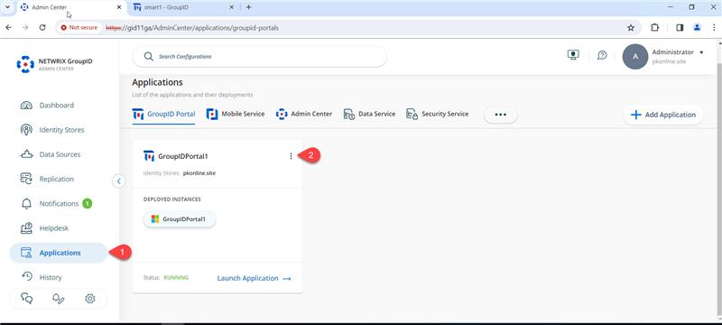
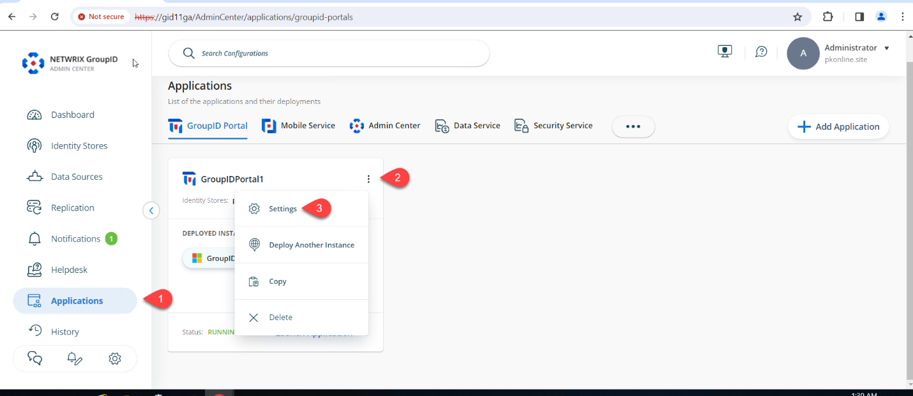
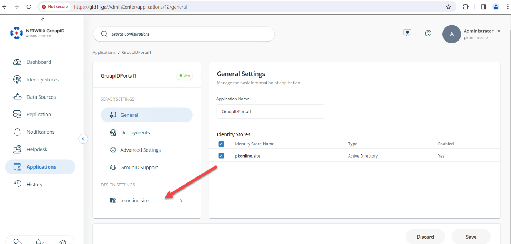
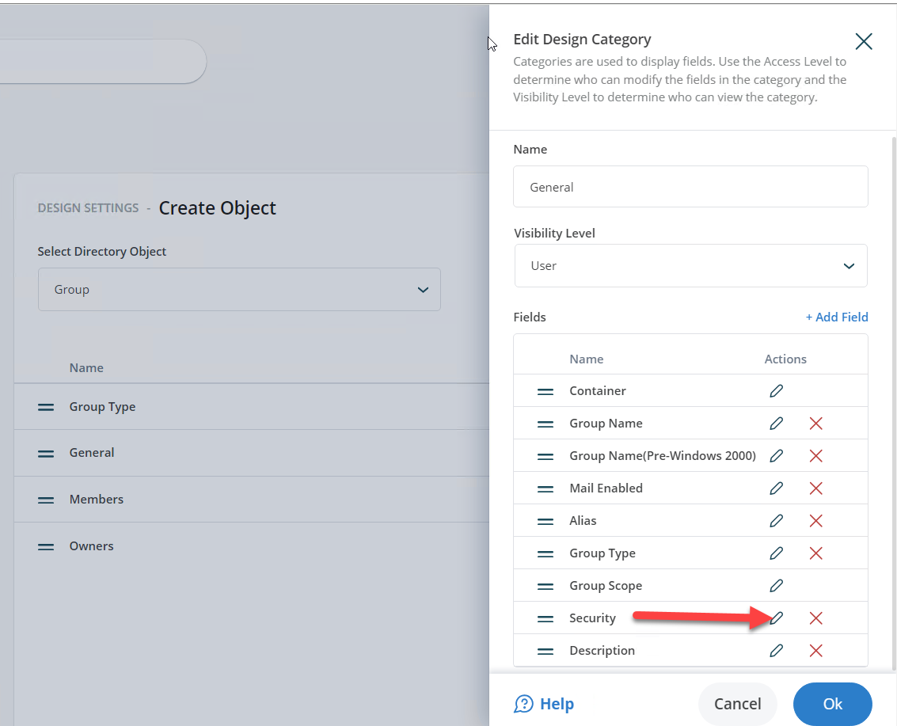
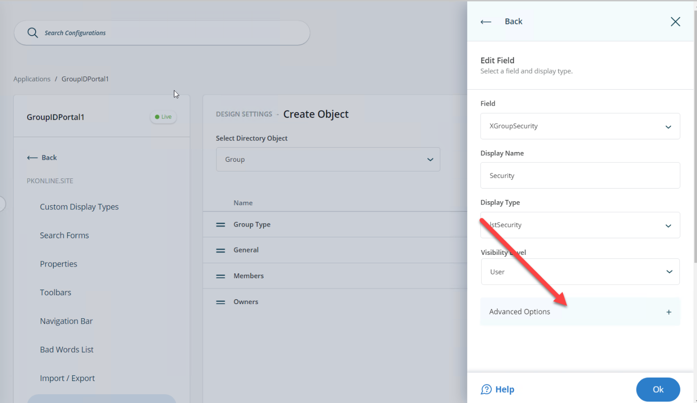
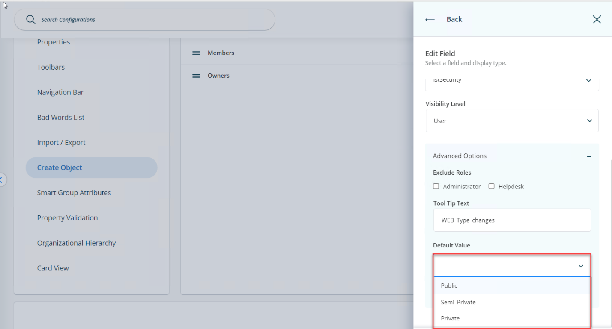
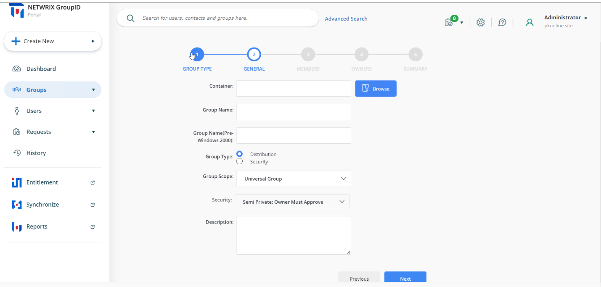
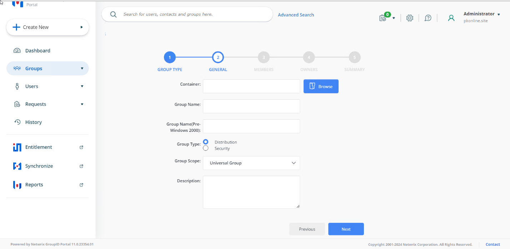

# How to Set 'Semi-Private' as the Default Security Type in v11

## Applies To
Netwrix Directory Manager 11

## Overview
By default, users can choose from several security types when creating a group in the Netwrix Directory Manager 11 user portal. You can configure the portal to set *semi-private* as the default security type in the **Create Group** wizard. You also have the option to allow users to select a different security type or to enforce the default for all users.

## Instructions
1. Open the Directory Manager Admin Portal at `https://servername/AdminCenter/`. Navigate to **Applications**, select your desired portal, and click the three dots (**...**) to edit it.  
   

2. Click **Settings**.  
   

3. Under **Design Settings**, click your identity store’s name.  
   

4. On the **Create Object** tab, select **Group** from the **Select Directory Object** drop-down list.  
   

5. In the **Name** list, select *General* and click **Edit**.

6. In the **Edit Design Category** dialog box, select **Security** and click **Edit**.  
   

7. In the **Edit Field** dialog box, click the **Advanced options** link.  
   

8. Select `Semi_Private` from the **Default Value** drop-down list.  
   

9. Optional: To enforce the semi-private security type, select the **Is Read-Only** check box. This action disables the **Security** drop-down list in the **Create Group** wizard and displays only the default value.  
     
   

10. Optional: To hide the **Security** drop-down list from a specific role, select the desired role (such as **Administrator** or **Helpdesk**) from the **Visibility Role** drop-down list. The **Security** drop-down list is visible to users of the selected role and to roles with a higher priority value, but hidden from all roles with a lower priority value.  
    

11. Click **OK** to close the dialog boxes then save your changes.
