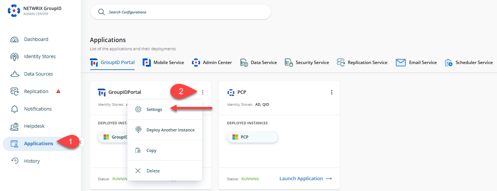
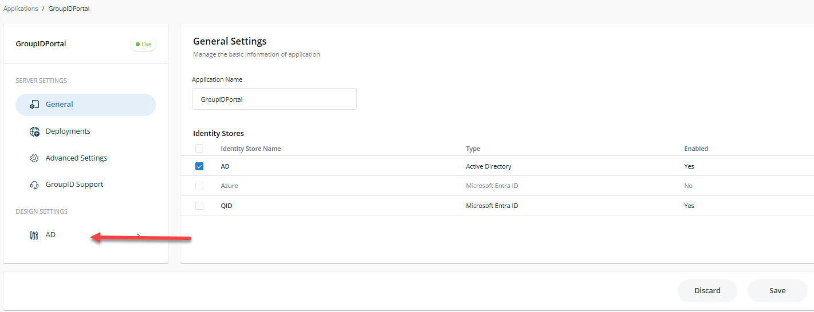
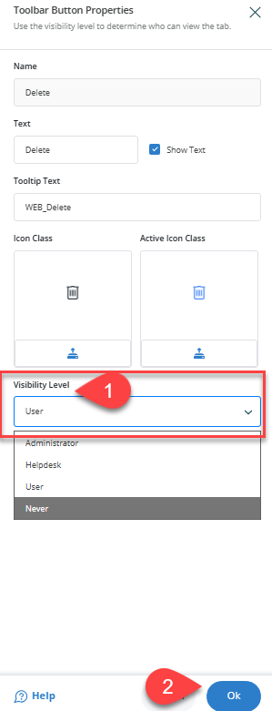

---
description: >-
  This article explains how to remove or hide the Delete option from the Netwrix Directory Manager portal for non-administrative users to prevent accidental deletion of critical groups.
keywords:
  - Directory Manager
  - Delete option
  - user permissions
sidebar_label: Remove Delete Option
tags:
  - portal-customization-and-ux
title: "Remove the Delete Option from the Portal"
knowledge_article_id: kA0Qk0000002QzJKAU
products:
  - directory-manager
---

# Remove the Delete Option from the Portal

## Applies To

Directory Manager 11

## Overview

Netwrix Directory Manager (formerly GroupID) allows you to control which users can delete groups in the portal. To prevent accidental deletion of critical groups, you can restrict the Delete option so that only administrators have permission to delete groups. This article explains how to remove or hide the Delete option from the portal for non-administrative users.

## Instructions

### Restrict the Delete Option in the Directory Manager Portal

1. In the **Directory Manager Admin Center**, go to the **Applications** tab in the left navigation bar.
2. Click the three-dot icon for the portal you want to modify, then click **Settings**.
   
3. In the portal settings, click the identity store name under **Design Settings** for which you want to make design changes.
   
4. Click the **Toolbars** button and select **Groups** from the **Select Toolbar Type** drop-down list.
5. Select **Delete** from the list for the selected toolbar and click the **Pencil** icon to edit.
   
6. In the new window, locate the **Visibility Role** drop-down list and change the value from **Users** to **Administrator**. When **Users** is selected, the button is visible to all roles with a higher priority than Users. To hide the Delete button from everyone, select **Never**.
   
7. After making changes, click the **Save** icon in the Designs tab to save your changes.
   
8. Refresh or relaunch the Directory Manager Portal and verify by opening the properties of any group. The Delete option will no longer be available in the toolbar for non-administrative users.

To hide the Delete option from the **Group Search** or **My Groups** toolbars, select the **Groups Search** toolbar type in step 4 and repeat steps 5 to 7.