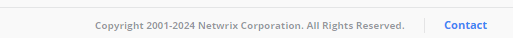
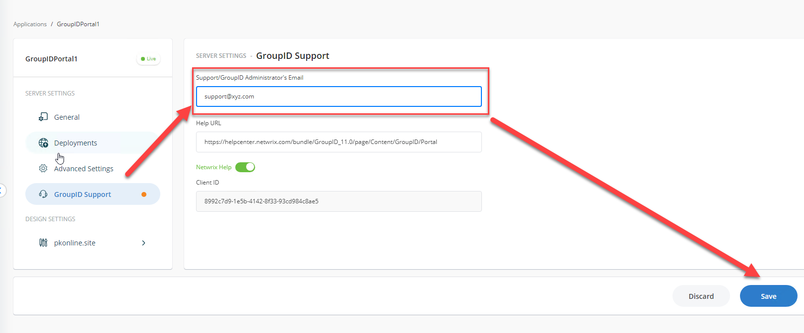

---
description: >-
  Shows how to change the support email address used by the Contact link in the
  Netwrix Directory Manager portal so users can route portal inquiries to your
  local IT team.
keywords:
  - support email
  - contact link
  - Directory Manager
  - portal
  - admin center
  - helpdesk
  - support address
products:
  - directory-manager
sidebar_label: Update Support Email Address for Contact Link
tags:
  - portal-customization-and-ux
title: "Update Support Email Address for Contact Link"
knowledge_article_id: kA0Qk0000002EmrKAE
---

# Update Support Email Address for Contact Link

## Applies To
Netwrix Directory Manager 11

## Overview
The Netwrix Directory Manager application portal includes a **Contact** link at the bottom of each page. This link opens your default email application with a pre-filled support email address, allowing users to contact the admin or helpdesk for inquiries, support requests, or feedback. You may need to change this email address so users can contact your local IT team for portal-related issues.

## Instructions

### Change the Support Email Address for the Contact Link
1. In the Directory Manager Admin Center, select **Application** > your required portal > **Settings**.  
   
2. Click the **Directory Manager Support** tab.
3. In the **Support group/administrator's email address** box, enter the email address for the group, user, or contact who will respond to requests or inquiries from portal users.  
   
4. Click **Save**.
5. Click the **Contact** link in the portal to verify that your specified email address appears in the 'To' box of your default email application.
