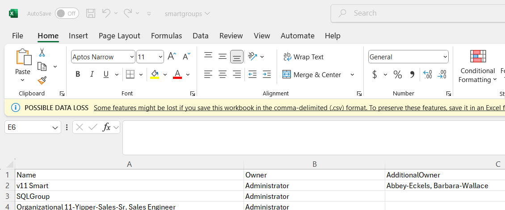

---
description: >-
  Shows how to use the Directory Manager Management Shell in Netwrix Directory
  Manager to export a list of owners and additional owners for Smart Groups and
  all group types, and how to include additional attributes in the export.
keywords:
  - Netwrix Directory Manager
  - export
  - owners
  - additional owners
  - Smart Groups
  - Management Shell
  - PowerShell
  - CSV
products:
  - directory-manager
sidebar_label: Export Owners and Additional Owners for Groups Usi
tags:
  - reporting-export-and-data-management
title: "Export Owners and Additional Owners for Groups Using Management Shell"
knowledge_article_id: kA0Qk0000002JbFKAU
---

# Export Owners and Additional Owners for Groups Using Management Shell

## Overview

This article explains how to use the Directory Manager Management Shell in Netwrix Directory Manager to export a list of owners and additional owners for groups and dynasties. This process is useful for environments with a large number of groups, providing visibility and management of group ownership.

## Instructions

1. Launch the Directory Manager Management Shell.
2. Log in to the Management Shell with your service account.
3. Run the cmdlet below to export owner and additional owner information for all Smart Groups. The CSV file will be saved to the `C:\` directory with the name `smartgroups.csv`.

```powershell
Get-SmartGroup | Select Name, @{Name="Owner"; Expression={ (Get-User -Identity $_.ManagedBy).Name }}, @{Name="AdditionalOwner"; Expression={ ($_.AdditionalOwner.split(",") | ForEach-Object { (Get-User -Identity $_).Name }) -join ", " }} | Export-Csv "C:\smartgroups.csv" -NoTypeInformation
```

> **NOTE:** To change the directory, replace `C:\smartgroups.csv` with the desired directory path.



4. To export the owner and additional owner list for all types of groups (managed and unmanaged), run the command below. This cmdlet will provide the owner and additional owner information for all types of groups.

```powershell
Get-Group | Select Name, @{Name="Owner"; Expression={ (Get-User -Identity $_.ManagedBy).Name }}, @{Name="AdditionalOwner"; Expression={ ($_.AdditionalOwner.split(",") | ForEach-Object { (Get-User -Identity $_).Name }) -join ", " }} | Export-Csv "C:\Groups.csv" -NoTypeInformation
```

5. If additional information is required, you can append the desired attributes to the cmdlet. Examples of additional attributes include:

- `smartGroupType`
- `security`
- `expiration`
- `whencreated`
- `UPN`
- `criteria`
- `SearchContainer`
- `Identity`
- `MaxItemsToDisplay`
- `ObjectType`
- `LdapFilter`
- `SmartFilter`

These attributes can be added to the `Select` statement in the cmdlet to gather more detailed information for each group.
