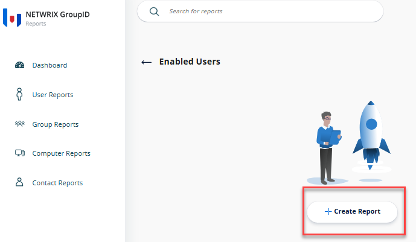

---
description: >-
  This article provides step-by-step instructions on generating a report for enabled users without managers in Netwrix Directory Manager.
keywords:
  - Netwrix Directory Manager
  - enabled users report
  - Active Directory
sidebar_label: Generate Report on Enabled Users
tags:
  - reporting-export-and-data-management
title: "Generate a Report on Enabled Users Without Managers"
knowledge_article_id: kA0Qk0000002R5lKAE
products:
  - directory-manager
---

# Generate a Report on Enabled Users Without Managers

## Overview

Netwrix Directory Manager (formerly GroupID) allows you to generate reports on enabled users who do not have a manager in the domain. The Reports module is a free tool for running reports on Active Directory and Microsoft Exchange/Office 365. This article explains how to generate this report using the Reports portal.

## Instructions

### Generate a Report on Enabled Users Without Managers

1. In the Directory Manager portal, select **Reports** from the left navigation bar. The Reports portal will open in a new browser tab.
   

2. Click the **User Reports** button on the navigation bar.

3. In the Users category, type **Enabled Users** in the search bar.

4. Select the first report template in the list.
   

5. Click **Create Report** to start the report creation wizard.
   

6. On the first page, provide a friendly name for the report, then choose the search scope within the directory and provide a filter criterion. By default, the wizard searches the Global Catalog. To limit the scope to a particular container:
   1. Click **Browse** to launch the **Select Container** dialog box and select the required source container.
   2. Select the **Include sub-containers** check box to include sub-containers in the report.
   3. In the **Filter Criteria** box, modify the default LDAP filter. The default filter generates a list of all users in the domain.
   4. Add a new clause, **manager Not Present**, to fetch a list of all enabled users without managers.
   

7. Click **Next**.

8. The **Report Fields** page displays the fields that will be included in the report. To add more fields, click **Add**. To remove a field, select it and click the **Cross** button. You can change the order of fields using the double bar buttons.
   

9. Click **Finish** to generate the report.

10. The report will be generated. You can download the report in your desired format or pin the report to the Reports portal Dashboard.
    