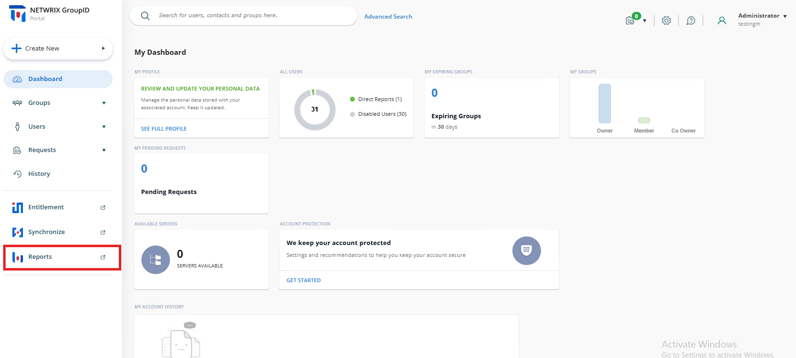
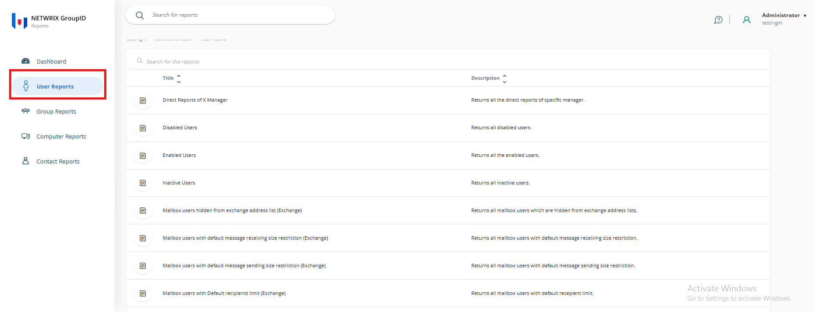
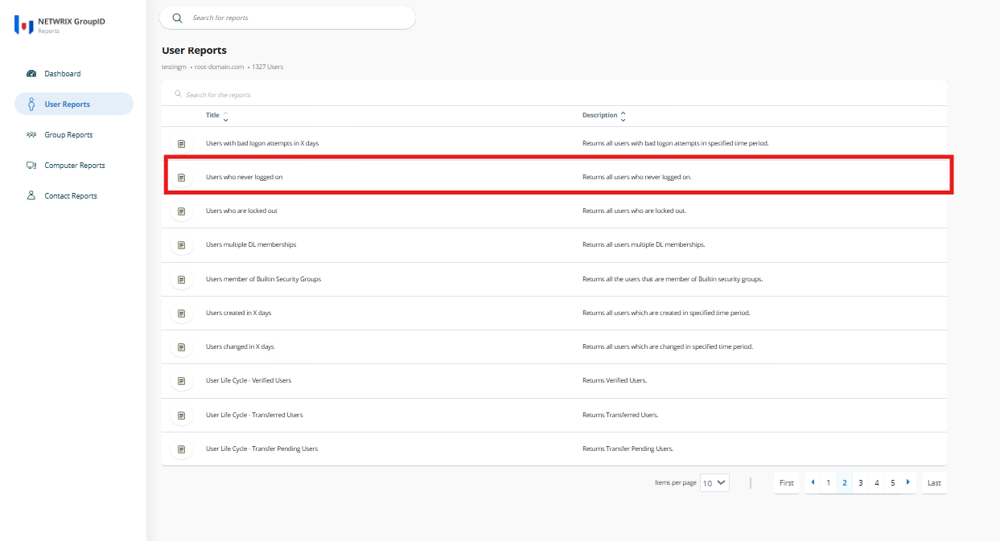
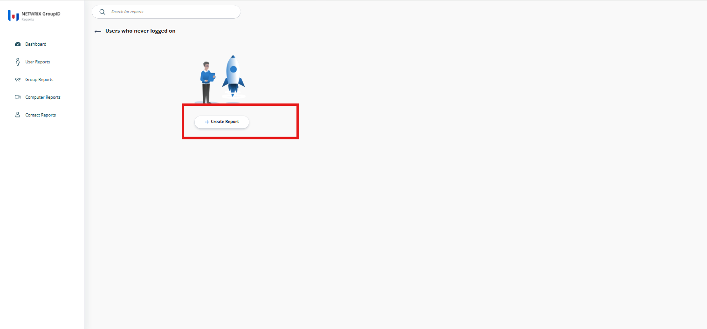
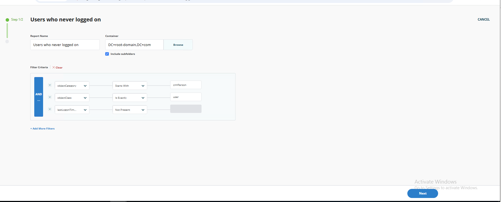
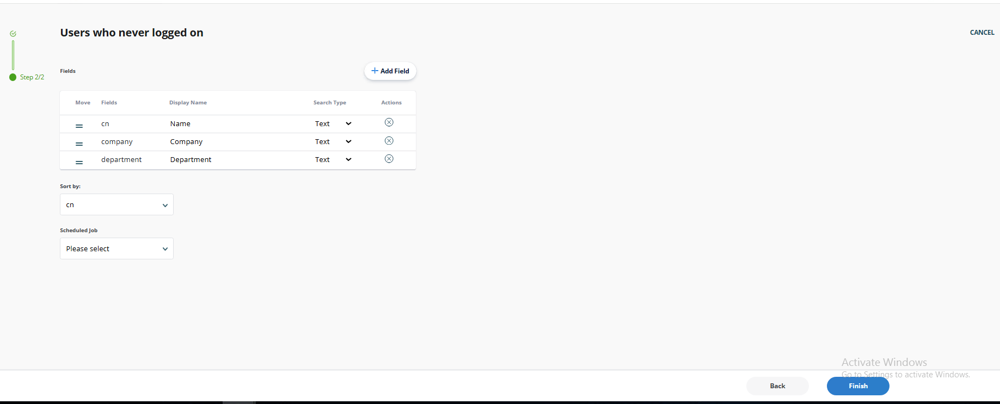
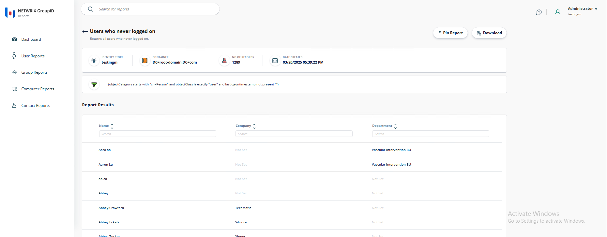

---
description: >-
  Step-by-step instructions to generate a report of Active Directory users who
  have never logged on using the Netwrix Directory Manager Reports module.
keywords:
  - users who never logged on
  - inactive accounts
  - Netwrix Directory Manager
  - Active Directory report
  - audit
  - report generation
  - lastLogonTimeStamp
  - user reports
products:
  - directory-manager
sidebar_label: Generating a Report on Users Who Never Logged On
tags:
  - reporting-export-and-data-management
title: "Generating a Report on Users Who Never Logged On"
knowledge_article_id: kA0Qk0000002CczKAE
---

# Generating a Report on Users Who Never Logged On

## Applies To
Netwrix Directory Manager 11

## Overview
This article provides step-by-step instructions for generating a report on users who have never logged on using the Netwrix Directory Manager Reports module. This report is useful for auditing, cleaning up unused accounts, or ensuring compliance.

## Instructions
1. Navigate to the **Application Portal** and click **Reports**.  
   

2. In the new tab that opens, click **User Reports**.  
   

3. Sort the reports by clicking the **Title** column. Locate the report titled **Users Who Never Logged On** on the second page and click it.  
   

4. Click **Create Report**.  
   

5. On the **Create Report** page, configure the following settings:
   - **Report Name:** Enter a descriptive name, such as "Users Who Never Logged On.""
   - **Container:** Select a specific container in Active Directory by clicking **Browse** to open the directory tree.
   - **Include Subfolders:** Enable this option to include all sub-containers within the selected directory.
   - **Filter Criteria:**
     - `objectCategory` – Starts With – `cn=Person`: Ensures only user objects classified as **Person** are included.
     - `objectClass` – Is Exactly – `user`: Ensures the report only includes user objects.
     - `lastLogonTimeStamp` – Not Present: Captures accounts that have never logged in.

   Use the **Add More Filters** option for additional criteria.  
   

6. Customize the report output by selecting the fields to display:
   - Use the **Add Field** button to add or remove fields.
   - Available fields include:
     - `cn (Common Name)` – Displayed as **Name**
     - `company` – Displayed as **Company**
     - `department` – Displayed as **Department**
   - Adjust the **Search Type** (for example, Text) for data display preferences.
   - Rearrange fields using the **Move** icon or remove them using the **X** button under **Actions**.

7. Set the **Sort By** field to `cn` (Common Name) for sorting results.

8. Optionally, schedule the report generation by selecting a predefined job from the dropdown menu in the **Scheduled Job** section.

9. Click **Finish** to complete the report generation process.  
   

## Viewing and Managing the Report
After clicking **Finish**, the report results will display all users who have never logged into their accounts.  

Additional actions you can perform include:
- Pin Report: Pin the report for quick access on the dashboard.
- Download: Export the report in formats such as HTML, MS Excel, or PDF.
