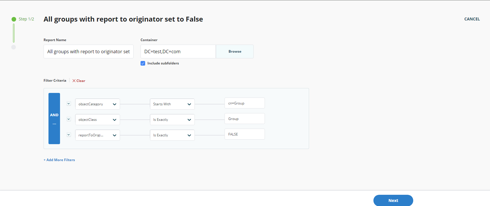
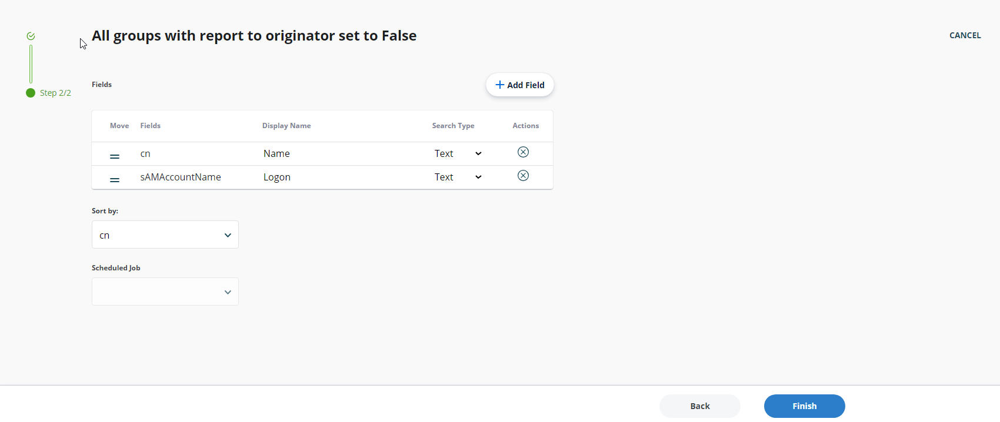
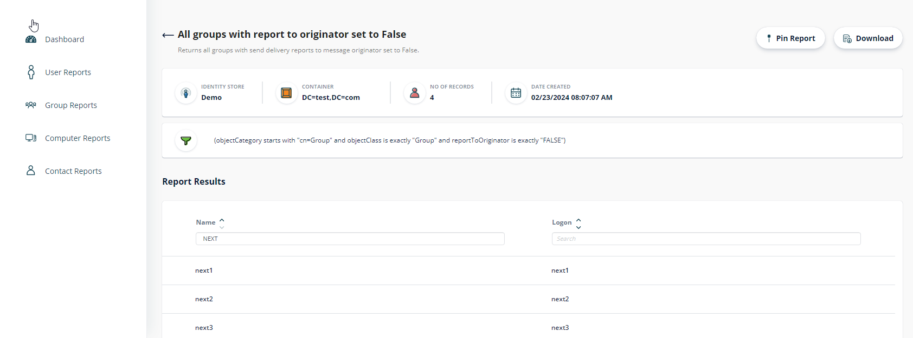
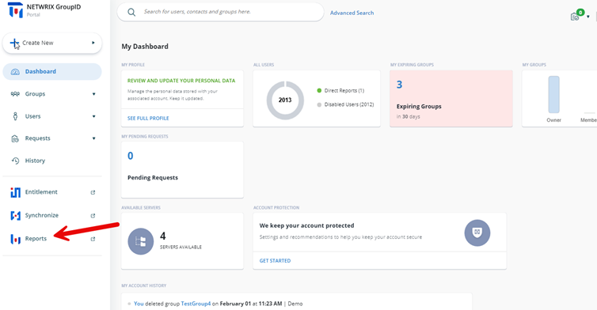
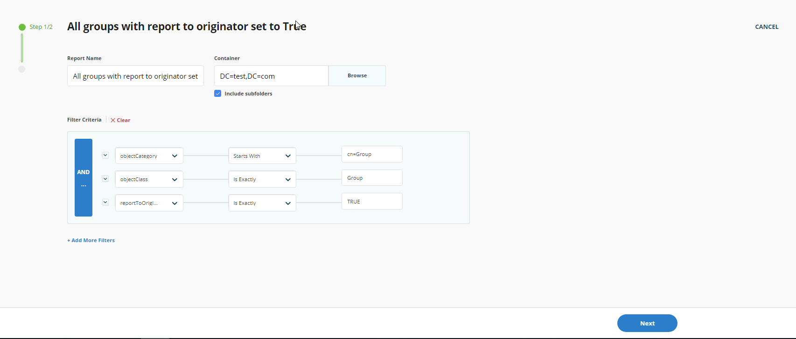
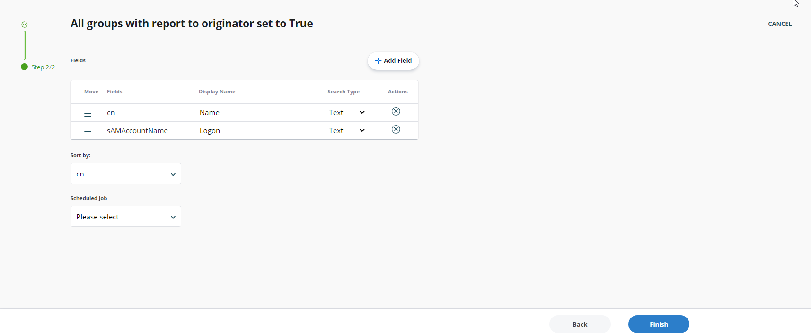
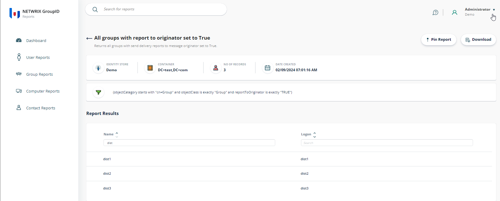

---
description: >-
  Shows how to generate reports that list all distribution groups with the
  Report To Originator attribute set to false or true using the Reports module
  in Netwrix Directory Manager.
keywords:
  - directory manager
  - group reports
  - reportToOriginator
  - delivery report
  - Active Directory
  - LDAP
  - Netwrix Directory Manager
  - Reports
products:
  - directory-manager
sidebar_label: 'How to Generate a Report on All Groups with Report to Originator Set to False or True'
tags:
  - reporting-export-and-data-management
title: >-
  How to Generate a Report on All Groups with Report to Originator Set to False
  or True
knowledge_article_id: kA0Qk0000002KdlKAE
---

# How to Generate a Report on All Groups with Report to Originator Set to False or True

## Applies To
Netwrix Directory Manager – [Reports ⸱ Imanami 🖽](https://www.imanami.com/reports/)

## Overview
Netwrix Directory Manager (formerly GroupID) allows you to generate reports on all groups with the **Report To Originator** attribute set to either **false** or **true**. The `reportToOriginator` parameter determines whether a delivery report is sent to the user (originator) who sends an email to a distribution group. This article explains how to generate these reports using the **Reports** module. The **Reports** module is a free tool for running reports on Active Directory and Microsoft Exchange/Office 365.

> **NOTE:** The values of `reportToManager` and `reportToOriginator` cannot both be set to `$true` at the same time. If one is set to `$true`, the other must be set to `$false`; otherwise, all delivery status messages will be suppressed.

## Instructions

### Generate a Report for All Groups with Report to Originator Set to False
1. Open the Netwrix Directory Manager Portal and go to the **Reports** options.
2. Select **Group Reports** > **All groups with report to originator set to False**.  
   
3. Click **Create Report** to launch the **Create Report** wizard.
4. On the first page, specify a custom title for your report in the **Report Name** box if desired. The default title is **All Groups with Report to Originator Set to False**.  
   
5. Click **Browse** to open the **Select Container** dialog box and select the required source container. The default selection is the **Global Catalog**.
6. Select the **Include sub containers** check box to include sub-containers for the selected container.
7. In the **Filter Criteria** section, modify the default LDAP filter as required. To add additional filters, click **Add More Filters**.
8. Click **Next**.
9. In the **Fields** section, add or remove fields as needed and adjust their order.  
   
10. From the **Sort By** drop-down list, select the field by which to sort the report results.
11. From the **Schedule** drop-down list, select a schedule for the report if desired. The report will run automatically at the specified time.
12. Click **Finish**.
13. The report is generated and displayed. The report includes:
    - Connected identity store name
    - Selected container
    - Number of records fetched
    - Date the report was created
    - Filter applied
    - List of report results  
    
14. The report is listed in the template's page. You can create multiple reports from the same template.
15. To download the report, click **Download** and select the format (PDF, Excel, or HTML).
16. You can also pin the report to the Dashboard by clicking **Pin Report**.

### Generate a Report for All Groups with Report to Originator Set to True
1. Open the Netwrix Directory Manager Portal and go to the **Reports** options.
2. Select **Group Reports** > **All groups with report to originator set to True**.  
   
3. Click **Create Report** to launch the **Create Report** wizard.
4. On the first page, specify a custom title for your report in the **Report Name** box if desired. The default title is **All Groups with Report to Originator Set to True**.  
   
5. Click **Browse** to open the **Select Container** dialog box and select the required source container. The default selection is the **Global Catalog**.
6. Select the **Include sub containers** check box to include sub-containers for the selected container.
7. In the **Filter Criteria** section, modify the default LDAP filter as required. To add additional filters, click **Add More Filters**.
8. Click **Next**.
9. In the **Fields** section, add or remove fields as needed and adjust their order.  
   
10. From the **Sort By** drop-down list, select the field by which to sort the report results.
11. From the **Schedule** drop-down list, select a schedule for the report if desired. The report will run automatically at the specified time.
12. Click **Finish**.
13. The report is generated and displayed. The report includes:
    - Connected identity store name
    - Selected container
    - Number of records fetched
    - Date the report was created
    - Filter applied
    - List of report results  
    
14. The report is listed in the template's page. You can create multiple reports from the same template.
15. To download the report, click **Download** and select the format (PDF, Excel, or HTML).
16. You can also pin the report to the Dashboard by clicking **Pin Report**.
