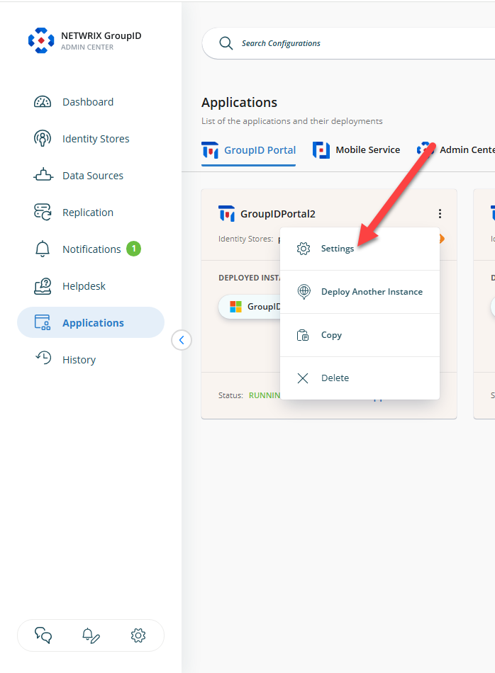
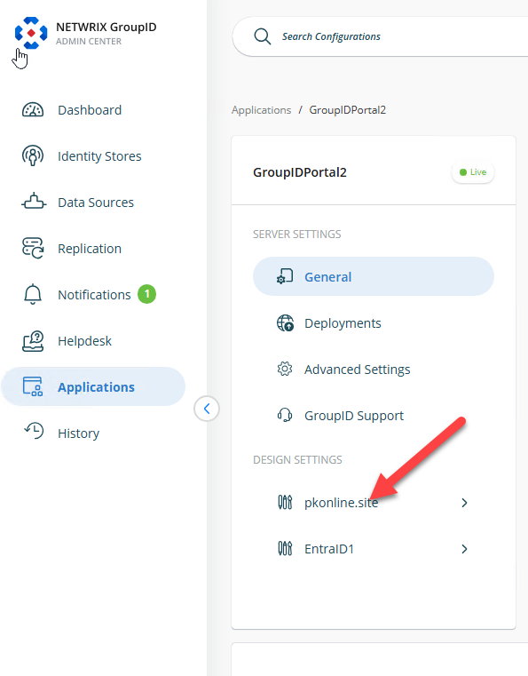
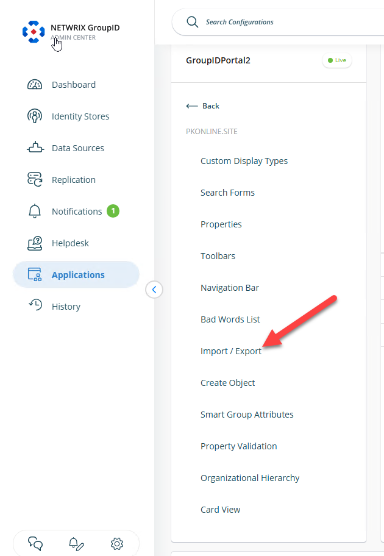

---
description: >-
  This article explains how to add additional attributes to the exportable fields in the Application portal of Netwrix Directory Manager.
keywords:
  - export attributes
  - Application portal
  - Netwrix Directory Manager
sidebar_label: Add Attributes to Export List
tags:
  - reporting-export-and-data-management
title: "How to Add Attributes to the Export List in the Application Portal"
knowledge_article_id: kA0Qk0000002NQLKA2
products:
  - directory-manager
---

# How to Add Attributes to the Export List in the Application Portal

## Overview

This article explains how to add additional attributes to the list of exportable fields in the Export option of the Application portal in **Netwrix Directory Manager** (formerly GroupID). By default, only a standard set of attributes is available for export. You can customize this list to include other attributes, such as **Common Name (CN)**.

To add more attributes to the Export list, you must update the portal's design settings.

## Instructions

1. Log in to the **Directory Manager Admin** portal and navigate to the **Applications** tab.

   

2. Open the settings for the application where you want to add the attribute, and click the identity store name.

     
   

3. Navigate to the **Import/Export** tab.

   

4. Click the **(+)** button. Select the field you want to add and provide a display name for it.

   

5. Save your changes. The new field will now be available in the Export wizard of the Application portal.

   