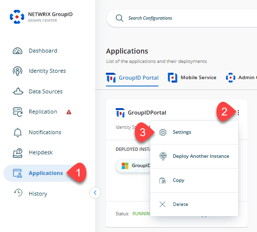

---
description: >-
  This article explains how to add additional attributes to the exportable fields in the Netwrix Directory Manager Portal.
keywords:
  - Directory Manager
  - export attributes
  - customization
sidebar_label: Add Attributes to Export List
tags:
  - reporting-export-and-data-management
title: "How to Add Attributes to the Export List in the Portal"
knowledge_article_id: kA0Qk0000002bczKAA
products:
  - directory-manager
---

# How to Add Attributes to the Export List in the Portal

## Overview

This article explains how to add additional attributes to the list of exportable fields in the Export option of the **Netwrix Directory Manager** (formerly **GroupID**) Portal. By default, only a standard set of attributes is available for export. You can customize the portal design to include other attributes, such as **Common Name (CN)**, in the export list.

> **NOTE:** Before making any changes to your environment, create a backup, snapshot, or checkpoint of the Directory Manager server.

## Instructions

1. In **Directory Manager Admin Center**, go to **Application** from the navigation bar and click the three-dot icon for the portal you want to customize.
2. Click the **Settings** button. A new page will appear.  
   
3. Select the **Identity Store** you want to customize the design for.
4. Click **Import/Export**, then click the **+** icon to add a new attribute field.  
   
5. On the **Import/Export Attribute** dialog, select an attribute from the **Schema Attribute** dropdown and provide a name.  
   
6. After making changes, click **Save**.
7. Refresh or relaunch the Directory Manager Portal. In the **Members** tab of any group, when you export the list of members, the newly added attribute will appear in the list of attributes to export.

