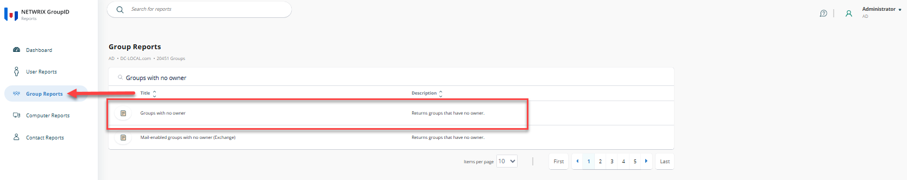

---
description: >-
  This article explains how to generate a report in Netwrix Directory Manager to view all groups that have no members but at least one owner or additional owner.
keywords:
  - Netwrix Directory Manager
  - report generation
  - Active Directory
sidebar_label: Generate Report on Groups Without Members
tags:
  - reporting-export-and-data-management
title: "How to Generate a Report on Groups Without Members and with Owners"
knowledge_article_id: kA0Qk0000002bY9KAI
products:
  - directory-manager
---

# How to Generate a Report on Groups Without Members and with Owners

## Applies To

Directory Manager 11

## Overview

This article explains how to generate a report in **Netwrix Directory Manager** (formerly GroupID) to view all groups that have no members but at least one owner or additional owner. The **Directory Manager Reports** module is a free reporting tool designed to run reports on Active Directory and Microsoft Exchange/Office 365.

## Instructions

1. In the **Directory Manager** portal, select **Reports** from the left navigation bar. The Reports portal will open in a new browser tab.

   

2. Click the **Group Reports** button on the navigation bar.

3. In the Groups category, type **Groups with no members** in the search bar.

4. Select the first report template in the list.

   

5. Click **Create Report** to initiate the report creation wizard.

   

6. On the first page, enter a name for the report, select the search scope within the directory, and specify a filter criterion. By default, the wizard searches the Global Catalog.

   To limit the scope to a particular container:
   1. Click **Browse** to launch the **Select Container** dialog box and select the required source container.
   2. Select the **Include sub-containers** checkbox if you want to include its sub-containers when reporting.
   3. In the **Filter Criteria** box, modify the default LDAP filter. The default filter generates a list of all users in the domain along with their group memberships.
   4. Add new clauses, **XAdditionalOwner Present** and **Member Not Present**, with an **OR** condition between **XAdditionalOwner** and **ManagedBy** clauses to fetch a list of all groups without members but at least one owner or additional owner.

   

7. Click **Next**.

8. The **Report Fields** page displays the fields that will be included in the report. To add more fields, click **Add**. To remove a field, select it and click the **X** icon. You can change the order of these fields by using the double bar buttons.

   

9. Click **Finish**.

10. The report will be generated. You can download the report in your desired format or pin the report to the Reports portal Dashboard.

    