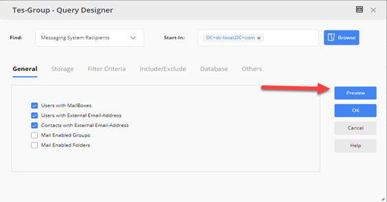
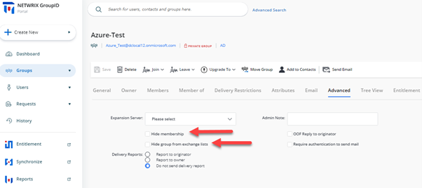
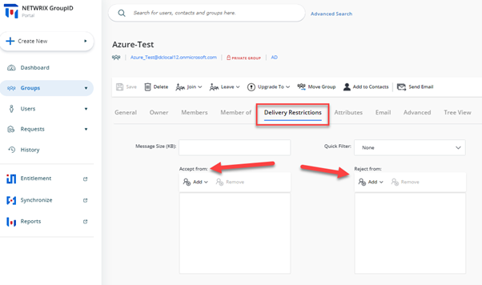

---
description: >-
  Best practices to prevent accidental internal and external data leakage when
  using Netwrix Directory Manager, including role-based scope limits, group
  creation controls, membership import methods, and mail-related safeguards.
keywords:
  - directory-manager
  - groups
  - membership
  - RBAC
  - data-leak
  - GAL
  - security-roles
  - bulk-import
  - delivery-restrictions
products:
  - directory-manager
sidebar_label: Best Practices for Preventing Accidental Data Leak
tags:
  - security-permissions-and-access-control
title: "Best Practices for Preventing Accidental Data Leakage"
knowledge_article_id: kA0Qk0000000IPxKAM
---

# Best Practices for Preventing Accidental Data Leakage

## Applies To:
- Netwrix Directory Manager 10 or above

## Business Scenario:
Our objective is to establish and enforce best practices to prevent external and internal data breaches while using Netwrix Directory Manager, ensuring the security and confidentiality of sensitive information.

## Best Practices:
Following are some of the Best Practices to avoid any kind of external/internal Data breaches while using Netwrix Directory Manager.

### Using Security Roles to Limit Scope of Search
Netwrix Directory Manager uses an RBAC model through which you can define Security Roles and delegate permissions to different users. You can set Netwrix Directory Manager search so that AD objects (for example, Groups, Users, Contacts) can only be searched within a specific OU and filtered based on Active Directory attributes.

For more information on how to set up a limit on the search scope for a particular Security Role, visit the following KB article:

- [Walkthrough Search Policy - Define Scope and Filter Results](/docs/kb/directorymanager/security-permissions-and-access-control/walkthrough-search-policy-define-scope-and-filter-results)

### Using Security Roles to Specify Specific Area Where Groups Can be Created or Have a Fixed and Hidden Path.
In Netwrix Directory Manager, you can apply policies to security roles so that role members use Netwrix Directory Manager in keeping with the policy restrictions. Netwrix Directory Manager’s New Object policy enables you to restrict role members to create new groups in a specific OU only.

For more information on how to set up a New Object policy for specific security roles, visit the following KB article:

- [How To Enforce Users to Create Groups in a Specific OU](/docs/kb/directorymanager/security-permissions-and-access-control/how-to-enforce-users-to-create-groups-in-a-specific-ou)

### Importing Membership via Netwrix Directory Manager Bulk Membership Import Feature for Groups
Many times, organizations create groups (Security and Distribution) in advance, i.e., before the actual usage of groups. To avoid any critical information being leaked out, it is recommended that such groups be created without populating membership upon creation.

Instead, you can use the **Bulk Import Membership** feature of Netwrix Directory Manager to update groups with the correct memberships just before their actual usage starts. Bulk import allows for external source files like a CSV or an Excel sheet to import membership when it is needed.

In Netwrix Directory Manager, bulk import of memberships is possible using the Import Wizard available in the Netwrix Directory Manager Portal. The following KB article provides step-by-step instructions to bulk import members into a group:

- [How To Import Members to a Group Using Self-Service Import Wizard](/docs/kb/directorymanager/workflows-automation-and-lifecycle-management/how-to-import-members-to-a-group-using-self-service-import-wizard)

### Creating Smart Group Without Updating Memberships
Another way to ensure that the group memberships do not update beforehand, if a group has been created in advance, is by just previewing the query results of a Smart group without updating the group memberships.

A query-based dynamic *smart group* is one whose membership is determined by the supplied criteria. The results can be previewed but not acted upon until needed. Keeping out of the update schedule ensures that membership updates only occur when you manually trigger them.

### Keep Group Hidden from GAL Until it is Ready to be Used
Keeping a group and its membership hidden from discoverability by external tools like Outlook can also help you comply with organizational policies for ensuring secrecy.

Using the Netwrix Directory Manager Portal, if a mail-enabled group is created, you can hide the group and its membership from the Address Book and GAL in the following way:

### Selecting Appropriate Security Type for Groups
During the creation of a group via the Netwrix Directory Manager Portal, you can designate the security type as Private, Semi-Private, or Public. This classification, serving as a pseudo attribute within Netwrix Directory Manager, governs the permission levels for joining the group. It is always recommended to choose Private as the Security Type for sensitive groups.

- **Private** – A closed group where the group owner solely determines group membership.
- **Semi-Private** – The group owner approves users' requests to join or leave the group.
- **Public** – An open group that anyone can join or leave.

### Setting up Delivery Restrictions on Mail-Enabled Groups
It is always recommended to ensure/limit the inflow of email messages received by critical groups in the production environment. Netwrix Directory Manager allows you to set Delivery Restrictions on such groups by leveraging the `AuthOrig` and `UnAuthOrig` attributes from Active Directory. Both Self-Service and Automate give Group Owners and Administrators the ability to set rules for accepting/rejecting emails from certain users for a particular group.

To set Delivery Restrictions via the Netwrix Directory Manager portal, simply search for the group and navigate to the **Delivery Restriction** tab in **Group Properties**.

### Setting up Approver Workflows for the Creation of New Groups
One of the most efficient methods to effectively manage the number and quality of groups being created by end users is the implementation of a continuous monitoring process where admins can approve the group being created.

Netwrix Directory Manager allows you to set up customized workflow approval processes with tailored filters to cater to use-case-specific triggering. This process ensures that whenever a group is created an approval request is sent to the concerned authorities for approval.

For more information on implementing such workflows, visit the following KB article:

- /docs/kb/directorymanager/workflows-automation-and-lifecycle-management/how_to_trigger_a_workflow_when_a_user_сreates_a_group (How to Trigger a workflow When a User Сreates a Group)

### Setting up Message Moderators for Mail-Enabled Groups
Another way to ensure that no unauthorized message is sent to critical groups is to set up moderator approval processes for Microsoft Exchange. Netwrix Directory Manager can be easily customized to provide the necessary attributes in the Group Properties visible on the portal to initiate a message approval process and assign moderators for certain critical distribution lists.

For more information on customization to the portal, visit the following KB article:

- [How To Add Message Approvers in Group Properties in Netwrix Directory Manager Portal](/docs/kb/directorymanager/configuration-and-integration/how-to-add-message-approvers-in-group-properties-in-groupid-portal)

### Other Best Practices to Improve Compliance.
In addition to the above-mentioned best practices for making sure the production environment is secure and compliant with company policy, visit the following KB article to learn about best practices for controlling changes to group memberships after creation:

- [Best Practices for Controlling Changes to Group Membership](/docs/kb/directorymanager/reporting-export-and-data-management/best-practices-for-controlling-changes-to-group-membership)

## Related Articles:
- [Walkthrough Search Policy - Define Scope and Filter Results](/docs/kb/directorymanager/security-permissions-and-access-control/walkthrough-search-policy-define-scope-and-filter-results)
- [How To Enforce Users to Create Groups in a Specific OU](/docs/kb/directorymanager/security-permissions-and-access-control/how-to-enforce-users-to-create-groups-in-a-specific-ou)
- [How To Import Members to a Group Using Self-Service Import Wizard](/docs/kb/directorymanager/workflows-automation-and-lifecycle-management/how-to-import-members-to-a-group-using-self-service-import-wizard) 
- [How to Trigger a workflow When a User Сreates a Group](/docs/kb/directorymanager/workflows-automation-and-lifecycle-management/how_to_trigger_a_workflow_when_a_user_сreates_a_group)
- [How To Add Message Approvers in Group Properties in Netwrix Directory Manager Portal](/docs/kb/directorymanager/configuration-and-integration/how-to-add-message-approvers-in-group-properties-in-groupid-portal)
- [How To Enforce Users to Create Groups in a Specific OU](/docs/kb/directorymanager/security-permissions-and-access-control/how-to-enforce-users-to-create-groups-in-a-specific-ou)
