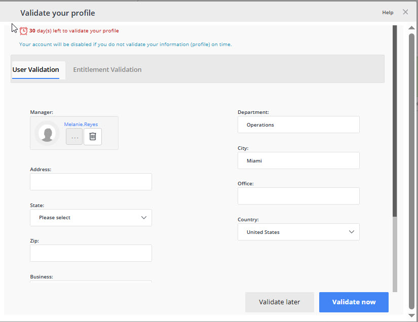

---
description: >-
  This article provides step-by-step instructions for configuring user profile validation in Netwrix Directory Manager, ensuring that directory profiles remain accurate and up-to-date.
keywords:
  - Directory Manager
  - Profile Validation
  - User Management
sidebar_label: Validate Directory Profiles
tags:
  - security-permissions-and-access-control
title: "Force Users to Validate Their Directory Profiles"
knowledge_article_id: kA0Qk0000002OcXKAU
products:
  - directory-manager
---

# Force Users to Validate Their Directory Profiles

## Applies To

Directory Manager 11

## Overview

Organizations need accurate employee directory profiles, but manual updates are often inefficient and lead to outdated information. Netwrix Directory Manager (formerly GroupID) addresses this by enabling administrators to require users to regularly review and update their own directory profiles. The Profile Validation feature automates this process and helps keep user information current.

## Instructions

### Configure User Profile Validation for an Identity Store

1. In the Admin Center, click the **Identity Stores** node.
2. On the **Identity Stores** tab, go to the settings of the required identity store.
3. On the **Configurations** tab, click the **Profile Validation** option in the left pane.
4. In the **Profile Criteria** area, specify a group to apply profile validation to. Members of this group must validate their profiles using the portal.
5. In the **User’s Profile Validation Life Cycle** box, set the profile validation life cycle period. The default is 100 days, meaning users must validate their profiles once every 100 days. When a user validates their profile, the current cycle closes and the next cycle begins for that user.
6. In the **Extension Period Settings** area, specify the number of days to grant as an extension period to expired users.
7. In the **Reminder Notification Settings** area, add or edit the email notification information. These notifications remind users to validate their profiles.
8. Click **OK**.

### Define a User Life Cycle Job for the Identity Store

The profile validation feature is monitored by the User Life Cycle job. This job checks the profile validation dates for users in the specified group, sends reminder notifications, and expires users who do not validate their profiles within the given period.

1. In the Admin Center, click the identity store node and open the properties of the required identity store.
2. Click the **Schedules** node and create a new schedule for the **User Life Cycle Job**.
3. Provide a schedule name and portal URL.
4. Set the trigger time and authentication for the scheduled job.
5. Click **Create Schedule** and save the changes.

### Specify Schema Attributes for Validation

1. In the Admin Center, click **Applications** and go to the settings of the portal.
2. Select an identity store to specify fields for profile validation.
3. Click the **Property Validation** tab.
4. From the **Select Directory Object** list, select **User**. All fields currently available for profile validation in the portal are listed under **Display Name**.
5. You can **add**, **edit**, or **remove** fields as needed.
6. To add a new field (schema attribute) for profile validation, click the **+** icon.
7. Use the **Field(s)** box to specify a schema attribute.
8. In the **Display Name** box, specify a name to display as the field’s label in the portal.
9. From the **Display Type** drop-down list, select a display type for rendering the attribute(s) in the portal.
10. From the **Visibility Role** drop-down list, select a security role. The field will be visible to users of the selected role and to roles with a higher priority value.
11. Use the **Exclude Role** option to exclude a higher priority role or roles from seeing the field.
12. Specify a tooltip for the field, the maximum number of characters the field can store, and other attributes as needed.
13. Click **OK** to close the dialog box.
14. Click **Save** to apply the changes.

  

### Profile Validation in the Portal

Directory Manager provides multiple alerts and reminder notifications to prompt users to validate their profiles by a certain date. The **My Profile** card on the portal dashboard changes color to indicate the warning level.

1. Launch the Directory Manager portal.
2. Click the **My Profile** card on the dashboard to open the **Validate Profile Properties** window.
3. Update the attributes the administrator has exposed for profile validation. In the default portal template, you can:
   - Update office information, such as address and contact numbers.
   - Specify or change your primary manager.
   - Transfer your direct reports to another manager.
   - Terminate your direct reports.
4. After verifying and updating the information, click the **Validate Now** button.

### Grant an Extension Period to Expired Users

Directory Manager expires users who do not validate their profiles within the required time frame, disabling their accounts in the directory. Expired users can request the administrator or Helpdesk to temporarily unlock their accounts and grant an extension period. If users do not validate their profile information within the extension period, Directory Manager expires them again and notifies their managers by email. To reactivate these accounts, managers must send a request to Helpdesk.

1. Log in to the Directory Manager portal.
2. Click **Users** in the left pane and select **My Direct Reports**.
3. Click the **Disabled Users** tab.
4. Select an expired user and click **Extend** on the toolbar. The user's account is temporarily unlocked for the duration specified in profile validation configurations. See Step 1 for configuration details.

