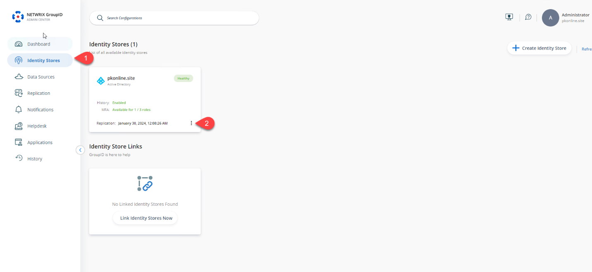
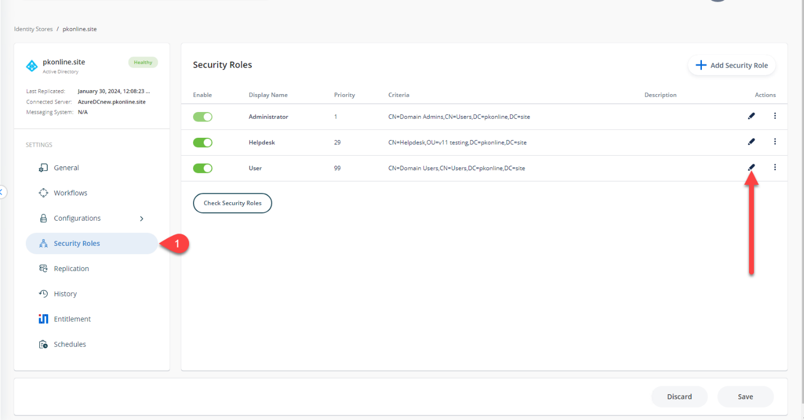
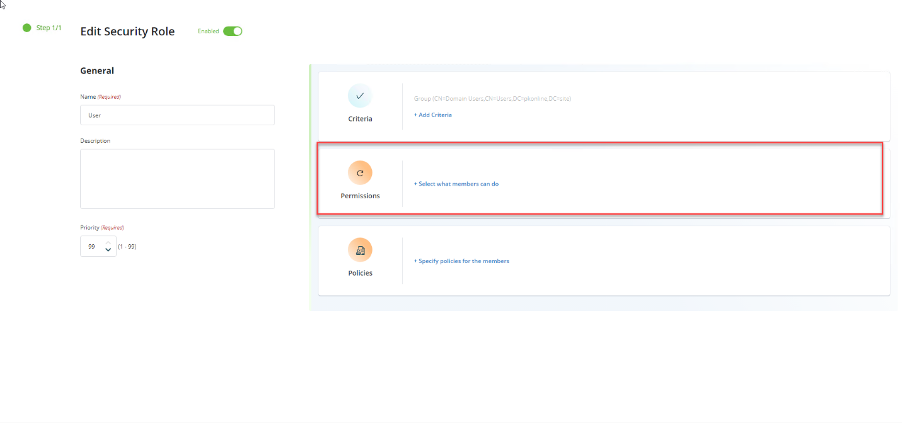
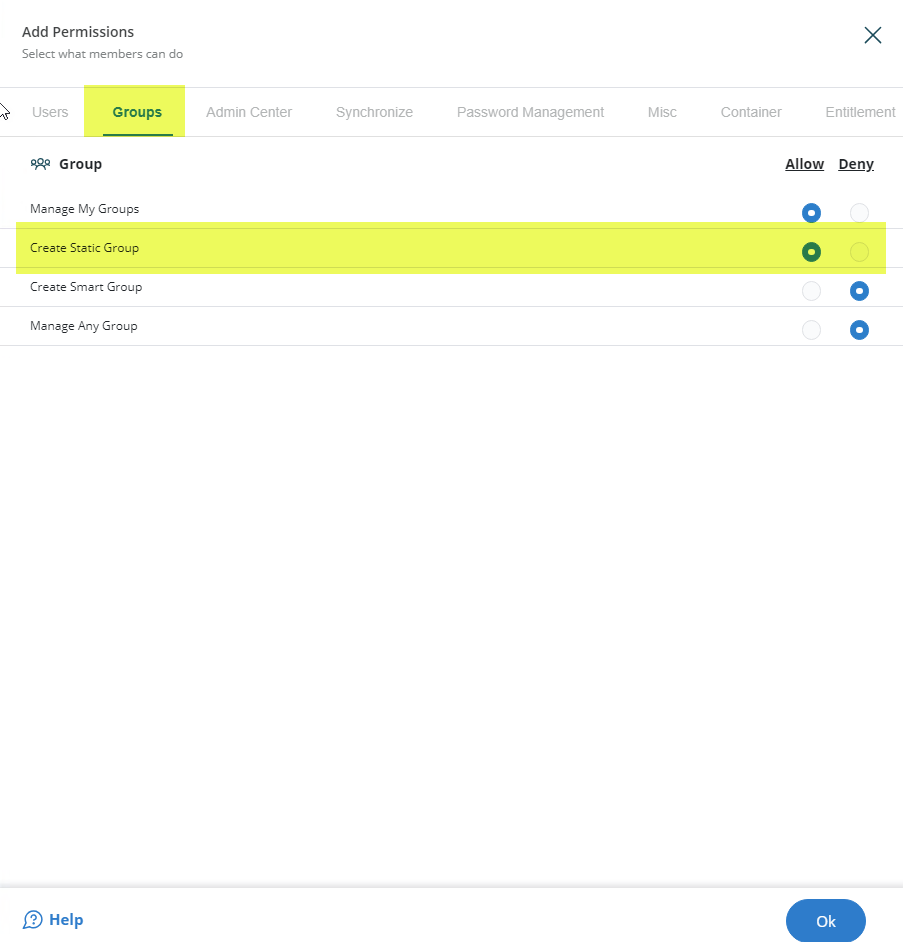

---
description: >-
  Shows how to configure a security role in Netwrix Directory Manager 11 to
  allow users to create only group and contact object types through the User
  portal. Follow the steps to modify the role permissions and prevent creation
  of other object types.
keywords:
  - Netwrix Directory Manager
  - security role
  - user portal
  - create objects
  - groups
  - contacts
  - identity store
  - permissions
products:
  - directory-manager
sidebar_label: How to Allow Users to Create Specific Objects in U
tags:
  - security-permissions-and-access-control
title: "How to Allow Users to Create Specific Objects in User Portal"
knowledge_article_id: kA0Qk0000002CebKAE
---

# How to Allow Users to Create Specific Objects in User Portal

## Applies To:
Netwrix Directory Manager 11

## Overview
This article provides instructions for configuring a security role in Netwrix Directory Manager 11 to allow users to create only *group* and *contact* object types through the User portal. By modifying the role’s permissions, you can prevent users from creating other object types, such as users and mailboxes, to align with your organization’s security and management policies.

## Instructions
To grant or deny permission to create specific objects in the Netwrix Directory Manager User portal, follow these steps:

1. Open the Netwrix Directory Manager Admin Portal at `https://servername/AdminCenter/`. Navigate to **Identity Stores**. Under an identity store's name, click the three dots (**...**) to edit it.

   

2. In the identity store's properties, click the **Security Roles** tab. Select the role you want to modify and click **Edit**.

   

3. On the **Role Properties** page, click the **Permissions** tab.

   

4. The **Create** permissions for the User portal are shown in the following images:

   

   

5. Select the **Allow** option for **Group** and **Contact** object types to permit creation. Select the **Deny** option for all other object types to restrict creation.

6. Click **OK** to save your changes.

When you allow the role to create *groups* and *contacts* using the portal, the result will look like this:

