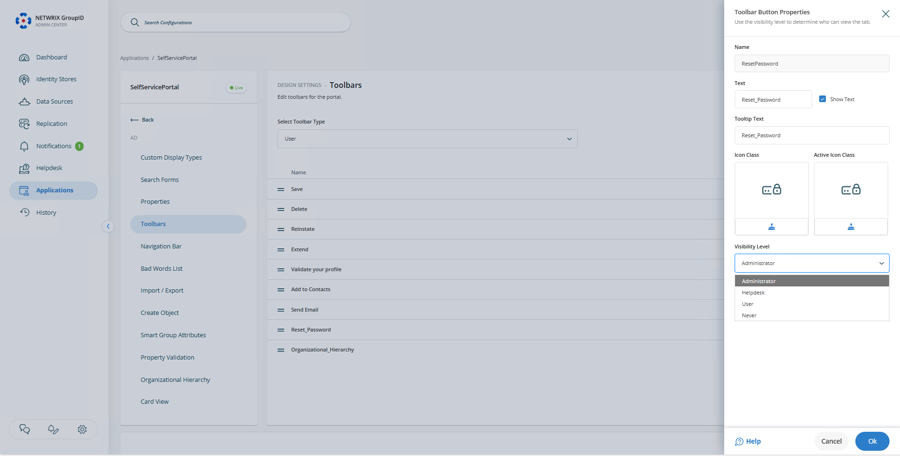

---
description: >-
  Shows how to delegate the password reset privilege to non-administrators in
  the Netwrix Directory Manager Self-Service portal by assigning an access level
  to a security role.
keywords:
  - Netwrix Directory Manager
  - password reset
  - self-service portal
  - delegate
  - security role
  - access level
  - admin center
  - Reset Password
products:
  - directory-manager
sidebar_label: How to Delegate Password Reset Privileges in Self-
tags:
  - security-permissions-and-access-control
title: "How to Delegate Password Reset Privileges in Self-Service Portal"
knowledge_article_id: kA0Qk0000002AhdKAE
---

# How to Delegate Password Reset Privileges in Self-Service Portal

## Applies To
Netwrix Directory Manager 11

## Overview
This article explains how to delegate the password reset function to users in the Netwrix Directory Manager Self-Service portal. By default, only administrators have this privilege, but you can assign it to any security role as needed.

## Instructions
1. Access the **Netwrix Directory Manager Admin Center** at `https://servername/AdminCenter/dashboard`.
2. Select **Applications > Portal Name > Settings**.
3. Select **Design Settings** and then select **Identity Store**.
4. Click the **Navigation bar** tab.
5. In the **Tab** list, select *Users* and click **Edit**.
6. On the **Edit Tab** dialog box, select **Reset Password** in the **Links** section and click **Edit**.  
   
7. From the **Access Level** list on the **Edit Link** dialog box, select a security role. This role and any roles with a higher priority value can reset the passwords of other users through the Self-Service portal.
8. Click **OK** to close the dialog boxes and then save the changes.

## Impact on the Self-Service Portal
In the Self-Service portal, the **Reset Password** node will be visible to the selected role and to roles with a higher priority value.
