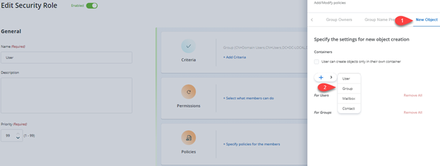
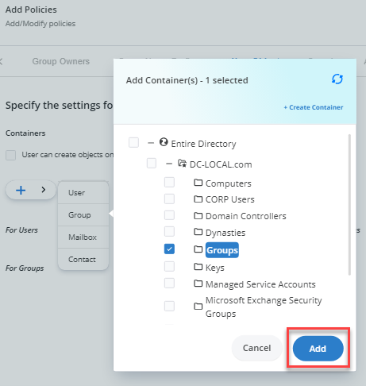

---
description: >-
  Shows how to restrict role members so they can create groups only within a
  specified OU by using Netwrix Directory Manager’s New Object policy in the
  Admin Center.
keywords:
  - Netwrix Directory Manager
  - New Object policy
  - OU
  - groups
  - security role
  - Identity Stores
  - Admin Center
  - group creation
products:
  - directory-manager
sidebar_label: How To Enforce Users to Create Groups in a Specifi
tags:
  - security-permissions-and-access-control
title: "How To Enforce Users to Create Groups in a Specific OU"
knowledge_article_id: kA0Qk0000000HiPKAU
---

# How To Enforce Users to Create Groups in a Specific OU

## Applies To:
Netwrix Directory Manager 11

## Business Requirement:
Using the Netwrix Directory Manager portal, users can create groups in any OU in the directory. Is there a way to limit users to create groups in a specific OU?

## Solution:
In Netwrix Directory Manager, you can apply policies to security roles, so that role members can use Netwrix Directory Manager in keeping with the policy restrictions.

Netwrix Directory Manager’s **New Object** policy enables you to restrict role members to create new groups in a specific OU only.

## Steps:
1. In the Netwrix Directory Manager Admin Center portal, click the **Identity Stores** tab.
2. On the **Identity Stores** tab, click on the **Triple Dot** button and then click **Edit** to open its properties.
3. On the **Security Roles** tab, select the security role you would like to apply the **New Object** policy to (for example, **User**).
4. On the **Policies** tab, click **New Object** in the left pane.
5. Select **Groups** and click **Add**.
6. On the **Select Container** dialog box, select the container in which role members can create groups (this will be the default OU when creating groups).

   The selected OU appears below the **Groups** option.

   

   
7. Click **OK**.
8. Click **Update Security Role** and then **Save**.

Now when members of the security role try to create groups, they will be created in the default OU that you specified in the **New Object** policy.

## Related Articles:
- [Walkthrough Search Policy - Define Scope and Filter Results](/docs/kb/directorymanager/security-permissions-and-access-control/walkthrough-search-policy-define-scope-and-filter-results)
- [How To Import Members to a Group Using Self-Service Import Wizard](/docs/kb/directorymanager/workflows-automation-and-lifecycle-management/how-to-import-members-to-a-group-using-self-service-import-wizard)
- [How to Trigger a workflow When a User Сreates a Group](/docs/kb/directorymanager/workflows-automation-and-lifecycle-management/how_to_trigger_a_workflow_when_a_user_сreates_a_group)
- [How To Add Message Approvers in Group Properties in Netwrix Directory Manager Portal](/docs/kb/directorymanager/configuration-and-integration/how-to-add-message-approvers-in-group-properties-in-groupid-portal)
- [Best Practices for Controlling Changes to Group Membership](/docs/kb/directorymanager/reporting-export-and-data-management/best-practices-for-controlling-changes-to-group-membership#netwrix-directory-manager-best-practices)
- [How To Enforce Users to Create Groups in a Specific OU](/docs/kb/directorymanager/security-permissions-and-access-control/how-to-enforce-users-to-create-groups-in-a-specific-ou)
- [Best Practices for Preventing Accidental Data Leakage](/docs/kb/directorymanager/security-permissions-and-access-control/best-practices-for-preventing-accidental-data-leakage)
