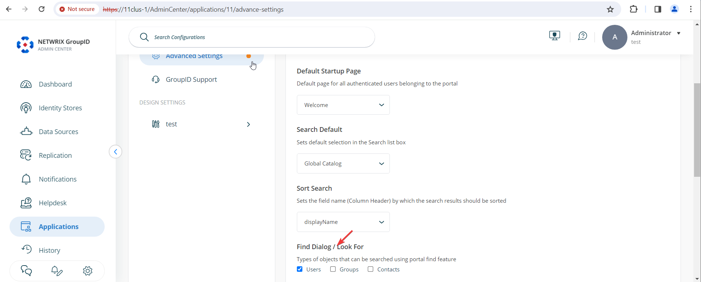

---
description: >-
  Learn how to configure the Netwrix Directory Manager portal so the Find dialog
  searches only user objects. This article shows where to change the Portal &
  Search setting to disable Contacts and Groups.
keywords:
  - directory manager
  - user portal
  - find dialog
  - search
  - object types
  - users
  - contacts
  - groups
  - portal settings
products:
  - directory-manager
sidebar_label: How to Limit Searchable Object Types in User Porta
tags:
  - security-permissions-and-access-control
title: "How to Limit Searchable Object Types in User Portals"
knowledge_article_id: kA0Qk0000002EQHKA2
---

# How to Limit Searchable Object Types in User Portals

## Applies To:
Netwrix Directory Manager 11

## Overview
By default, the **Find** dialog box in Netwrix Directory Manager 11 portals allows users to search for all object types, including users, contacts, and groups. You can configure the portal settings to restrict the **Find** dialog box so that users can search only for user objects. This article explains how to update the settings to limit search results to user objects only.

## Instructions
1. In the **Netwrix Directory Manager Admin Center**, go to **Applications**. For the application or portal where you want to implement this setting, click the three dots (**...**) and select **Settings**.

   

2. On the next page, click **Advanced Settings**. Under the **Portal & Search** tab on the right, find the option named **Find Dialogue / Look For**. Uncheck **Groups** and **Contacts** to limit searches to user objects only.

   

3. Scroll down and click the **Save** button to apply your changes.

## Impact
Before making this change, the **Find** dialog box allows searches for *Users*, *Contacts*, and *Groups*:

After updating the settings to allow only **Users**, the **Find** dialog box will display only the *User* object type in searches:

