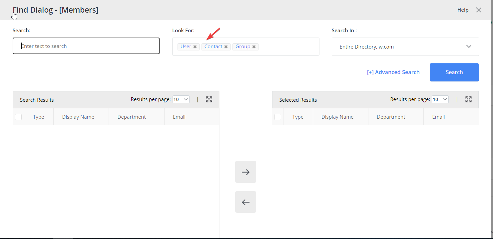
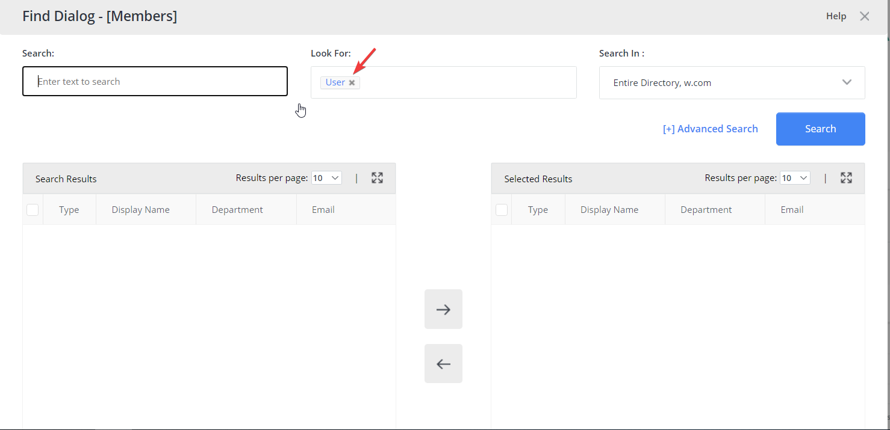

---
description: >-
  Shows how to configure Netwrix Directory Manager so users can search only for
  User objects in the User portal's Find dialog box.
keywords:
  - Netwrix Directory Manager
  - Find dialog
  - user portal
  - search settings
  - portal settings
  - advanced settings
  - user objects
products:
  - directory-manager
visibility: public
sidebar_label: How to Limit Users to Search Only for User Objects
tags:
  - security-permissions-and-access-control
title: "How to Limit Users to Search Only for User Objects"
knowledge_article_id: kA0Qk0000002NOjKAM
---

# How to Limit Users to Search Only for User Objects

## Overview

This article explains how to configure Netwrix Directory Manager so that users can search only for User objects in the User portal's **Find** dialog box.

By default, the **Find** dialog box allows users to search for all object types, including users, contacts, and groups. You can restrict this feature to specific object types by adjusting the portal settings.

## Instructions

1. In the **Directory Manager Admin Center**, go to **Applications**. Locate the desired application/portal and click the three-dot icon to select **Settings**.

   

2. Click **Advanced Settings**. Under the **Portal & Search** tab on the right, locate the **Find Dialogue / Look For** option. Uncheck **Groups** and **Contacts** to limit searches to User objects only.

   

3. Scroll down and click **Save** to apply your changes.

## Result

By default, the **Find** dialog box allows searches for *Users*, *Contacts*, and *Groups*.

After applying the configuration, the **Find** dialog box will display only the **User** object type in searches.

