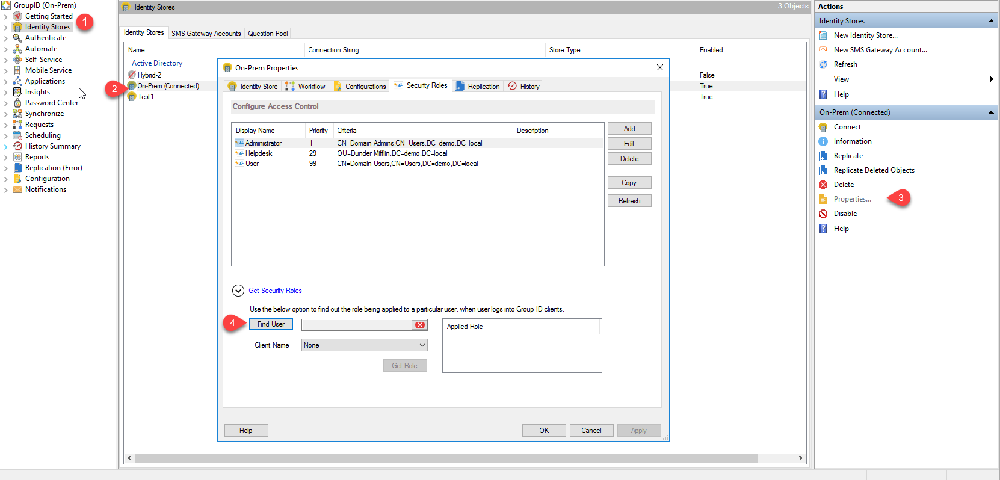
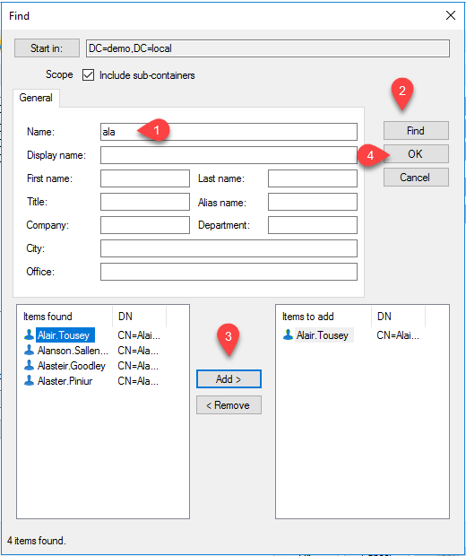
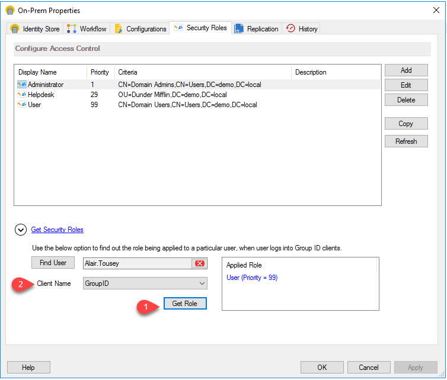

---
description: >-
  Shows how to view a user’s assigned security roles in an identity store for
  any Netwrix Directory Manager client. Covers Management Console steps to find
  a user’s role per client or portal.
keywords:
  - Netwrix Directory Manager
  - roles
  - security roles
  - identity store
  - Management Console
  - find user
  - client role
  - Self-Service
products:
  - directory-manager
sidebar_label: How to View Roles Assigned to a User v10
tags:
  - security-permissions-and-access-control
title: "How to View Roles Assigned to a User v10"
knowledge_article_id: kA0Qk0000002C1tKAE
---

# How to View Roles Assigned to a User v10

## Applies To
Netwrix Directory Manager 10

## Overview
Netwrix Directory Manager allows you to assign security roles to users in an identity store, controlling their access and permissions. Knowing which roles are assigned to each user is important for effective access management and security.

This article explains how to quickly view a user's assigned security roles in an identity store for any Netwrix Directory Manager client.

### Directory Manager Clients
You can check a user's security role assignment for the following Netwrix Directory Manager clients:

- Automate
- Management Shell
- Netwrix Directory Manager Mobile app
- All Self-Service and Password Centre portals created using Netwrix Directory Manager

## Instructions
1. In the Netwrix Directory Manager Management Console, click the **Identity Stores** node.
2. On the **Identity Stores** tab, double-click an identity store to open its properties.
3. On the **Security Roles** tab, click **Get Security Roles** to view the roles assigned to a user in the selected Netwrix Directory Manager client.  
   
4. Click the **Find User** button to specify the user you want to check the role for.
5. The **Find** dialog box is displayed, where you can search for and select the required user. You can use the **Delete** icon to remove the selected user and specify another one.  
   
6. In the **Client Name** list, select a Netwrix Directory Manager client to view the user’s role for that client. To see the user’s role in a specific portal, select the relevant Self-Service portal. To view the user’s highest privileged role in Netwrix Directory Manager, select `None`.  
   
7. Click the **Get Role** button. The **Applied Role** area shows the user role for the selected client along with role priority. For `None`, the highest privileged role of the user is displayed, regardless of any client.
