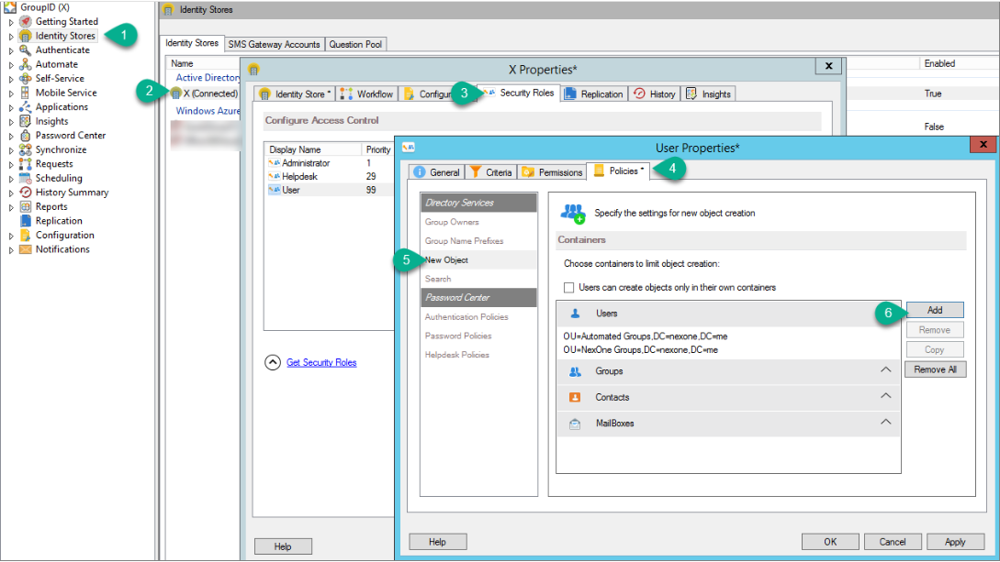
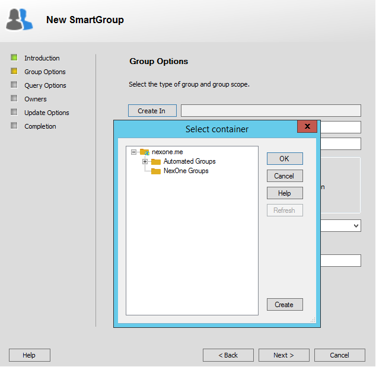
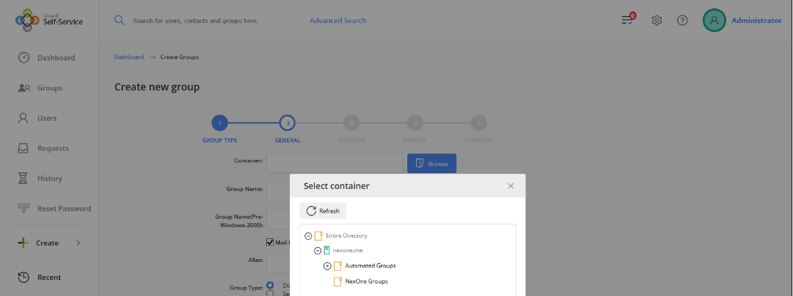
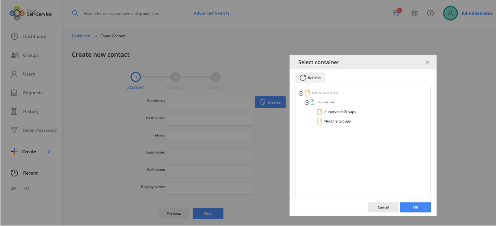

---
description: >-
  Shows how to limit users so they can create new directory objects only in
  specified containers by applying the New Object policy to security roles in
  Netwrix Directory Manager. Includes steps for configuring the policy and
  expected results in Automate and Self-Service portals.
keywords:
  - Netwrix Directory Manager
  - New Object policy
  - security roles
  - containers
  - organizational units
  - create objects
  - Automate
  - Self-Service
  - groups
  - contacts
products:
  - directory-manager
sidebar_label: Limit Users to Create New Objects in Specified Con
tags:
  - security-permissions-and-access-control
title: "Limit Users to Create New Objects in Specified Containers"
knowledge_article_id: kA0Qk0000002Jo9KAE
---

# Limit Users to Create New Objects in Specified Containers

## Overview

This article explains how to limit users to creating new objects only in specified containers in Netwrix Directory Manager. By applying the **New Object** policy to security roles, you can restrict where users are allowed to create groups, mailboxes, and other directory objects.

## Instructions

1. In the Directory Manager Management Console, click the **Identity Stores** node.  
2. On the **Identity Stores** tab, double-click the required identity store to open its properties.  
3. On the **Security Roles** tab, select a role to manage its policies and click **Edit**.  
4. On the properties page, click the **Policies** tab then click **New Object** in the left pane.  
5. Choose one of the following options:

   - **Limit role members to create objects only in their own containers:**
     1. Select the **Users can create objects only in their own containers** check box.  
     2. The **Select Container** option will be disabled when role members create new objects.

   - **Specify a container for an object type:**
     1. Select the object type you want to specify a container for. The arrow for the selected object will point downward.  
     2. Click **Add**.  
     3. In the **Select Container** dialog box, select one or more containers where role members can create the selected object type. If the selected container is a parent, child containers are automatically selected; you can unselect child containers if needed. Role members will only see the selected containers when creating new objects and can choose the desired container.  
     4. Click **OK**.

6. Click **Apply** and then **OK** on the **New Object** page.

> **NOTE:** Removing all containers for an object type means the New Object policy no longer applies to that object type, and users can create the object in any OU in the identity store.

## Expected Results

With the New Object policy applied, role members can create new objects only in the specified containers.

### In Automate

- On the **Group Options** page of the **New Group** wizard, users can view and select only the specified OUs for new group creation.  
  

### In the Self-Service portal

- On the **General** page of the **Create Group** wizard, users can view and select only the specified OUs for new group creation.  
  

- On the **Account** page of the **Create Contact** wizard, users can view and select only the specified OUs for new contact creation.  
  
