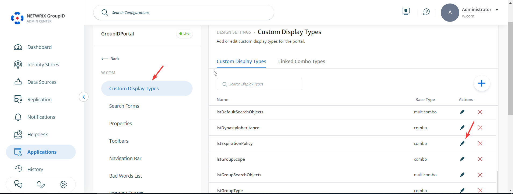
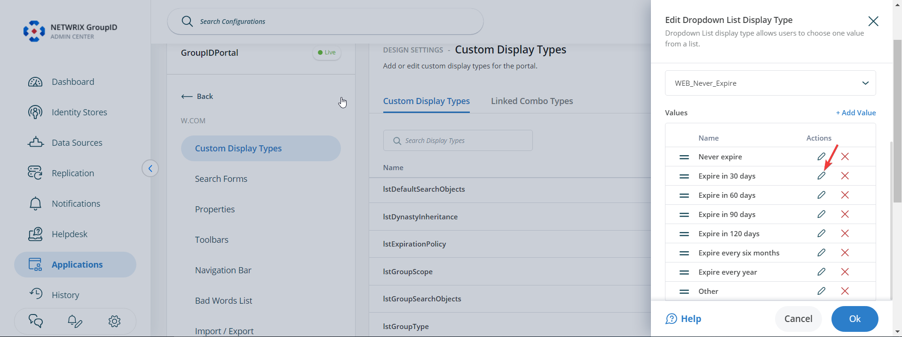
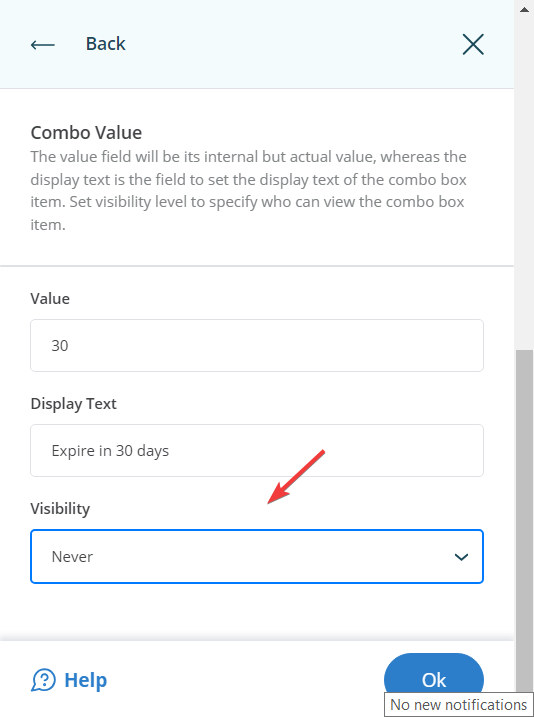
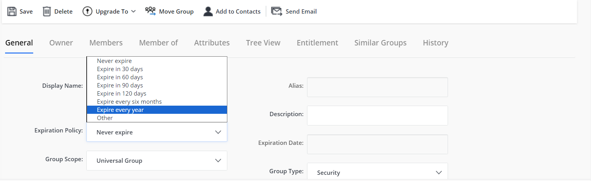
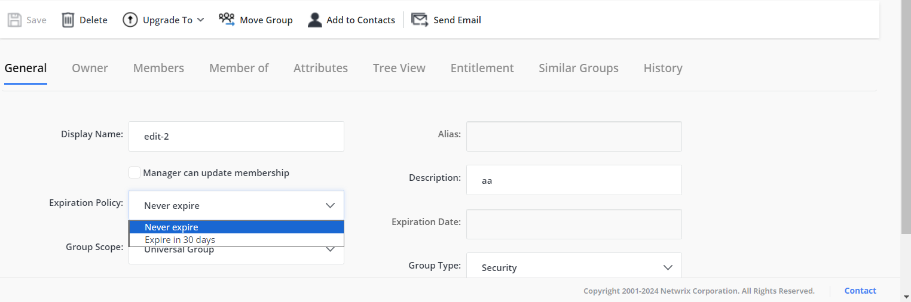
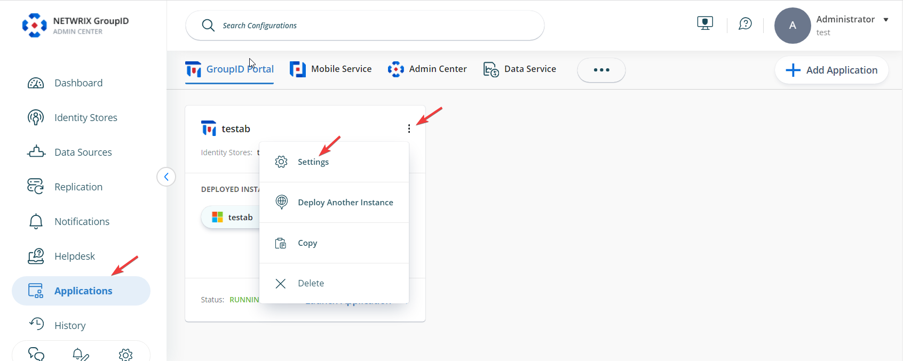
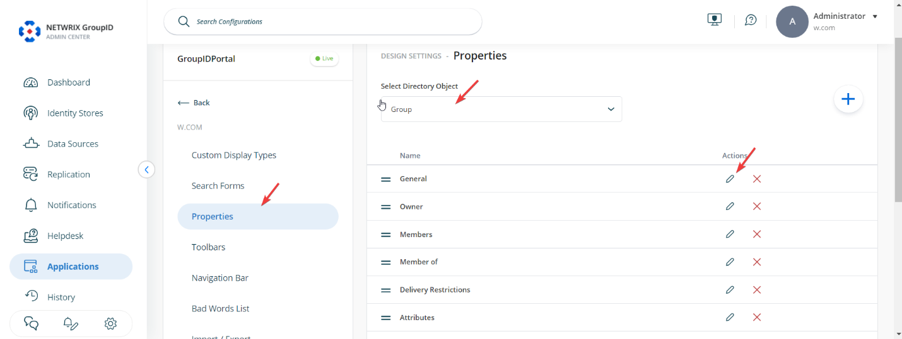
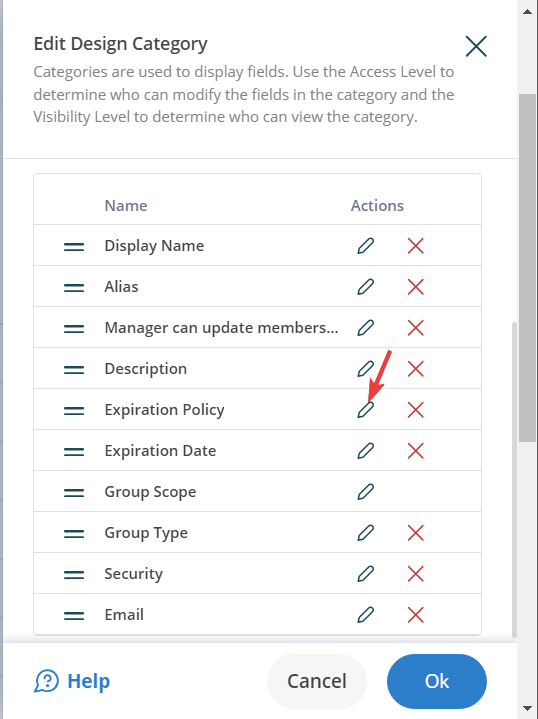
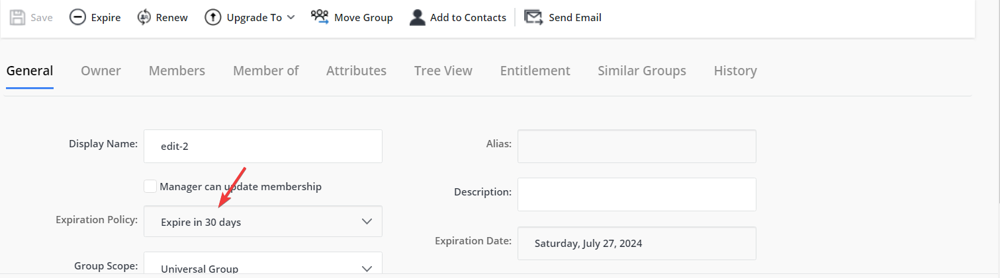

---
description: >-
  Shows how to restrict which Expiration Policy options are visible or make the
  Expiration Policy field read-only or hidden for specific roles in the Netwrix
  Directory Manager portal.
keywords:
  - expiration policy
  - roles
  - Netwrix Directory Manager
  - portal settings
  - lstExpirationPolicy
  - read-only
  - design settings
  - Admin Center
products:
  - directory-manager
sidebar_label: Restricting Expiration Policy Options by Role
tags:
  - security-permissions-and-access-control
title: "Restricting Expiration Policy Options by Role"
knowledge_article_id: kA0Qk0000002Is5KAE
---

# Restricting Expiration Policy Options by Role

## Applies To
Netwrix Directory Manager 11

## Overview
By default, all expiration policy options are available in the **Expiration Policy** drop-down list for group properties in Netwrix Directory Manager 11. You can customize which options are visible or make the drop-down list read-only or hidden for specific roles. This article explains how to configure these settings in the portal.

## Instructions

### Show Specific Options in the Expiration Policy List
1. In Netwrix Directory Manager Admin Center, go to **Applications**. Under **Directory Manager Portal**, click the three dots (**...**) next to your portal and select **Settings**.  

   

2. On the **Server Settings** tab, under **Design Settings**, select your portal.  

   

3. On the **Custom Display Types** tab, select `lstExpirationPolicy` and click **Edit**.  

   

4. In the **Edit Dropdown List Display Type** window, select a value in the **Values** area and click **Edit**. The **Values** area displays all values defined for the Expiration Policy drop-down list.  

   

5. In the **Combo Value** dialog box, select a visibility level for the value:
   - Select a role to make the value visible to users of that role and roles with a higher priority value.
   - Select `Never` to hide the value from all users.  

   

6. Click **OK** to close the **Combo Value** and **Edit Design Type** dialog boxes. Then click the **Save** icon at the bottom to save your changes.

You can set the visibility level for all required values in the **Expiration Policy** drop-down list.

By default, or if no visibility settings are configured, all expiry options are available in the **Expiration Policy** drop-down list:

After applying visibility settings, only the selected values will be available. For example, if you set `Never` for all but two values, only those two will appear in the list:

> **NOTE:** You can also completely hide the **Expiration Policy** drop-down list or make it read-only.

### Make the Expiration Policy Drop-Down List Read-Only
1. In Netwrix Directory Manager Admin Center, go to **Applications**. Under **Directory Manager Portal**, click the three dots (**...**) next to your portal and select **Settings**.  

   

2. On the **Server Settings** tab, under **Design Settings**, select your portal.  

   

3. On the **Properties** tab, select `Group` in the **Select Directory Object** list. Then select the **General** option and click **Edit**.  

   

4. In the **Edit Design Category** dialog box, select the **Expiration Policy** option in the **Fields** section and click **Edit**.  

   

5. In the **Edit Field** dialog box, select a role in the **Access Role** list. The access level determines whether a user can change the value in the **Expiration Policy** drop-down list.
   - Select a role to allow users of that role and roles with a higher priority value to change the value.
   - Select `Never` to make the **Expiration Policy** drop-down list read-only for all users.
   - Alternatively, select the **Is Read Only** check box to disable the list for all users, so they can view its value but cannot change it.

6. Click **OK** to close the **Edit Field** and **Edit Design Category** dialog boxes. Then click the **Save** icon at the bottom of the page.

The disabled **Expiration Policy** drop-down list will be displayed in the portal as shown below. The **Expiration Date** field is also read-only and displays the group's expiry date, as calculated based on the expiry policy.

