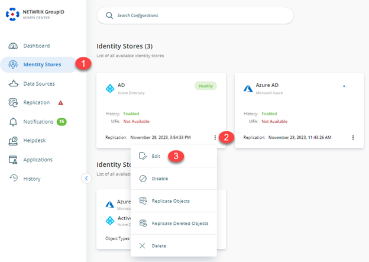
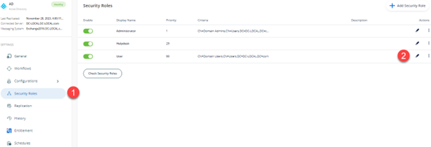
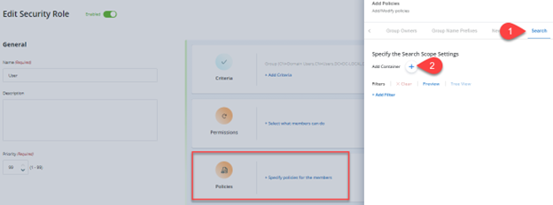
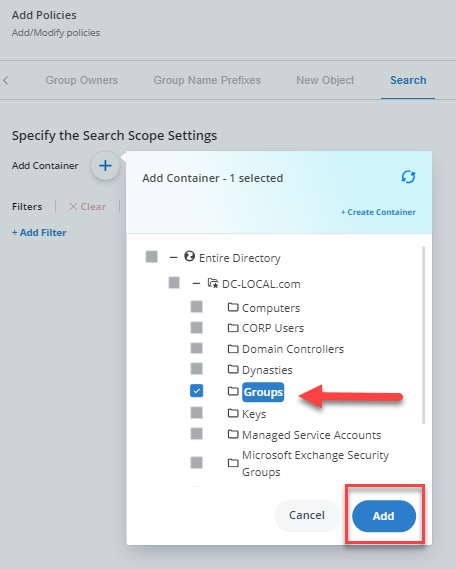
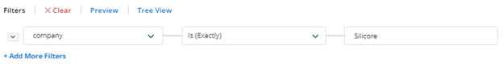
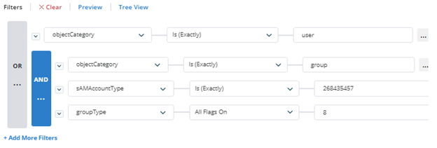
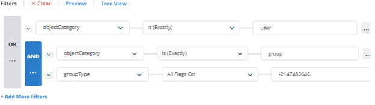
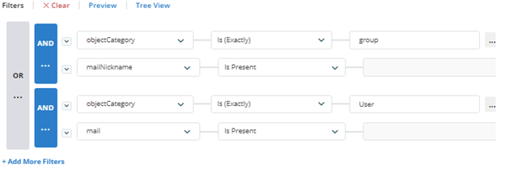

---
description: >-
  Shows how to configure the Search Policy for security roles in Netwrix
  Directory Manager to restrict search scope to a specific OU and filter results
  by Active Directory attributes.
keywords:
  - directory manager
  - search policy
  - LDAP filter
  - OU
  - Active Directory
  - security roles
  - search scope
  - filters
products:
  - directory-manager
sidebar_label: Walkthrough Search Policy - Define Scope and Filte
tags:
  - security-permissions-and-access-control
title: "Walkthrough Search Policy - Define Scope and Filter Results"
knowledge_article_id: kA0Qk0000000HQfKAM
---

# Walkthrough Search Policy - Define Scope and Filter Results

## Applies To:
Netwrix Directory Manager 11

## Business Requirement:
Set Netwrix Directory Manager search in such a way that AD objects (e.g., *Groups, Users, Contacts*) can only be searched within a specific OU and filtered based on Active Directory attributes.

## Solution:
This business requirement can be achieved by configuring the Search Policy for security roles in an identity store.

## More Information:
Use the Search policy to:

- Limit the search scope to a particular container for role members.
- Designate an LDAP criterion that uses AD attributes to add a search filter.

Let's assume you specify a container and set the LDAP filter to (`Country=United States*`). When a role member performs a search, Netwrix Directory Manager looks up the container and displays objects that have the `United States` as a value for the `Country` attribute.

Now consider these scenarios:

- If you only specify a container, a search performed by role members returns all matching objects residing in that container.
- If you only specify an LDAP filter, a search performed by role members displays only those objects with the Country attribute set to the United States from all containers in the identity store.

By default, or in the absence of this policy, any search performed by role members returns objects from all containers in the identity store.

## Apply the Search Policy:
1. In Netwrix Directory Manager Admin Center, click the **Identity Stores** node.
2. On the **Identity Stores** tab, click on the **Triple Dot** button, and then click on the **Edit** button to go to the properties of the required identity store.

   

3. On the **Security Roles** tab, select a role to define a search policy for it, and click **Edit**.

   

4. On the **Role Properties** page, click the **Policies** tab and then click **Search** in the left pane.

   

5. Click the **Plus** button and select a container. A search performed by role members would return objects that reside in this container.

   

### Choose a Search Filter:
When you apply an LDAP filter, a search performed by role members only shows objects that match the specified criterion.

1. In the **Filter** area on the **Search** page, click on **+Add Filter**, and select a schema attribute from the drop-down list (for example, `Company`).
2. Select an operator from the second drop-down list (for example, *Is Exactly*).
3. Enter a value concerning the selected schema attribute in the third box.

   

You can define multiple queries by clicking on the **+Add More Filters** and using the **AND** or **OR** operator to group all rows that make up a query.

A down arrow appears in the applied operator's icon. Click it to display the context menu with the following options:

- **Select Group** to select all rows that make up the query.
- **Ungroup** to remove the operator and ungroup the rows.
- **Change** to change the AND operator to OR and vice versa.
- **Add Clause** to add a new row for specifying an additional clause for the query.
- **Delete** to delete the query with all its rows.

## Some Useful Examples:
- To limit searches to mail-enabled distribution groups and all users:

  

- Limit searches to all global security groups and all users:

  

- Limit searches to mail-enabled groups and mail-enabled users:

  

### Related Articles:
- [Walkthrough Search Policy - Define Scope and Filter Results](/docs/kb/directorymanager/security-permissions-and-access-control/walkthrough-search-policy-define-scope-and-filter-results)
- [How To Import Members to a Group Using Self-Service Import Wizard](/docs/kb/directorymanager/workflows-automation-and-lifecycle-management/how-to-import-members-to-a-group-using-self-service-import-wizard)
- [How to Trigger a workflow When a User Сreates a Group](/docs/kb/directorymanager/workflows-automation-and-lifecycle-management/how_to_trigger_a_workflow_when_a_user_сreates_a_group)
- [How To Add Message Approvers in Group Properties in Netwrix Directory Manager Portal](/docs/kb/directorymanager/configuration-and-integration/how-to-add-message-approvers-in-group-properties-in-groupid-portal)
- [Best Practices for Controlling Changes to Group Membership](/docs/kb/directorymanager/reporting-export-and-data-management/best-practices-for-controlling-changes-to-group-membership#netwrix-directory-manager-best-practices)
- [How To Enforce Users to Create Groups in a Specific OU](/docs/kb/directorymanager/security-permissions-and-access-control/how-to-enforce-users-to-create-groups-in-a-specific-ou)
- [Best Practices for Preventing Accidental Data Leakage](/docs/kb/directorymanager/security-permissions-and-access-control/best-practices-for-preventing-accidental-data-leakage)
