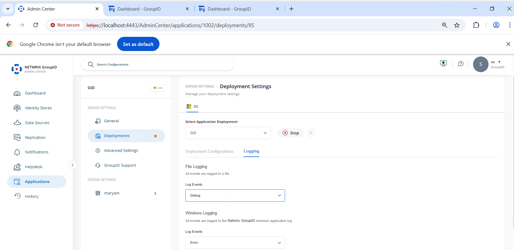
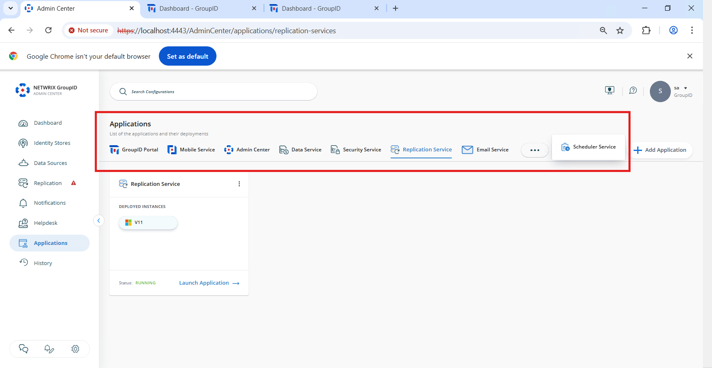

---
description: >-
  Learn how to change the log level from Error to Debug in Netwrix Directory
  Manager 11 to capture more detailed logging for troubleshooting and support.
keywords:
  - Netwrix Directory Manager
  - logging
  - debug
  - Admin Center
  - troubleshooting
  - log level
  - services
  - replication
  - scheduler
products:
  - directory-manager
sidebar_label: Change Log Level from Error to Debug v11
tags:
  - system-administration-and-maintenance
title: "Change Log Level from Error to Debug v11"
knowledge_article_id: kA0Qk0000002F6DKAU
---

# Change Log Level from Error to Debug v11

## Applies To
Netwrix Directory Manager 11

## Overview
By default, Netwrix Directory Manager records only critical errors in its logs. If you need to investigate unexpected behavior, debug a failed process, or work with support, you can increase the log level to capture more detailed information. Setting the log level to **Debug** provides deeper insight into system operations and helps you identify and resolve issues more effectively.

## Instructions

### Change Log Level from Error to Debug
1. Go to the **Admin Center**.
2. Navigate to **Applications**.
3. Open the **Settings** for the application you want to modify.
4. Go to **Deployments**.
5. Select **Logging**.
6. Set both **File Logging** and **Windows Logging** to **Debug** using the dropdown lists.
7. Click **Save** to apply the changes.  
   
8. Repeat these steps for each of the following applications:
   - Replication Service
   - Admin Center
   - Data Service
   - Security Service
   - Email Service
   - Mobile Service
   - Scheduler Service

9. Once complete, Netwrix Directory Manager will capture detailed logs for better system monitoring and troubleshooting.
