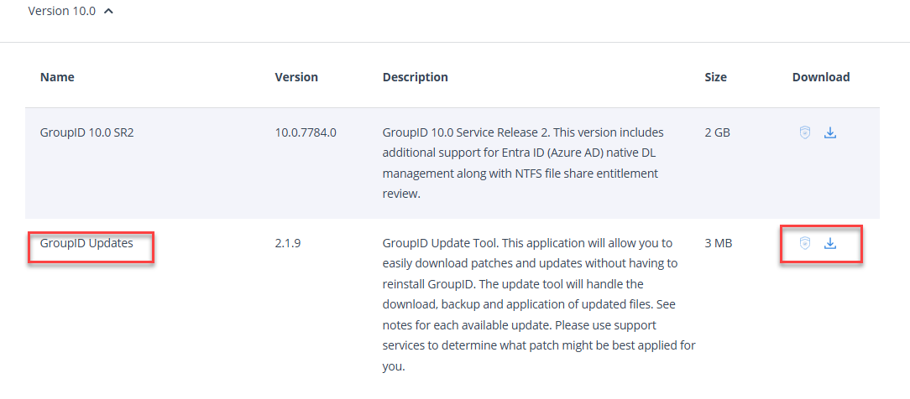
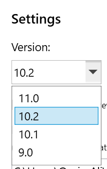
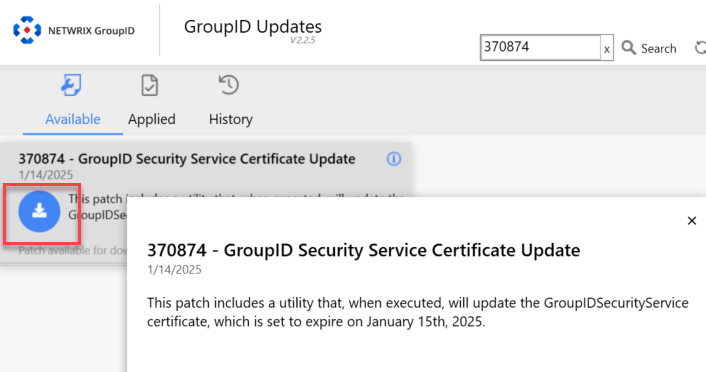
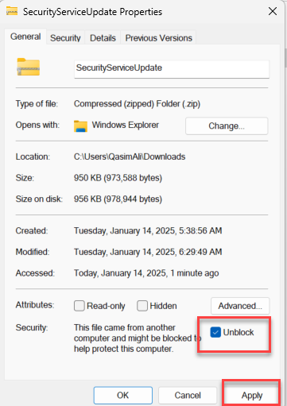
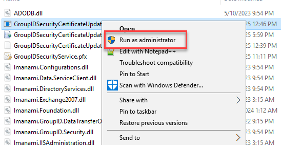
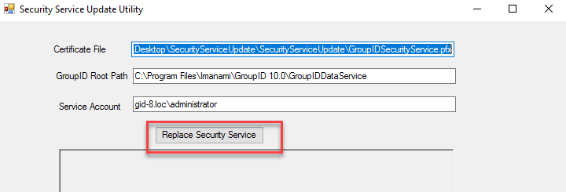
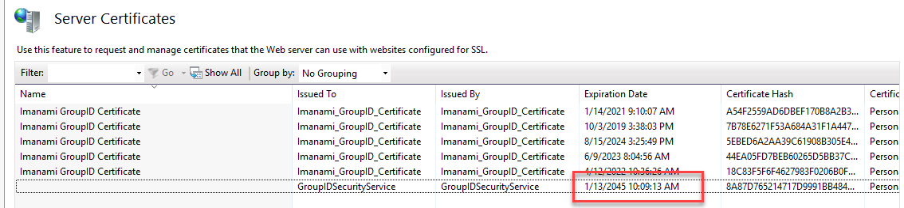
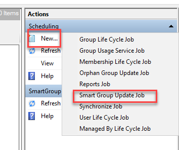
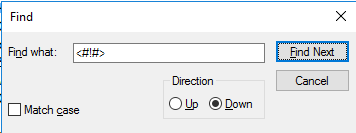
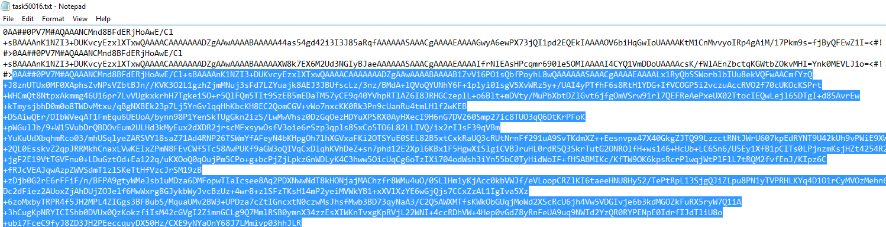

---
description: >-
  Step-by-step instructions to replace the Netwrix Directory Manager Security
  Service SSL certificate that expires on January 15, 2025, including patch
  download, certificate replacement, scheduled job updates, and an automation
  PowerShell script.
keywords:
  - Netwrix Directory Manager
  - security service
  - certificate replacement
  - SSL
  - scheduled jobs
  - IISRESET
  - PowerShell
  - 370874
products:
  - directory-manager
sidebar_label: How to Replace the Security Service Certificate
tags:
  - system-administration-and-maintenance
title: "How to Replace the Security Service Certificate"
knowledge_article_id: kA0Qk0000001rWvKAI
---

# How to Replace the Security Service Certificate

## Applies To

Netwrix Directory Manager 10SR2

## Overview

The Netwrix Directory Manager Security Service relies on an SSL certificate to function properly. This certificate, which expires on January 15, 2025, is essential for secure operations such as user authentication, authorization, and encryption of data between clients and the SQL Server database. This article provides step-by-step instructions for replacing the certificate when it expires.

## Instructions

### Replace the Security Service Certificate

Follow the steps below to replace the Security Service certificate:

1. Open the **Directory Manager Updates** tool then click on **Settings**.
2. Select Version as `10.2` and download patch #`370874`, but DO NOT apply it yet.
3. If you do not have the Directory Manager Updates tool, you can download it from https://www.netwrix.com/my_products.html.







4. Once downloaded, navigate to the patch download folder. Rename the file `370874.gpb` to `370874.zip`.
5. Once renamed, right-click the zip file and click **Properties**. In the **General** tab, uncheck **Unblock** and apply the changes.



6. After the zip file is unblocked, extract the contents of the ZIP file to access the utility. Run the `GroupIDSecurityServiceCertificateUpdate.exe` as an **Administrator**.



7. Verify that the **DataService** path and **Service Account** are correct.
8. Enter the information for the **Service Account** (e.g., Domain\Account_Name).
9. Click **Replace Security Service**. This action assigns the necessary permissions to the new certificate, replaces the existing one, and updates the thumbprints across all integrated applications.



10. Perform an `IISRESET` by launching Windows PowerShell/Command Prompt as an Administrator and typing `IISRESET`.
11. Verify the expiry date for the Security Service certificate by launching **IIS Manager Home** then clicking **Server Certificates**. The new expiration date should show **1/13/2045**.



### Update or Recreate Scheduled Jobs

Once the Directory Manager Security Service Certificate has been updated, you have two options for handling scheduled jobs.

- Recreate Existing Schedules (Recommended): Existing schedules will need to be recreated to ensure proper functionality after the certificate update. New schedules created after the certificate update will not require any changes.
- Update Existing Schedules (Advanced): If you prefer to update the existing schedules instead of recreating them, follow the steps below:

1. Create a backup of the Directory Manager Scheduled Job task files located at `\Program Files\Imanami\GroupID 10.0\Schedules`.
2. Create a new scheduled job in the Directory Manager Management Console. Any job type is acceptable, but the SmartGroup Update Job is recommended.



3. Navigate to `\Program Files\Imanami\GroupID 10.0\Schedules` and open the newly created task file. Sort by **Modified Date** to identify it.
4. Open the task file in Notepad.
5. Click at the beginning of the first line and press **CTRL + F**.
6. Search for `<#!#>`. On the second occurrence, copy everything afterward to the end of the file.





7. Open another Notepad file and save the copied information. You will use this in the next step.
8. Open each remaining task file in the same directory and replace the content after the second occurrence of `<#!#>` with the copied token.
9. Save and close each updated task file.
10. Open each schedule in the Directory Manager Management Console and reauthenticate.

### Automating Steps (3–9) Using PowerShell

Instead of manually completing steps 3–9, you can use the PowerShell script below to automate the process. This script extracts the token from the most recently modified task file and applies it to all other task files in the directory.

```powershell
# Define the folder containing the schedule files
$folderPath = "C:\Program Files\Imanami\GroupID 10.0\Schedules"

# Get the list of task files, sorted by Last Write Time (newest first)
$txtFiles = Get-ChildItem -Path $folderPath -Filter "*.txt" | Sort-Object LastWriteTime -Descending

# Get the content of the newest task file
$latestFile = $txtFiles[0]
$latestContent = Get-Content -Path $latestFile.FullName -Raw

# Split content to locate the token
$splitContent = $latestContent -split "<#!#>"

# Verify token structure
if ($splitContent.Count -ge 3) {
    $replacementContent = $splitContent[2]
} else {
    Write-Host "The latest file does not contain two '<#!#>' markers."
    exit
}

# Apply the token to other task files
foreach ($file in $txtFiles[1..($txtFiles.Count - 1)]) {
    $content = Get-Content -Path $file.FullName -Raw
    $parts = $content -split "<#!#>"
    if ($parts.Count -ge 3) {
        $newContent = $parts[0] + "<#!#>" + $parts[1] + "<#!#>" + $replacementContent
        Set-Content -Path $file.FullName -Value $newContent -NoNewline
        Write-Host "Updated file: $($file.Name)"
    } else {
        Write-Host "Skipped file (less than two '<#!#>' markers): $($file.Name)"
    }
}
```

> **NOTE:** In a primary–secondary server environment, the above process must be implemented first on the primary server and then on the secondary servers.
