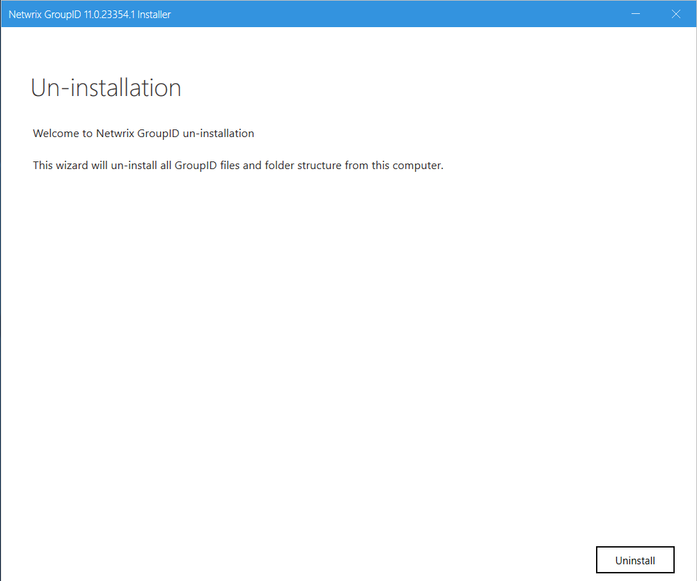
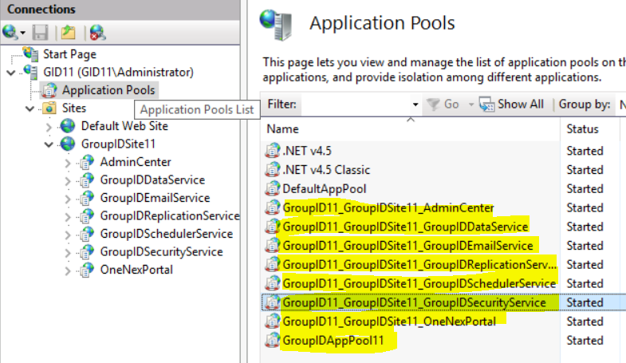

# Uninstalling Directory Manager

## Overview

This article explains how to uninstall previous versions of Netwrix Directory Manager (formerly GroupID) to upgrade to the latest version. It also provides instructions for completely removing Directory Manager from your machine.

## Instructions

Follow these steps to uninstall Netwrix Directory Manager for an upgrade or to completely remove it from your machine.

> **NOTE:** Before you uninstall Directory Manager, ensure that the logged-in user is a member of the local Administrators group on the machine. Make sure the Directory Manager portal is fully closed before you begin the uninstall process.

### Uninstall Netwrix Directory Manager to Upgrade to a Newer Version

1. Double-click the `setup.exe` file in the Directory Manager installation package to launch the Directory Manager Installer.  
   
2. Click **Uninstall Directory Manager** to remove the application files via **Programs & Features** in Control Panel.
3. Proceed with the upgrade to the newer version of Directory Manager.
4. Click the **Install Directory Manager** link on the Directory Manager Installer to install the latest version.
5. After installation, run the Upgrade wizard to make earlier version data compatible with the new version.

### Completely Uninstall Directory Manager from the Machine

1. Click **Uninstall Directory Manager** on the Directory Manager Installer to uninstall the application files from your computer.
2. Remove the following components to ensure complete uninstallation:
   - Directory Manager installation directory
   - Other relevant directories
   - Directory Manager DLLs
   - Registry keys
   - Services files
   - Directory Manager application pool
   - Directory Manager certificates

#### Remove the Installation Directory, Other Directories, DLLs, Registry Keys, and Services Files

On the Directory Manager machine, complete the following cleanup steps:

1. Delete the installation directory: navigate to `X:\Program Files\Imanami` (where X represents the installation drive) and delete the directory named **Directory Manager [version]** (for example, Directory Manager 11).
2. Delete other relevant directories: right-click the Windows button, select **Run**, type `%ALLUSERSPROFILE%\Imanami`, press Enter, and delete the **Directory Manager** folder from the location referenced in the command.
3. Delete the Directory Manager DLLs: navigate to `C:\Windows`, search for all DLL files with names starting with **Netwrix** (type `Netwrix*.dll` in the Windows Explorer Search box to find them), and delete these files.
4. Delete the registry keys: open **Registry Editor** and delete the following registry key (for Directory Manager 11.0):

   ```text
   HKEY_LOCAL_MACHINE\SOFTWARE\Imanami\GroupID\Version 11.0
   ```

5. Delete the services files: navigate to `C:\Windows\Microsoft.NET\Framework64\v4.0.30319\Temporary ASP.NET Files` and delete the **root** folder.

#### Remove IIS Portal Files, the Application Pool, and Certificates

On the Directory Manager machine, open the Internet Information Services (IIS) console by typing `inetmgr` in the Windows **Run** dialog box, then complete the following:

1. Remove the portal files: under the **GroupIDSite** node in the console tree, locate the portals you have created using the portal names, and delete each portal by right-clicking it and selecting **Remove** from the shortcut menu. Then navigate to `C:\Windows\Microsoft.NET\Framework64\v4.0.30319\Temporary ASP.NET Files` and delete each portal folder one by one.
2. Remove the application pool: expand the **\<machine name\>** node in the console tree and click **Application Pools**. On the Application Pools page, delete **Directory Manager App Pool 11** and all other pools that start with **GroupID11_GroupIDSite11** prefixes.  
   
3. Remove the certificates: click the **\<machine name\>** node in the console tree. On the **Features View** tab, select **Server Certificates** in the **IIS** section, then delete these certificates bound to **GroupIDSite** (the site deploying Directory Manager Data Service):
   - GroupIDSecurityService
   - Netwrix Directory Manager Certificate

> **NOTE:** Do not remove these certificates if another Directory Manager version is installed on the machine.
