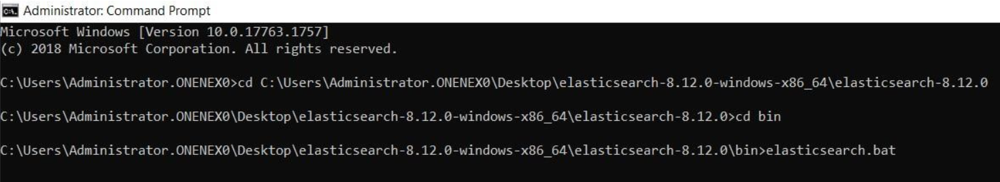
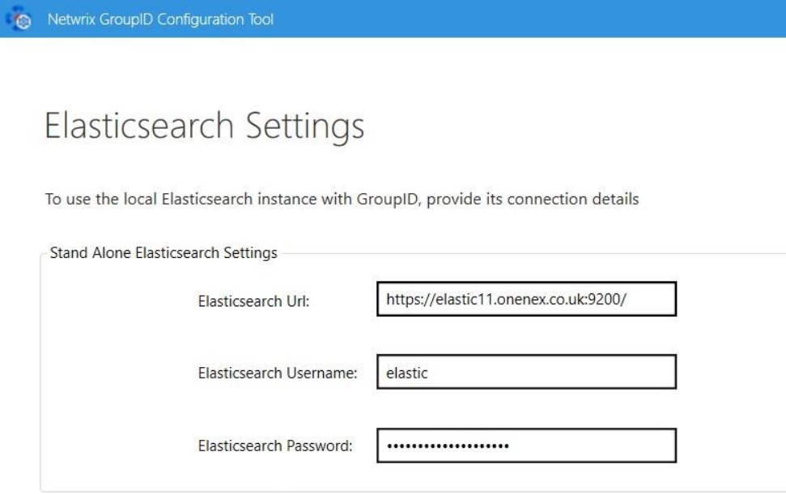

---
description: >-
  Shows how to install and configure Elasticsearch on a separate machine for use
  with Netwrix Directory Manager 11, including installing it as a Windows
  service and configuring the product to use the external instance.
keywords:
  - elasticsearch
  - elastic repository
  - Netwrix Directory Manager
  - GroupID
  - install Elasticsearch
  - elasticsearch-service
  - elasticsearch-reset-password
  - Windows service
products:
  - directory-manager
sidebar_label: Manage Elastic Repository on a Separate Instance w
tags:
  - system-administration-and-maintenance
title: "Manage Elastic Repository on a Separate Instance with V11"
knowledge_article_id: kA0Qk00000015nFKAQ
---

# Manage Elastic Repository on a Separate Instance with V11

## Applies To
Netwrix Directory Manager 11

## Question
Is it possible to manage the Elastic repository on a separate instance in Netwrix Directory Manager (formerly GroupID) 11?

## Answer
Yes, this is possible. To improve performance and manageability, you can install and configure Elasticsearch on a separate machine for use with Netwrix Directory Manager 11. Follow the steps below to complete the setup.

### Prerequisites
- Ensure that **Java 11 or higher** is installed. You can verify this by running `java -version` in Command Prompt (CMD).
- If you're installing Elasticsearch version 8.12 or later, Java installation is not required.
- Install a separate box for Elasticsearch for elastic repository management.

### Instructions
1. Install Elasticsearch on a separate machine by downloading the latest version from the official website.
2. Extract the package and open CMD.
3. Navigate to the `bin` directory and run `elasticsearch.bat`.  
   
4. Take note of the **username** and **password** provided upon successful installation. You may keep the password provided, but if you would like to reset the password, run the command below:

```bat
bin/elasticsearch-reset-password -u elastic
```

5. Access Elasticsearch via browser to confirm it is running.

> **NOTE:** If you run `elasticsearch.bat` in CMD without installing it as a service, Elasticsearch will stop running when the CMD window is closed. To keep it running independently, follow the next steps to install Elasticsearch as a Windows service.

1. To install Elasticsearch as a Windows service, run:

```bat
elasticsearch-service.bat install
```

in CMD. Let the installation complete.
2. Open `services.msc`, find **elasticsearch-service-x64**, set **Startup Type** to **Automatic**, and start the service.
3. Verify Elasticsearch is running by navigating to the service URL in your browser.
4. On the Netwrix Directory Manager server, open the **Netwrix Directory Manager Configuration Tool**. When prompted, select **I will install and manage Elastic myself**.
5. Enter the **URL** and **credentials** for the separate Elasticsearch machine.  
   
6. Complete the remaining configuration steps to finalize the setup.

Once completed, Netwrix Directory Manager 11 will be successfully configured to use an external Elasticsearch instance for its repository.
