---
description: >-
  Imanami PhoneID service is deprecated as of January 31, 2025. This article
  explains the impact on Netwrix Directory Manager, recommended replacement
  options using FIDO2/WebAuthn passkeys, and step-by-step enrollment guidance
  (including YubiKey support).
keywords:
  - Imanami PhoneID
  - PhoneID deprecated
  - passkey
  - WebAuthn
  - YubiKey
  - Netwrix Directory Manager
  - FIDO2
  - enrollment
products:
  - directory-manager
visibility: public
sidebar_label: PhoneID Authentication Option Discontinued
tags:
  - troubleshooting-and-errors
title: "PhoneID Authentication Option Discontinued"
knowledge_article_id: kA0Qk0000001tC9KAI
---

# PhoneID Authentication Option Discontinued

Netwrix Directory Manager - Imanami PhoneID Authentication Option Discontinued

## What is happening with Imanami PhoneID?

On January 31, 2025, the Imanami PhoneID service will be deprecated. At that time, the following activities using PhoneID will no longer function. An example of activities impacted:

- Requests to authenticate an identity using an already enrolled phone with this application will fail.
- Enrollment requests from the PhoneID mobile application will fail to send SMS notifications.
- Netwrix Directory Manager deployments will fail to register as a client to the PhoneID service.

## What will happen in the future?

As Netwrix Directory Manager will no longer support the Imanami PhoneID service, the user interface for enrollment and selection as an authentication service will be removed from the admin and user experiences with the release of Netwrix Directory Manager version 11.1.

## What are the viable replacement options available?

Netwrix recommends using Netwrix Directory Manager in conjunction with a FIDO2-based passkey token, utilizing Netwrix Directory Manager's support for WebAuthn. Below is an example of how to achieve this:

1. Enable YubiKey support in the configuration, even if you do not plan on using YubiKey hardware tokens.

   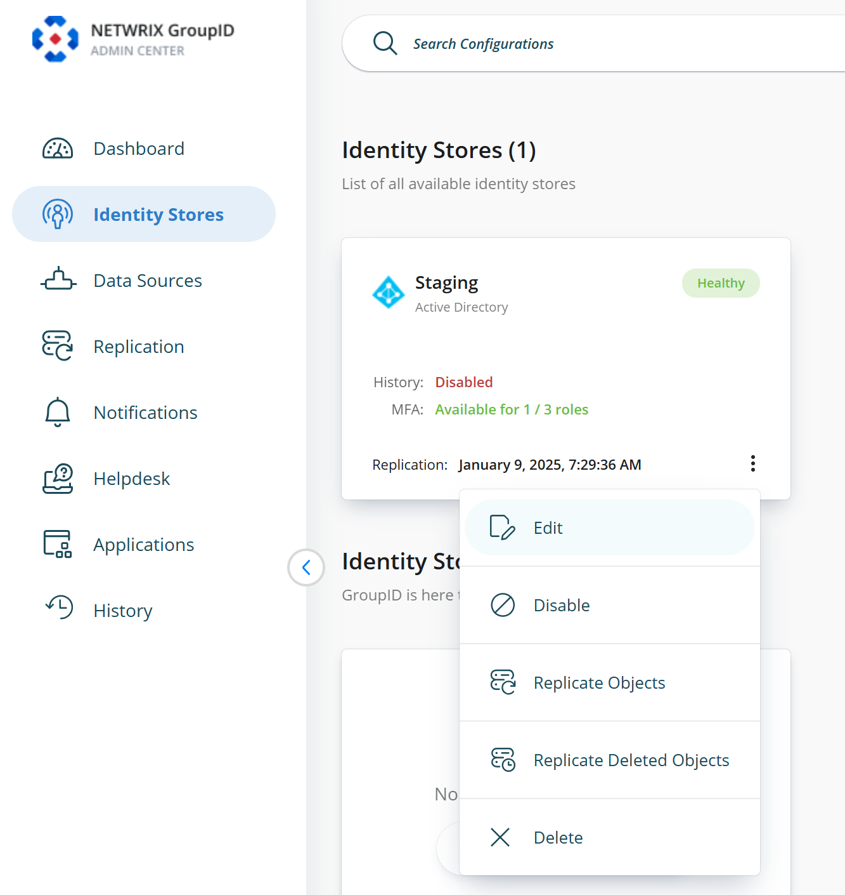

   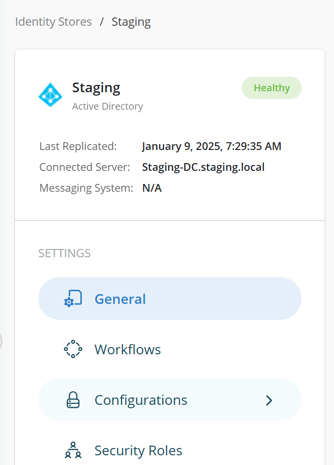

   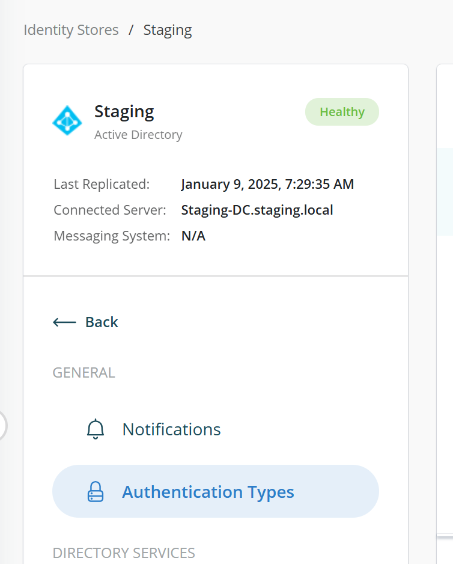

   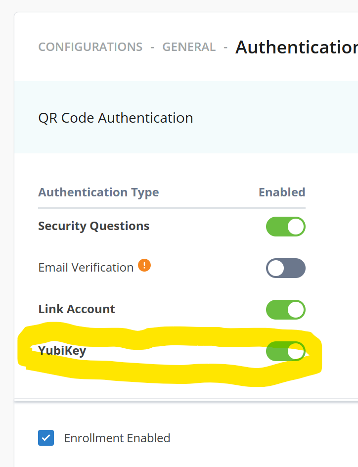

2. From the user portal, users should enroll their account and select YubiKey from the available options.

   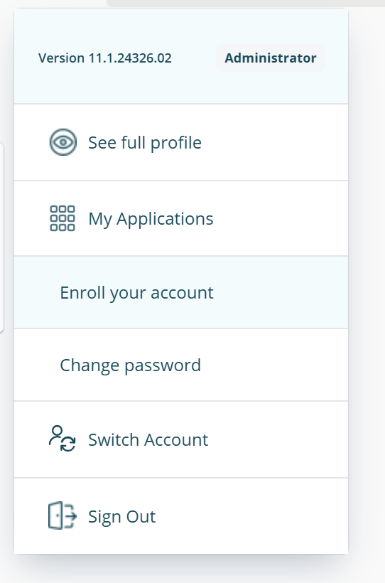

   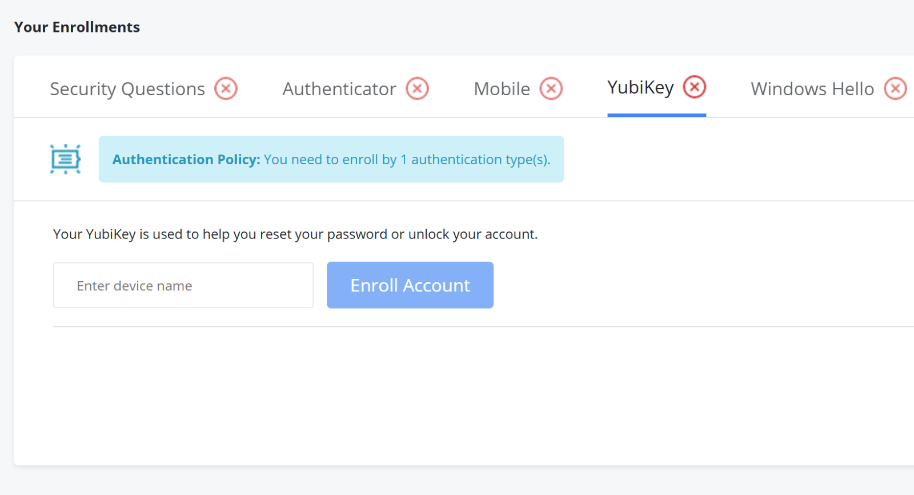

3. Give your passkey-enabled device an appropriate name.

   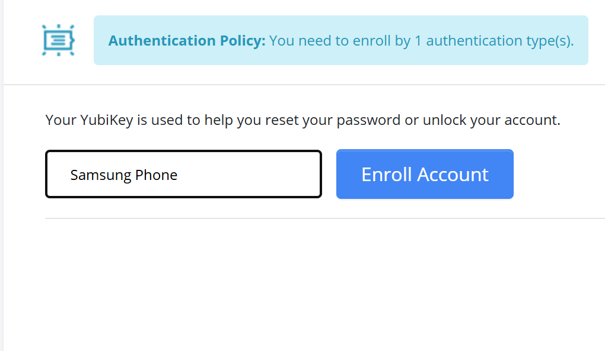

4. You will be prompted to choose a location to save your passkey.

   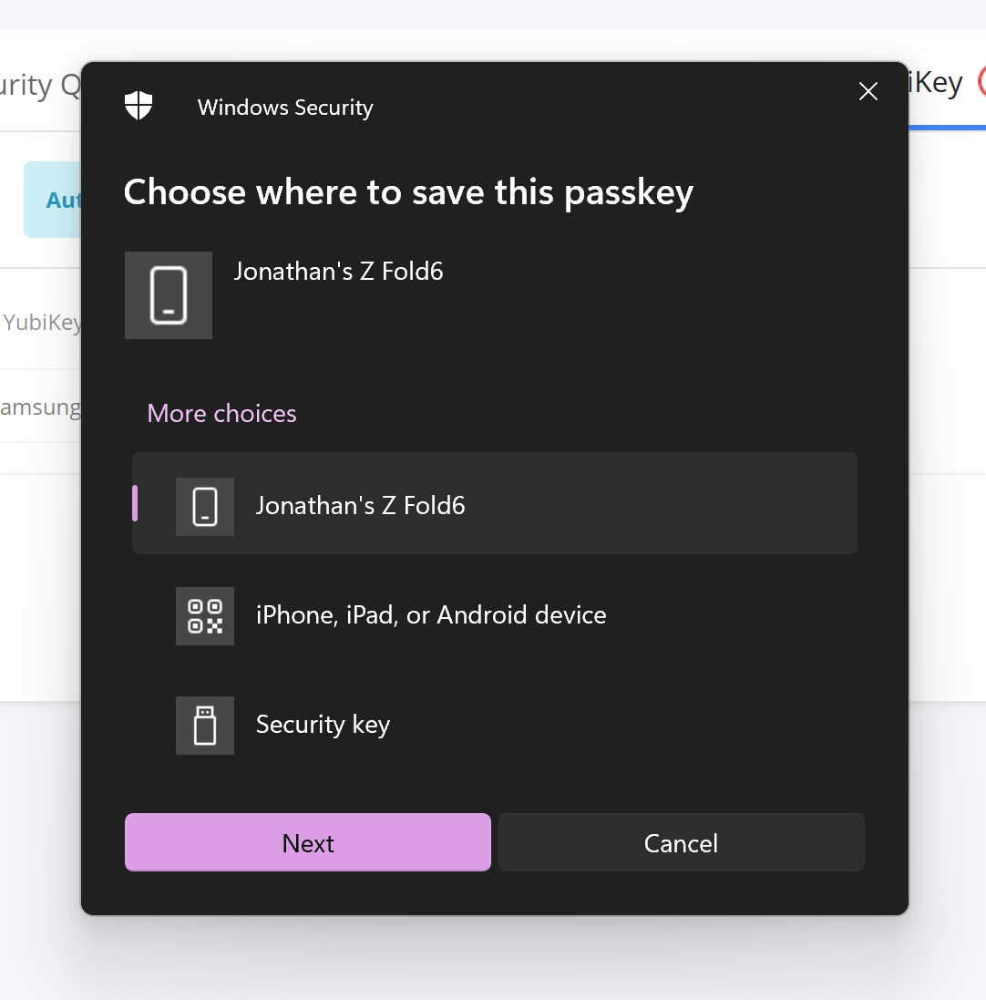

5. You will receive a notification on your device or be prompted to insert a USB token, depending on the chosen method.

   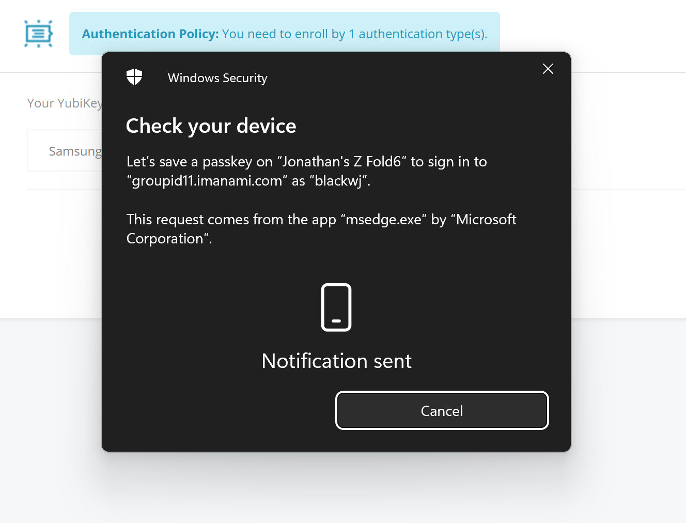

6. If using a mobile phone, you should be prompted to create a key for the web portal enrollment.

   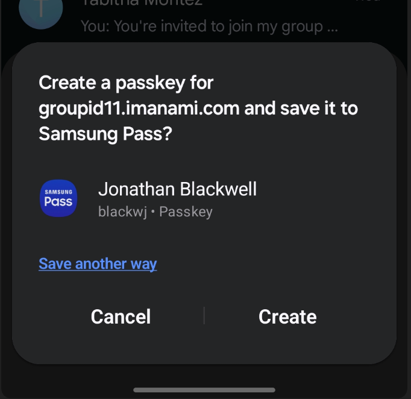

7. After completion, you will receive confirmation on both the mobile device and the portal.

   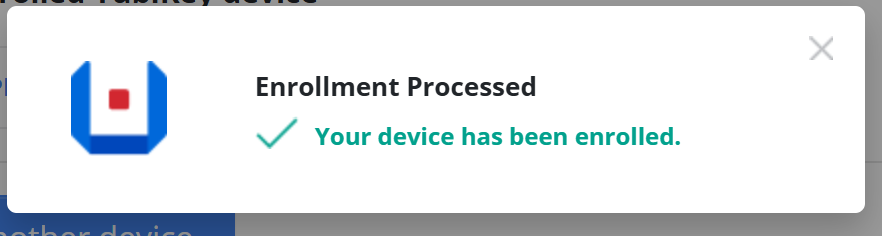

## What is a Passkey, and why do we recommend using it?

According to the FIDO Alliance, passkeys are a replacement for passwords that provide a faster, easier, and more secure user login experience. Passkey-based user authentication is immune to phishing risks because it does not rely on a shared secret, as traditional passwords do.

Technically, a passkey is a discoverable FIDO credential linked to a user account and a specific website or application. As a FIDO credential, a passkey consists of a key pair that employs standard public key cryptography to verify a user's identity without sharing any secrets. This method aligns with WebAuthn authentication.

A passkey is associated with both a user account and a website running Netwrix Directory Manager. When a new passkey is created, it is automatically linked to the user ID and the Relying Party ID — in the case of a website hosting Netwrix Directory Manager.

Passkeys are discoverable, meaning they can be automatically detected and utilized by clients for user authentication. When a user initiates the authentication process, the authenticator does not need to know the user's ID. Instead, it uses the Relying Party ID to locate the correct passkey for authenticating against that website. This process eliminates the need for the user to enter their user ID and ensures that a malicious actor cannot trick them into signing in to a fraudulent website.
