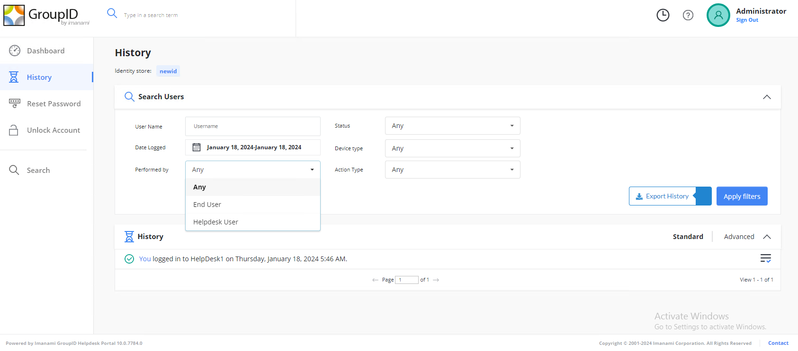

---
description: >-
  Explains how to resolve an issue where searching the History for a specific
  user in the Netwrix Password Reset Helpdesk Portal returns no results.
keywords:
  - Netwrix Password Reset
  - Helpdesk Portal
  - History
  - Performed By
  - End User
  - user search
  - User Name
  - audit
products:
  - directory-manager
sidebar_label: Search History by Specific User Through Password C
tags:
  - troubleshooting-and-errors
title: "Search History by Specific User Through Password C  No Results"
knowledge_article_id: kA0Qk0000000N1RKAU
---

# Search History by Specific User Through Password C  No Results

## Symptom

This article addresses the issue you encounter when you attempt to search for the history of a specific user through the Netwrix Password Reset Helpdesk Portal. The **History** feature of the portal enables Helpdesk users to audit and analyze the functions performed by end users.

In the **History** section of the Netwrix Password Reset Helpdesk Portal, when you search for the history of any individual user, no records are displayed.

## Cause

The default setting for the **Performed By** field is `Any` instead of `End User`.

## Resolution

1. Select `End User` in the **Performed By** field.
2. Search for the user by typing their display name in the **User Name** field.

