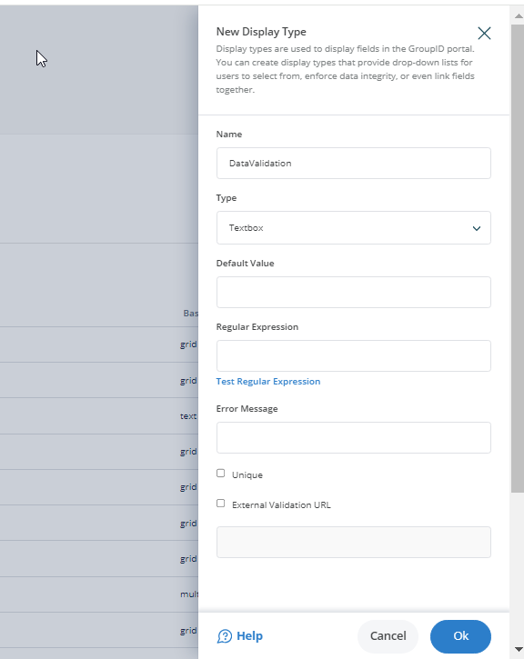

---
description: >-
  Shows how to configure real-time data validation for portal fields in Netwrix
  Directory Manager, including default values, regular expressions, uniqueness
  checks, and external validation.
keywords:
  - real-time validation
  - regular expression
  - portal fields
  - unique value
  - Netwrix Directory Manager
  - external validation
  - data validation
products:
  - directory-manager
visibility: public
sidebar_label: How to Apply Real-time Data Validation
tags:
  - workflows-automation-and-lifecycle-management
title: "How to Apply Real-time Data Validation"
knowledge_article_id: kA0Qk0000002KYvKAM
---

# How to Apply Real-time Data Validation

## Applies To
Netwrix Directory Manager 11

## Overview
Netwrix Directory Manager (formerly GroupID) supports real-time data validation in portal fields. In traditional systems, users only see validation errors after completing all data entry and clicking **Save**. This process can be frustrating, as users must revisit and correct errors after filling out multiple pages. With Netwrix Directory Manager, the portal validates each field as users enter data, providing immediate feedback and allowing users to correct errors on the spot. This real-time validation improves accuracy and streamlines the data entry process.

Netwrix Directory Manager validates data according to rules for uniqueness and syntax, displaying a message as soon as a user enters invalid data. As an administrator, you can add input fields to a portal and apply the following checks:

- Specify a default value for a field.
- Use a regular expression to validate the data entered in a field.
- Require users to enter a unique value for a field.

## Instructions
1. In the Netwrix Directory Manager Management Console, select **Applications > Netwrix Directory Manager Portals**.
2. Open the settings for the desired portal.
3. Go to the Design settings of your identity store to apply real-time data validation.
4. On the **Custom Display Types** tab, click **Add (+)** to create a new display type.
5. Enter a name for the display type in the **Name** box.
6. From the **Type** list, select *Textbox* and click **OK**.

7. Enter a value in the **Default Value** box to set it as the default for the text box. Users can modify this value in the portal.
8. In the **Regular Expression** box, type a regular expression to validate data entered in the text box. Leave this box blank if you do not want to apply a validation rule.
9. In the **Error Message** box, type the text to display when a user enters data that does not conform to the regular expression.
10. Click **Test** to check if the regular expression is valid. In the **Regular Expression Example** box, type an example that satisfies the regular expression and click **Test**.
11. To require users to enter a unique value for the field, select the **Unique** check box. Netwrix Directory Manager checks for uniqueness in the directory or an external data source. The portal prevents users from proceeding unless they provide a unique value. You can also use an external data source, such as an Excel file, to validate uniqueness in real time. Select the **External Validation URL** check box and enter the API URL in the box below.
12. Click **OK** to close the **Text Display Type** dialog box.
13. On the toolbar, click **Save**.

## Applying the Textbox Display Type to a Portal Field
Apply the textbox display type to a field, such as the *group name* field in the group creation wizard. When a user enters a group name, the portal validates it according to the regular expression and checks for uniqueness in the directory or external data source. The portal displays an error message in real time if the entry does not pass these checks.
