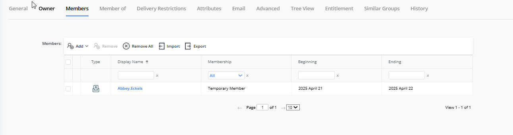

---
description: >-
  Step-by-step instructions for changing a user's membership type in Netwrix
  Directory Manager, including how to assign temporary membership with automatic
  removal after a specified period.
keywords:
  - membership
  - temporary membership
  - group membership
  - Active Directory
  - Netwrix Directory Manager
  - membership lifecycle
  - Addition Pending
  - Removal Pending
  - Temporary Removed
products:
  - directory-manager
sidebar_label: How to Change a User's Membership Type
tags:
  - workflows-automation-and-lifecycle-management
title: How to Change a User's Membership Type
knowledge_article_id: kA0Qk0000002MNpKAM
---

# How to Change a User's Membership Type

## Overview

This article explains how to change a user's membership type in Netwrix Directory Manager, including how to assign temporary membership with automatic removal after a specified period.

Netwrix Directory Manager allows you to add users to Active Directory groups as temporary members and specify start and end dates for their membership. The Membership Life Cycle job runs in the background to add or remove temporary group members on the specified dates. This enables scenarios such as granting external users access for a limited time without affecting permanent group members.

## Membership Types

| Membership Type | Description |
| --- | --- |
| Perpetual | The object is a permanent member of the group. |
| Temporary Member | The object is a member of the group for the period specified in the **Beginning** and **Ending** fields. At the end of the period, the object is removed from group membership. |
| Addition Pending | The object will become a temporary member of the group for a future period. Use the **Beginning** and **Ending** fields to set the period. Before the beginning date, the membership type is displayed as "Addition Pending." On the beginning date, the membership type changes to "Temporary Member."  **Example:** If you add Smith as a temporary member to Group A for May 20–30, Smith appears as "Addition Pending" until May 20. On May 20, Smith becomes a "Temporary Member." After May 30, Smith is removed from the group. |
| Removal Pending | The object will be temporarily removed from group membership for a future period. Use the **Beginning** and **Ending** fields to set the period. Before the beginning date, the membership type is "Removal Pending." On the beginning date, the membership type changes to "Temporary Removed."  **Example:** If you remove Smith from Group A for May 20–30, Smith appears as "Removal Pending" until May 20. On May 20, Smith's membership type changes to "Temporary Removed." After May 30, Smith is added back as a permanent member. |
| Temporary Removed | The object is temporarily removed from group membership for the specified period. At the end of the period, the object is added back as a permanent member. |

## Instructions

1. In the Directory Manager Portal, search for the group whose member's membership type you want to change.  
2. Select the group on the **Search Results** page and click **Properties** on the toolbar. The **Members** tab in group properties lists the group members.  
3. To change a member's membership type, click anywhere in the respective row to make it editable. Select **Temporary Member** from the **Membership** column then specify the membership period using the **Beginning** and **Ending** fields. Other membership options are described in the table above.

4. Save the changes.
