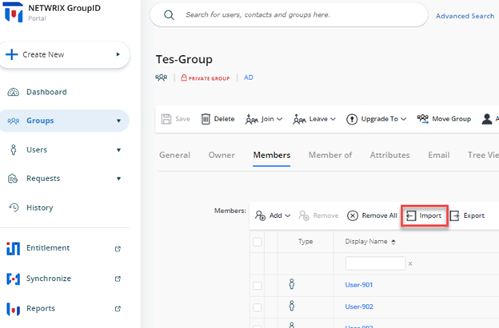
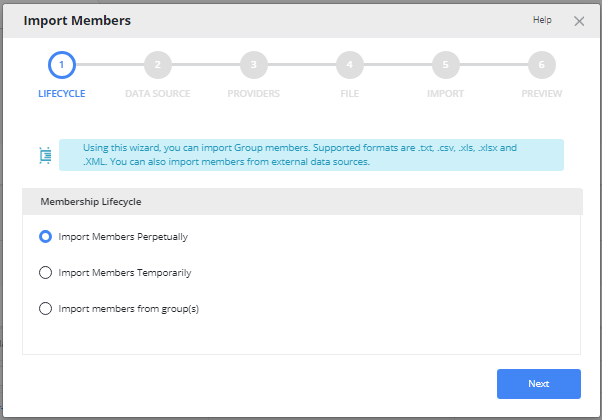
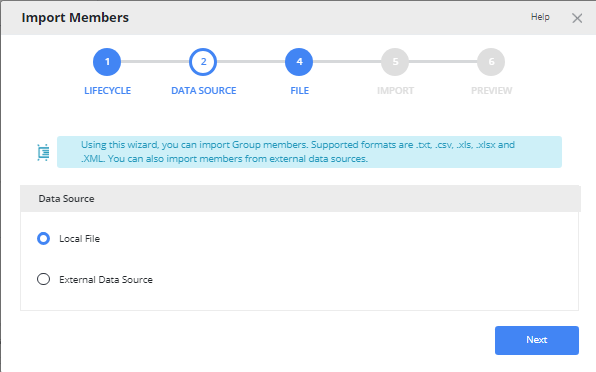
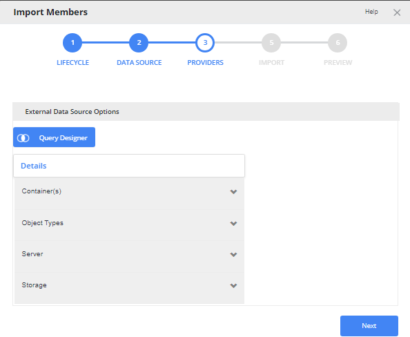
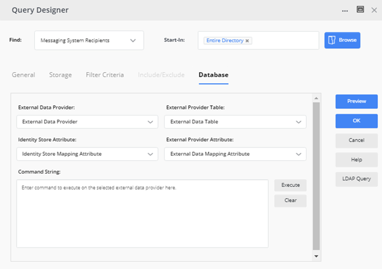
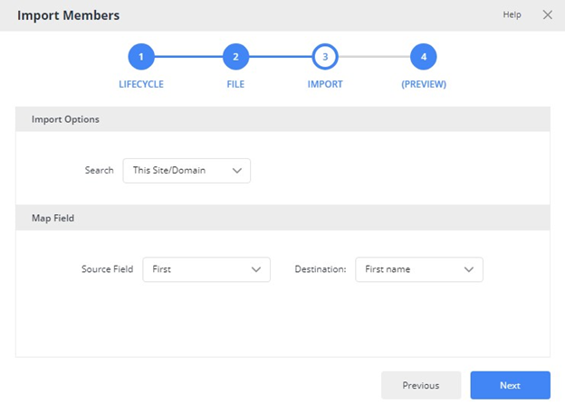
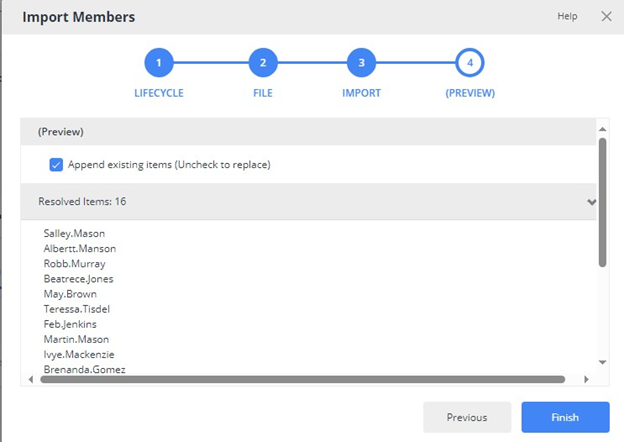

---
description: >-
  Shows how to import members to a group from an external data source using the
  Netwrix Directory Manager self-service Import Group Membership wizard.
keywords:
  - import members
  - group membership
  - CSV import
  - Active Directory
  - Import Wizard
  - Netwrix Directory Manager
  - self-service
  - data source
  - membership lifecycle
products:
  - directory-manager
sidebar_label: How To Import Members to a Group Using Self-Servic
tags:
  - workflows-automation-and-lifecycle-management
title: "How To Import Members to a Group Using Self-Service Import Wizard"
knowledge_article_id: kA0Qk0000000HthKAE
---

# How To Import Members to a Group Using Self-Service Import Wizard

## Applies To:
Netwrix Directory Manager 11

## Business Scenario:
You want to import members to a group from an external data source using the Netwrix Directory Manager portal.

## More Information:
To import the membership for a group from an external data source, such as a CSV, TXT, XLSX, XLS, or XML file, Netwrix Directory Manager offers the Import Group Membership wizard. The members you are looking to import must exist in Active Directory and can be resolved using a unique identifier. This is different from a database group where the connection to the external data source is persistent. A use case for a database group is when you have sensitive information in your database that you do not want to bring into your Active Directory, but you still want to build a criterion based on the information.

## Steps:
You must specify an external data source; the Import Group Membership wizard gets the list of members from it and imports them from the Active Directory into the group. For example, you have a list of Employee-IDs in a text file, and you want to add all Active Directory users with matched IDs to the membership of the group.

The process to import members is discussed in these steps:

1. Launch the Netwrix Directory Manager portal and search for the Group you would like to import members into.
2. Navigate to the **Members** tab and click on the **Import** button to launch the Import Wizard.

   

3. On the **Membership Lifecycle** page, specify whether the imported members will remain in the group permanently or temporarily. Provide the following information and click **Next**.

   Select the Import member perpetually option to import the membership for the group permanently.

   OR

   Select the Import Members temporarily option to import the membership for the group temporarily. In case of temporary membership, select the membership duration from the Duration list:

   - **7 Days**: to import the membership for 7 days starting today.
   - **30 Days** to import the membership for 30 days starting today.
   - **90 Days** to import the membership for 90 days starting today.
   - **Custom** to import the membership for the period indicated in the From and To boxes.

   Members are added to the group on the date in the From box.

   

4. On the **Data Source** page, select and configure the data source that contains the objects to import to the group. You can choose between a **Local File** such as TXT, CSV, XLS, XLSX, and XML or an **External Data Source** such as SQL DB, ODBC, SCIM providers, etc.

   

   - For an **External Data Source**, provide LDAP Criteria and an External Source in the Query Designer.

     

     Click on the **Query Designer** button and provide the Data Source from where you would like to import the Membership.

     

   - For the **Local File**, simply upload the relevant file.

     

5. Click **Next**.
   

6. On the **Import Options** step, select the search option and map the data source fields to the corresponding Active Directory fields. The wizard matches the values of the mapped fields to determine the objects to import.

7. On the **Map Field** step, provide the following:

   - From the **Source** field list, select the name of the field in the external data source to map to its equivalent Active Directory field.
   - From the **Destination** field list, select the name of the Active Directory field to map to the selected source field. The wizard imports memberships where values for both fields match.

8. Click **Next** to preview the objects returned for adding as group members.

   

9. Click **Finish**.

### Related Articles:
- [Walkthrough Search Policy - Define Scope and Filter Results](/docs/kb/directorymanager/security-permissions-and-access-control/walkthrough-search-policy-define-scope-and-filter-results)
- [How To Import Members to a Group Using Self-Service Import Wizard](/docs/kb/directorymanager/workflows-automation-and-lifecycle-management/how-to-import-members-to-a-group-using-self-service-import-wizard)
- [How to Trigger a workflow When a User Сreates a Group](/docs/kb/directorymanager/workflows-automation-and-lifecycle-management/how_to_trigger_a_workflow_when_a_user_сreates_a_group)
- [How To Add Message Approvers in Group Properties in Netwrix Directory Manager Portal](/docs/kb/directorymanager/configuration-and-integration/how-to-add-message-approvers-in-group-properties-in-groupid-portal)
- [Best Practices for Controlling Changes to Group Membership](/docs/kb/directorymanager/reporting-export-and-data-management/best-practices-for-controlling-changes-to-group-membership#netwrix-directory-manager-best-practices)
- [How To Enforce Users to Create Groups in a Specific OU](/docs/kb/directorymanager/security-permissions-and-access-control/how-to-enforce-users-to-create-groups-in-a-specific-ou)
- [Best Practices for Preventing Accidental Data Leakage](/docs/kb/directorymanager/security-permissions-and-access-control/best-practices-for-preventing-accidental-data-leakage)
