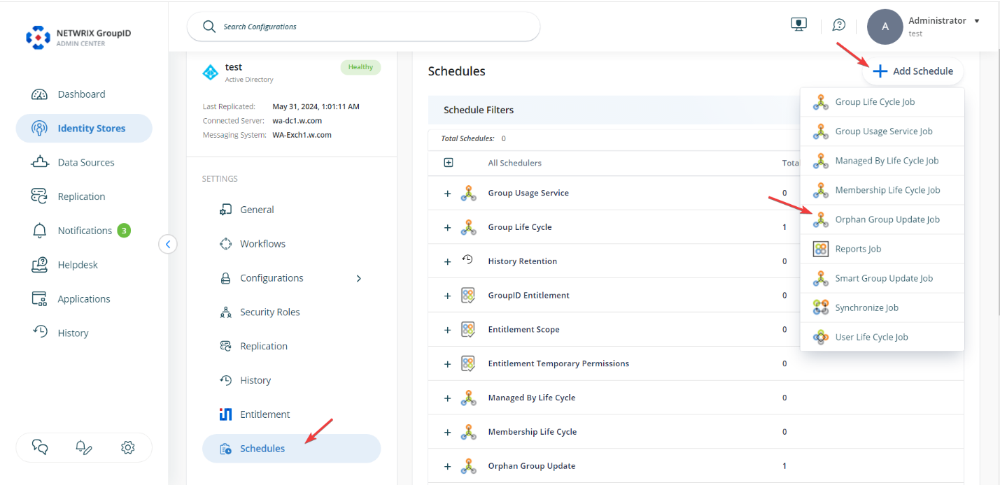
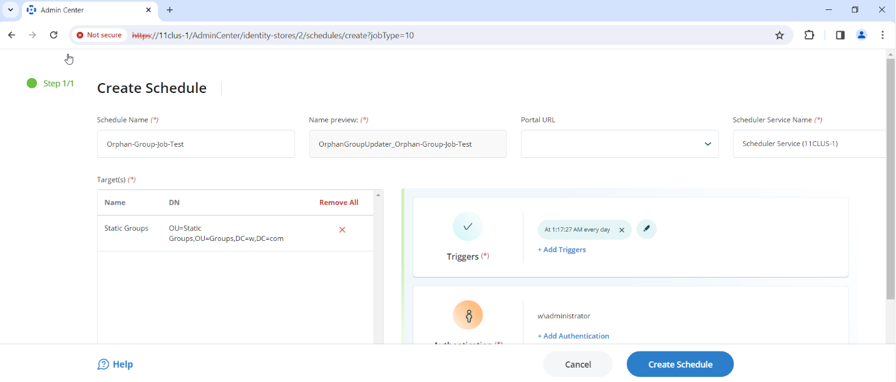

---
description: >-
  This article explains how to create and schedule an Orphan Group Update job in Netwrix Directory Manager to automatically assign a primary owner to groups that do not have one.
keywords:
  - Orphan Group Update
  - Netwrix Directory Manager
  - Active Directory
sidebar_label: Create Orphan Group Update Schedule
tags:
  - workflows-automation-and-lifecycle-management
title: "How to Create an Orphan Group Update Schedule"
knowledge_article_id: kA0Qk0000002LoLKAU
products:
  - directory-manager
---

# How to Create an Orphan Group Update Schedule

## Overview

This article explains how to create and schedule an Orphan Group Update job in **Netwrix Directory Manager** (formerly **GroupID**) to automatically assign a primary owner to groups that do not have one.

Groups may lose their primary owner if the owner is removed manually or if the owner's Active Directory account is deleted. These groups, known as orphan groups, have no primary owner but retain at least one additional owner. The Orphan Group Update job promotes the first additional owner (user, contact, or security group) to primary owner and sends a notification to the promoted owner. If a security group is promoted, all members of that group receive the notification. This process ensures that orphan groups are automatically assigned a new primary owner.

## Instructions

1. In the **Directory Manager Admin Center**, select **Identity Stores**.
2. On your target identity store, click the three-dot icon to edit it.

   

3. Scroll down on the next page and select **Schedules**.
4. Click **Add Schedule** and select **Orphan Group Update Job**.

   

5. Under **Schedule Name**, enter a unique name for the schedule.
6. In **Targets**, click **Add Container** and select the organizational unit (OU) where the job should run.
7. In the **Portal URL** drop-down list, select a Directory Manager portal URL to include in notifications. Users will be redirected to this portal to perform any necessary actions.
8. In the **Scheduler Service Name** drop-down list, select the Scheduler service responsible for triggering this schedule. The number of services displayed depends on the number of Elasticsearch clusters in the environment.
9. In the **Triggers** area, click **Add Triggers** to specify a triggering criterion for the schedule.
10. In the **Authentication** area, click **Add Authentication** to specify an account for running the schedule in the identity store.
11. Click **Create Schedule**.

   

12. When the schedule runs, it searches for groups in the specified OU that do not have a primary owner but have additional owners and promotes the first additional owner to primary owner.