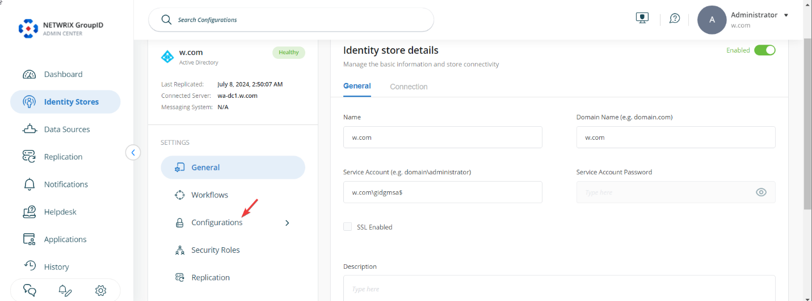
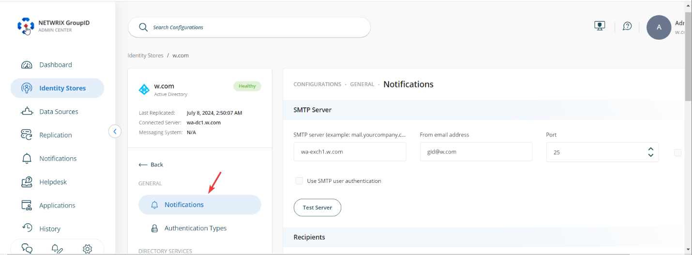
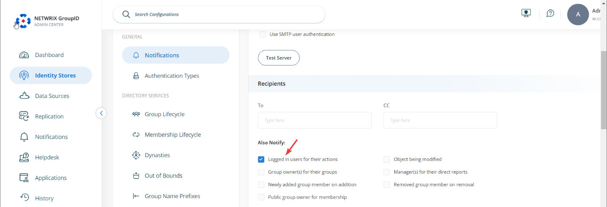
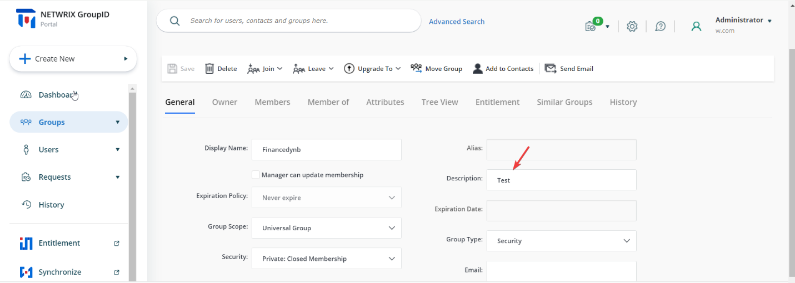
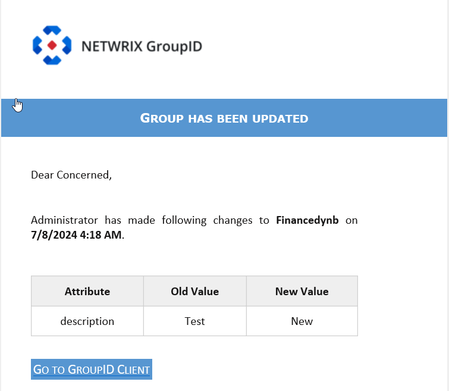

---
description: >-
  Shows how to enable email notifications in Netwrix Directory Manager 11 so
  logged-in users receive emails for changes they make to directory objects via
  the user portal.
keywords:
  - Netwrix Directory Manager
  - notifications
  - email notification
  - identity store
  - user portal
  - logged-in users
  - directory objects
  - mail-enabled users
products:
  - directory-manager
sidebar_label: Notify Logged-In Users About Changes Made to Direc
tags:
  - workflows-automation-and-lifecycle-management
title: "Notify Logged-In Users About Changes Made to Directory Objects"
knowledge_article_id: kA0Qk0000002INRKA2
---

# Notify Logged-In Users About Changes Made to Directory Objects

## Applies To
Netwrix Directory Manager 11

## Overview
You can configure Netwrix Directory Manager 11 (formerly GroupID) to send users an email notification whenever they make changes to directory objects through the user portal. To enable this feature, update the notification settings in the identity store.

## Instructions
1. In Directory Manager Admin Center, click the **Identity Stores** node.  
2. For your identity store, click the three dots (**...**) button and select **Edit**.  
   
3. On the next page, click the **Configurations** button.  
   
4. Click the **Notifications** button.  
   
5. Under the **Also Notify** option, select the checkbox labeled **Logged in users for their actions**.  
   
6. Scroll down and click the **Save** button.

With this notification setting enabled, email notifications will be sent to the logged-in user for changes they make to directory objects using the portal.

> **NOTE:** This setting applies to mail-enabled users only.

## Impact
In the example below, an end user changes the **Description** field of a group.

The user will receive an email notification for the changes they made.

