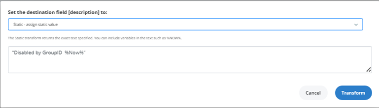

---
description: >-
  This article explains how to use Netwrix Directory Manager Synchronize to automatically deprovision user accounts in Active Directory when an employee's status is updated to Termed in the HR database.
keywords:
  - Active Directory
  - user accounts
  - deprovisioning
  - Netwrix Directory Manager
  - Synchronize
sidebar_label: Use Synchronize to Deprovision User Accounts
tags:
  - workflows-automation-and-lifecycle-management
title: "Use Synchronize to Deprovision User Accounts in Active Directory"
knowledge_article_id: kA0Qk0000002bLFKAY
products:
  - directory-manager
---

# Use Synchronize to Deprovision User Accounts in Active Directory

## Related Queries

- "Use Directory Manager Synchronize to deprovision user accounts in Active Directory"
- "Is there any way to deprovision user accounts in Active Directory while stamping them with a time and date when they are disabled?"

## Overview

This article explains how to use **Netwrix Directory Manager** (formerly GroupID) **Synchronize** to automatically deprovision user accounts in **Active Directory** when an employee's status is updated to **Termed** in the HR database. The process also stamps the account with the date and time of deprovisioning in the **Description** field for audit and tracking purposes.

## Instructions

1. Open the **Synchronize** portal.
2. In the left pane, click the **Create New** button and select **Job**.
3. On the **Job Template** page, provide job details, select the **Blank Job** option, and click **Next**.
4. Select your source provider, then select **Active Directory** as the destination provider and click **Next**.
5. In the **Sync Object Options** section:
   - Select the required object type (for example, **User**).
   - Select the attribute that will serve as the primary key (for example, **EmployeeID**).
   - Select **Description** and **Disable Account** (pseudo-attribute) as destination fields.

   

6. On the **Map Fields** page, apply the following transformations:
   - Set the destination field for **Description** to **Static** and enter: 
     ```plaintext
     Disabled by GroupID %Now%
     ```
     
   - Set the destination field for **Disable Account** to **Static** and enter: 
     ```plaintext
     True
     ```
     

7. Click **Next**, then use the **Advanced** option to filter user accounts in the HR database where **EmploymentStatus** is 
   ```plaintext
   Termed
   ```

   

   

8. Complete the job wizard, then preview the job to verify the expected results.

   

> **NOTE:** The **Disable Account** pseudo-attribute is available in **Synchronize** and accepts `True` or `False` as values. The `%Now%` variable in the **Description** field will insert the current date and time when the job runs.