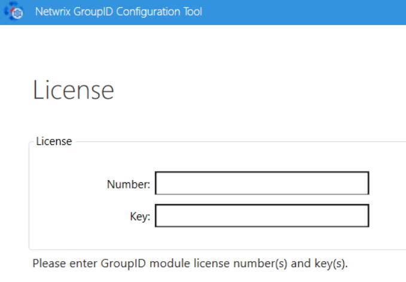
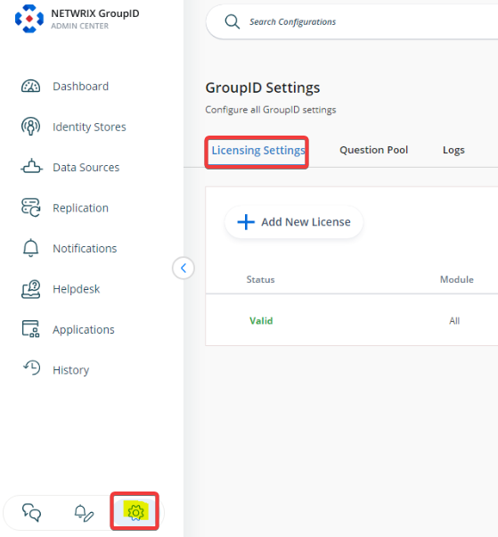
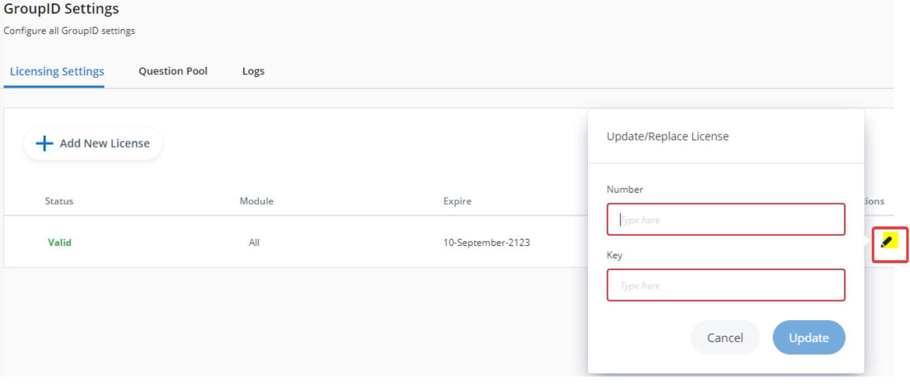

---
description: >-
  Provides details of the licensing model for Netwrix Directory Manager,
  including license types, how to enter and view license information, and steps
  to upgrade an evaluation license.
keywords:
  - Netwrix Directory Manager
  - licensing
  - license key
  - evaluation license
  - module license
  - license upgrade
  - Configuration Tool
  - Admin Center
products:
  - directory-manager
sidebar_label: Viewing and Managing Licenses
tags:
  - workflows-automation-and-lifecycle-management
title: "Viewing and Managing Licenses"
knowledge_article_id: kA0Qk00000015s5KAA
---

# Viewing and Managing Licenses

## Overview

This article outlines the licensing model for Netwrix Directory Manager, including license types, activation methods, and upgrade paths.

### License Types

- **Evaluation License:** Grants access to all modules for 30 days in a test environment. The **Reports** module is free and does not require a license.
- **Module License:** Grants access to specific modules. Available licenses for Netwrix Directory Manager 11 include:
  - Automate Upgrade
  - Complete
  - Group Management
  - Password Center Upgrade
  - Password Management
  - Self-Service Upgrade
  - Suite Upgrade
  - Synchronize Upgrade
  - User Management

  **NOTE:** If any of the licenses above are applied, the **Reports** module is automatically included at no cost.
- **Full (Complete) License:** Provides unrestricted access to all modules. An evaluation license can be upgraded to a full license.

## Instructions

### Entering License Information

1. During installation, on the **License** page of the Configuration Tool, enter a valid license number and license key.  
   
2. If the **Next** button remains disabled, retype your entry for accuracy.
3. If using module-based licensing, enter any one module license during setup.
4. To add more licenses later:
   - Launch the **Netwrix Directory Manager Configuration Tool V11** from the Windows Start menu.
   - Proceed to the **License** page and enter additional license information.

### Upgrading from an Evaluation License

1. Contact Netwrix Sales to obtain a full or module license number and key.
2. In the **Netwrix Directory Manager Admin Center**, click the **Settings** node.  
   
3. In the **Licensing Settings** dialog box, click **Edit**.
4. Enter the new license number and key provided by Netwrix.  
   
5. Click **Update** and relaunch Netwrix Directory Manager.

### Viewing License Information

On the **License** page in the Configuration Tool, you can view:

- **Status:** Valid or expired.
- **Number:** The license number you entered.
- **Key:** The license key associated with the number.
- **Licenses:** Number of machines the license covers.
- **Module:** The licensed module(s). "All" appears if using a full license."
