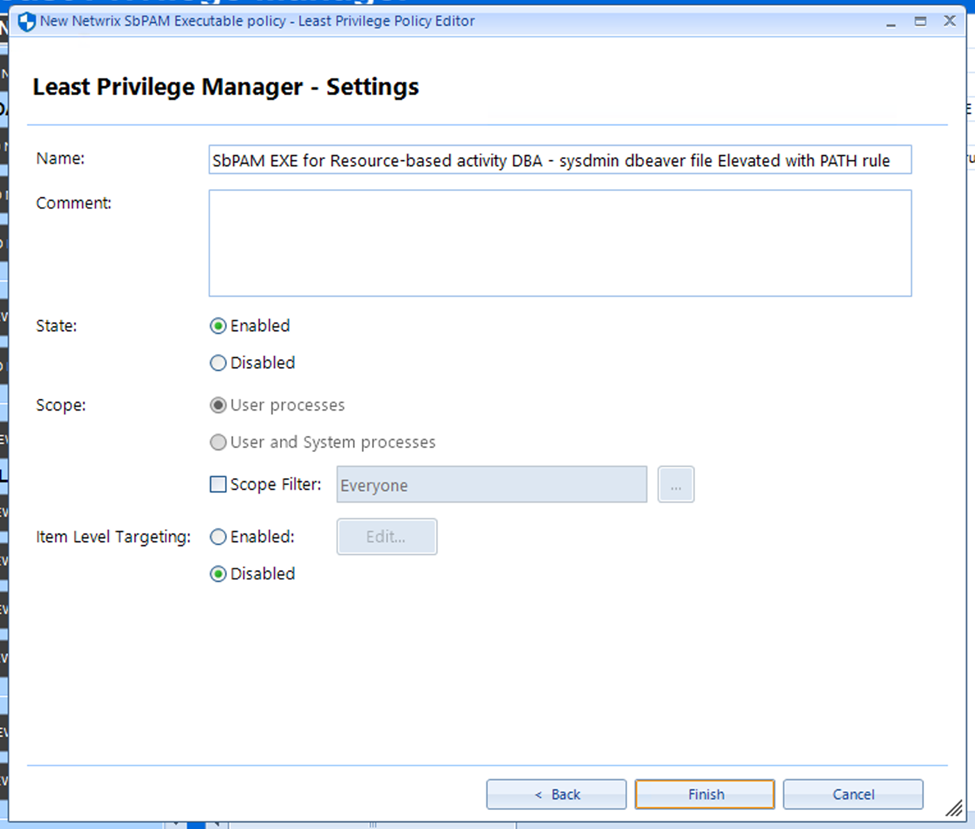

# Configuring Netwrix Endpoint Policy Manager to Run Programs with Elevated Privileges via Privilege Secure

## Summary

This article outlines the process of configuring Netwrix Endpoint Policy Manager to integrate with Netwrix Privilege Secure. This integration allows Endpoint Policy Manager to be granted on-demand privilege elevation when launching a specified program from a server or workstation. It is assumed that Endpoint Policy Manager is already installed and configured. In this example we will configure the integration with `dbeaver.exe`, but the configured program can be anything.

Additionally, the Netwrix Endpoint Policy Manager documentation offers two video demos that outline the NPS/Endpoint Policy Manager integration: https://kb.policypak.com/kb/section/429/

## Instructions

1. On the Endpoint Policy Manager server, locate the Endpoint Policy Manager installer’s zip archive. This archive will contain a directory with the following name:

```
\PolicyPak ADMX (Troubleshooting)\PolicyDefinitions\
```

2. Reference this PolicyPak video to decide how you want to implement the ADMX settings: https://kb.policypak.com/kb/article/505-troubleshooting-with-admx-files/

3. Create a domain-based GPO (`GPMC.MSC`) or a local Group Policy (`GPEDIT.MSC`), and ensure the endpoint machine(s) will be addressed. Navigate to the **Bypass SbPAM server SSL certificate verification** setting under the indicated path:



12. You should now be able to launch the indicated program with elevated privileges by right-clicking and selecting the Netwrix Endpoint Policy Manager context menu entry.
