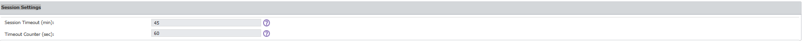
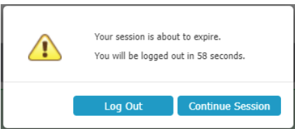

# Configure Session Timeout Settings for the Administration Interface

## Overview

Netwrix Endpoint Protector Server includes a session timeout feature for the Administration Interface to enhance security. You can configure session timeout settings to control how long a user session remains active during periods of inactivity. These settings help protect the management console from unauthorized access due to unattended sessions and complement other system security features, such as role-based access controls.

## Instructions

1. Go to **System Configuration** > **System Settings** > **Session Settings** in the Netwrix Endpoint Protector Management Console.  
   

2. Modify the session timeout settings as needed:
   - **Session Timeout**: Set the amount of time (between `5` and `60` minutes) a user can be inactive before the session expires.
   - **Timeout Counter**: Set the countdown duration (between `5` seconds and one minute less than the Session Timeout) for the session timeout warning.

> **NOTE:** If **Session Timeout** is set to `5` minutes and **Timeout Counter** is set to `60` seconds, after `4` minutes of inactivity a pop-up window will notify you that you will be logged out in `60` seconds.

3. If no activity occurs during the countdown, Netwrix Endpoint Protector displays a message indicating the session will expire. You can choose to log out or continue your session, which resets the session timeout interval.  
   
