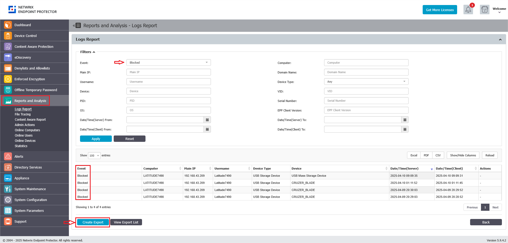

# Export Event Logs from Reports and Analysis

## Overview

This article explains how to export selected event logs from the **Reports and Analysis** section in Endpoint Protector. You can filter for specific events and export the results for further analysis or record-keeping.

## Instructions

1. On the Endpoint Protector server, navigate to **Reports and Analysis**.
2. Apply a filter for the desired event logs.  
   
3. Click the **Create Export** button at the bottom of the list to generate an export file.
4. Download the generated `.csv` or `.xlsx` file from **View Export List**.  
   
5. Access and review the exported file as needed.  
   
