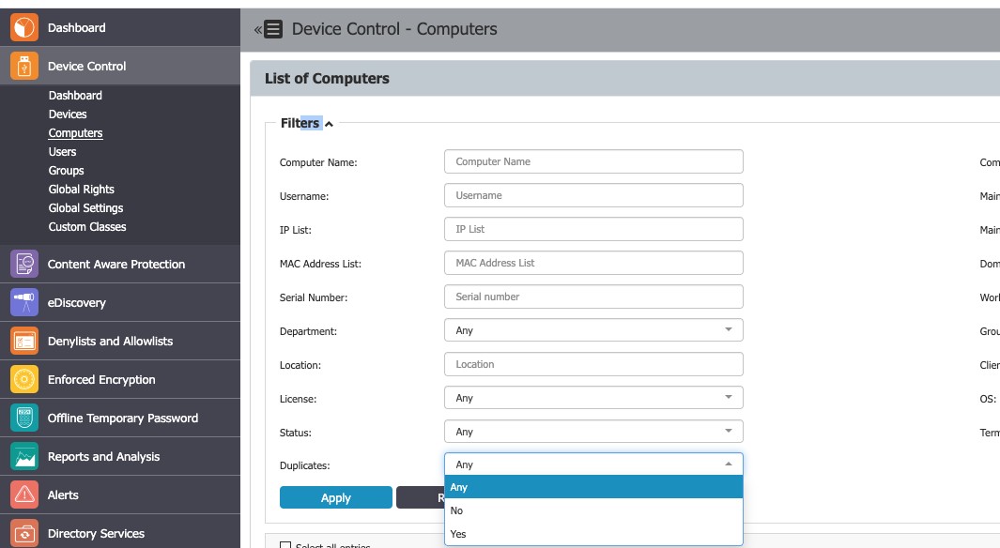

# How to Identify and Remove Duplicate Computers

## Overview

This article explains how to identify and remove duplicate computers in Netwrix Endpoint Protector. Duplicate endpoints can occupy additional licenses, removing them helps free up licenses for other systems.

## Instructions

1. In the Netwrix Endpoint Protector Console, navigate to the **Device Control** menu and select **Computers**.
2. In the Filters section, select **Duplicates** > **Yes** > **Apply**.  
   
3. Review the list of duplicate computers. You can further filter for **Licensed** and **Offline** computers.
4. Delete the unwanted duplicate entries to release the associated licenses.
