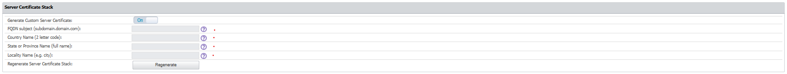

# How to Set FQDN in Server Certificate Subject

## Question

Can you set the Fully Qualified Domain Name (FQDN) in the server certificate subject?

## Answer

Yes, this is possible. Follow these steps to set the FQDN in the server certificate subject:

1. Go to **System Configuration > System Settings > Server Certificate Stack**.
2. Turn ON **Use FQDN in subject** (or **Generate Custom Server Certificate** if applicable).
3. Enter the desired FQDN in the appropriate field.
4. At the bottom of the page, click **Save** to apply the changes.
5. Verify that a confirmation message appears at the top of the page indicating the changes have been saved.
6. Click the **Regenerate** button in the **Regenerate Server Certificate Stack** section.
7. When prompted by the pop-up window, select **Yes** to confirm regeneration.
8. A green banner will appear at the top of the screen stating that the server certificate will be regenerated in a few minutes. You will be logged out from the user interface and will need to log in again.
9. Wait a few minutes until the certificate is regenerated.

### Important Notes

- If you are using FQDN in the subject and a self-signed certificate, you must reimport the self-signed certificate after regenerating the server certificate stack.
- If the server certificate is regenerated, the DPI certificate will also be regenerated. The new DPI certificate must be reimported on all Mac machines.
- MacOS users must proceed with caution when performing these steps. If you regenerate the server certificate stack and do not upload the new DPI certificate, Mac machines may lose internet access.
- If you are still experiencing issues, please reach out to [Netwrix Support](https://www.netwrix.com/support.html).
