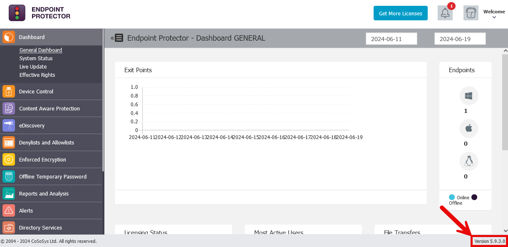
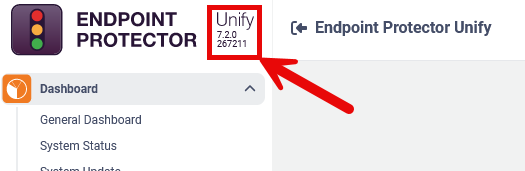
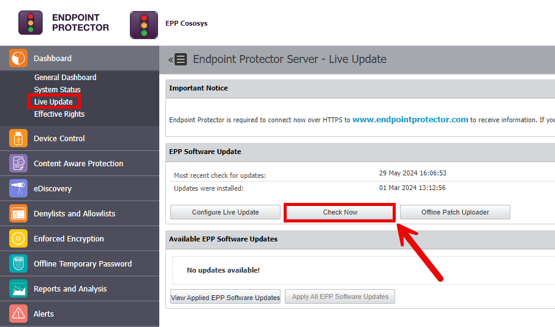
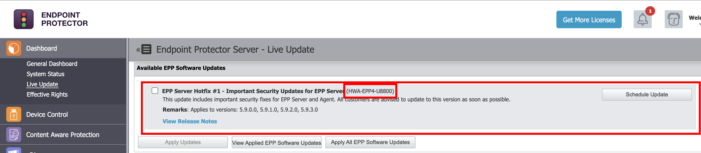
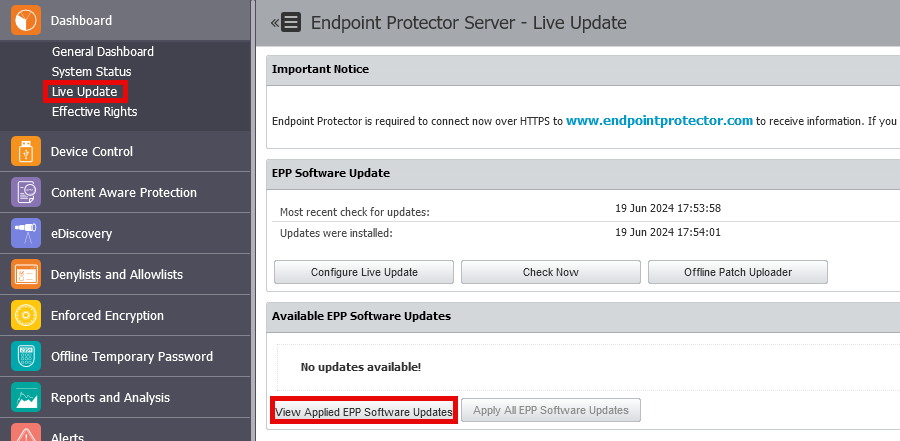

# How to Update Netwrix Endpoint Protector or Unify Server

## Finding the Current Version

Customers not using the live update server will need to know their version number to ensure the correct patch is installed.

To find the version of the Netwrix Endpoint Protector server, follow the below steps:

1. Navigate to the web interface of the console.  
2. Log in.  
3. View the bottom right of the screen to find the version information.

To find the version of the Unify server, follow the below steps:

1. Log in to the Unify web console.  
2. Check the top left for the version information.

## Updating with Live Update

Live Update is the recommended way to patch the Netwrix Endpoint Protector server. It uses the server's internet connection to check for and download updates for the Netwrix Endpoint Protector server. More information on the Live Update feature can be found here. If internet access is restricted on the Netwrix Endpoint Protector appliance, then follow the instructions for offline update.

To install the latest updates with Live Update, follow the below steps:

1. Log in to the Netwrix Endpoint Protector Web Console using an administrative account.  
2. Under the **Dashboard** heading, select **Live Update.**  
3. Click on **Check Now** to check for updates.  
4. Check the box on the update(s) to be installed.  
5. Select **Apply Updates.**

## Updating Using the Offline Patch Uploader

The offline patch uploader is the mechanism used to perform offline updates of the Netwrix Endpoint Protector server when no internet connection is available from the Netwrix Endpoint Protector server itself.

To apply an offline update, follow the below steps:

1. Download the offline patch.  
2. Log in to the Netwrix Endpoint Protector Web Console using an administrative account.  
3. Under the **Dashboard** heading, select **Live Update.**  
4. Click on **Offline Patch Uploader.**  
5. Browse to the downloaded update and select it.  
6. Click **Ok.**  
7. Wait for the system to apply the update.

## Verifying an Update Installed

To verify an update was applied to the Netwrix Endpoint Protector server, follow the below instructions:

1. Log in to the Netwrix Endpoint Protector web console using an administrative account.  
2. Under the **Dashboard** heading, select **Live Update.**  
3. Click on **View Applied EPP Software Updates.**  
4. Look through the applied updates to see if the update was installed.

