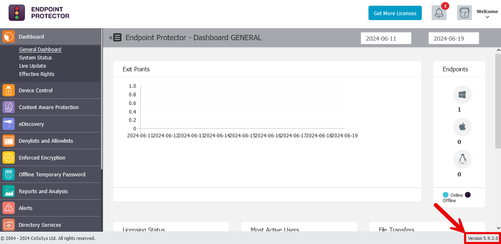
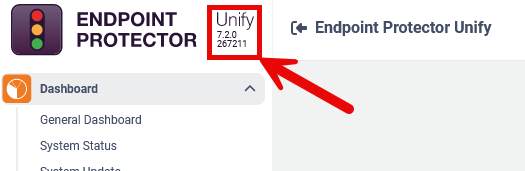
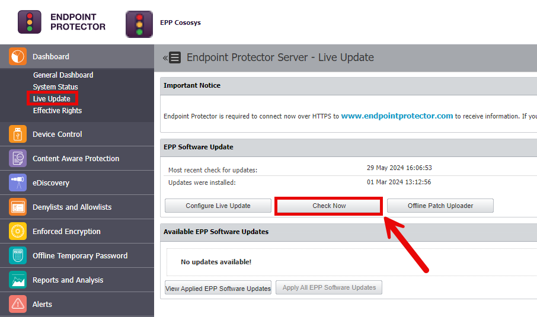
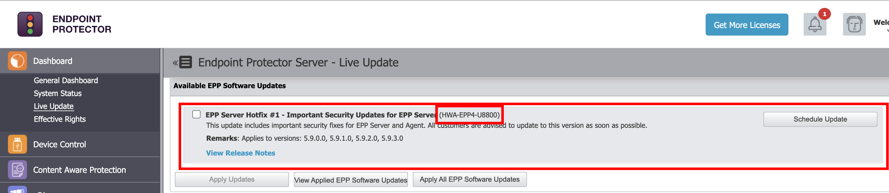
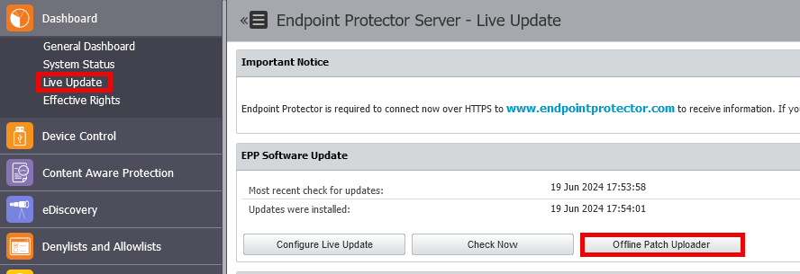
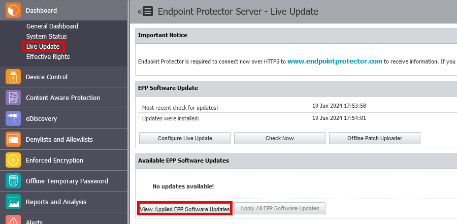
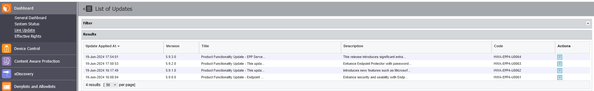

# How to Update Netwrix Endpoint Protector or Unify Server

:::note
Netwrix removed the Live Update feature from Endpoint Protector (EPP) starting with EPP Server version 2509. You can only apply updates through the [Offline Patch Uploader](/docs/endpointprotector/admin/systemconfiguration/systemdashboard#software-update).
:::

## Finding the Current Version

Customers not using the live update server will need to know their version number to ensure they install the correct patch.

To find the version of the Netwrix Endpoint Protector server, follow these steps:

1. Navigate to the web interface of the console.  
2. Log in.  
3. View the bottom right of the screen to find the version information.

To find the version of the Unify server, follow these steps:

1. Log in to the Unify web console.  
2. Check the top left for the version information.

## Updating with Live Update

Live Update is the recommended way to patch the Netwrix Endpoint Protector server. It uses the server's internet connection to check for and download updates. For more information about Live Update, see [Server Update](/docs/endpointprotector/admin/systemconfiguration/systemdashboard#server-update) in the Netwrix Endpoint Protector documentation. If internet access is restricted on the Netwrix Endpoint Protector appliance, follow the instructions for offline update instead.

To install the latest updates with Live Update, follow these steps:

1. Log in to the Netwrix Endpoint Protector Web Console using an administrative account.  
2. Under the **Dashboard** heading, select **Live Update.**  
3. Click on **Check Now** to check for updates.  
4. Check the box on the update(s) to be installed.  
5. Select **Apply Updates.**

## Updating Using the Offline Patch Uploader

Use the offline patch uploader to update the Netwrix Endpoint Protector server when it has no internet connection. For more information, see [Server Update](/docs/endpointprotector/admin/systemconfiguration/systemdashboard#software-update) in the Administration section of the Netwrix Endpoint Protector documentation.

To apply an offline update, follow these steps:

1. Download the offline patch.  
2. Log in to the Netwrix Endpoint Protector Web Console using an administrative account.  
3. Under the **Dashboard** heading, select **Live Update.**  
4. Click on **Offline Patch Uploader.**  
5. Browse to the downloaded update and select it.  
6. Click **Ok.**  
7. Wait for the system to apply the update.

## Verifying an Update Installed

To verify that the Netwrix Endpoint Protector server applied an update, follow these instructions:

1. Log in to the Netwrix Endpoint Protector web console using an administrative account.  
2. Under the **Dashboard** heading, select **Live Update.**  
3. Click on **View Applied EPP Software Updates.**  
4. Look through the applied updates to confirm the server installed the update.

