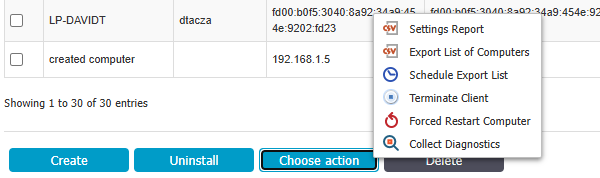

# How to Export the List of Computers, Users, or Devices

## Overview

This article explains how to export the list of computers, users, or devices from the console. You can perform a manual export or schedule an export, and the exported lists are accessible from the **Exported Entities** section.

## Instructions

### Manual Export

1. Open the Endpoint Protector console and navigate to the **Device Control** section.
2. Select **Computers**, **Users**, or **Devices**.
3. Click **Choose action** and select **Export list of**...  
   
4. A banner appears at the top of the page indicating where the export file can be found.
5. On the **List of exports** page, navigate to **System Maintenance** > **Exported Entities**.
6. In the **Actions** menu, you can download or delete the exported list.

### Scheduled Export

1. Open the Endpoint Protector console and navigate to the **Device Control** section.
2. Select **Computers**, **Users**, or **Devices**.
3. Click **Choose action** and select **Schedule export list**.  
   
4. Select the **frequency** and **start date** for the export. Click **Schedule**.
5. A banner appears at the top of the page confirming that the export has been scheduled.
6. On the **List of exports** page, navigate to **System Maintenance** > **Exported Entities**.
7. In the **Actions** menu, you can download or delete the exported list.