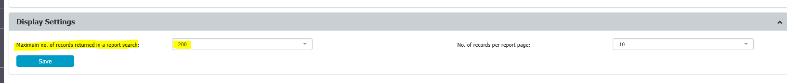

# How to Increase the 200 Entries Display Limitation

## Overview

The default limit of 200 entries is set to improve Endpoint Protector server performance. This article explains how to increase the maximum number of records shown in report searches.

## Instructions

:::warning
Use this feature wisely. Large search results can impact overall server performance. To improve server performance for large queries, Netwrix strongly recommends increasing the assigned EPP Server sizing.
:::

To increase the display limit, follow these steps:

1. Log in to the **Endpoint Protector** console.
2. Navigate to **Device Control** > **Global Settings** > **Maximum no. of records returned in a report search**.
3. Increase this limit to your desired amount.  
   