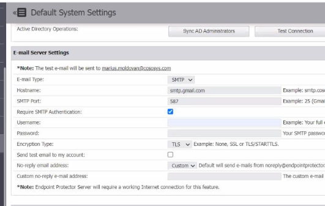

# How to Set Up SMTP With Gmail

## Overview

This article explains how to configure SMTP settings in **Endpoint Protector** to use **Gmail** as your email provider. It includes the required configuration values, steps for generating an app password, and instructions for sending a test email.

## Instructions

### Configure SMTP Settings

1. Open the **Endpoint Protector Web Console**.
2. Go to **System Configuration** > **System Settings**.
3. In the **Email Server Settings** section, select **SMTP** from the **Email Type** field.
4. Fill in the fields as follows:
   - **Email Type:** SMTP
   - **Hostname:** smtp.gmail.com
   - **SMTP Port:** 587
   - **Require SMTP Authentication:** Enabled
   - **Username:** Enter your Gmail email address
   - **Password:** Enter the app password generated in your Google Account (see steps below)
   - **Encryption Type:** TLS
   - **Send test email to my account:** Enabled
   - **No-reply email address:** Default

   

5. To use a custom no-reply email address, select **Custom** and enter your preferred email address, or leave the default.

> **IMPORTANT:** When using Gmail as your SMTP provider, you must use an app password instead of your account password.

### Configure App Password

1. Navigate to your [Google Account – App Passwords](https://security.google.com/settings/security/apppasswords).
2. Select **Security**.
3. Under the **Signing in to Google** section, select **2-Step Verification**.
4. At the bottom of the page, select **App passwords**.
5. Enter a name that corresponds with where you will use the app password.
6. Select **Generate**.
7. Follow the on-screen instructions to enter the app password. The app password is the 16-character code generated on your device.
8. Select **Done**.
9. Once all fields are complete, click **Save**.
10. Select **Send test email to my account** and click **Save** again. If the configuration is correct, a green banner will confirm that a test email was sent.