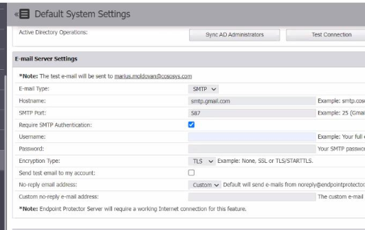

# How to Set Up SMTP With Gmail

## Overview

This article explains how to configure SMTP settings in **Endpoint Protector** to use **Gmail** as your e-mail provider. It includes the required configuration values, steps for generating an app password, and instructions for sending a test e-mail.

For the full list of e-mail server configuration options, see [Mail Settings](/docs/endpointprotector/admin/systemconfiguration/mailsettings).

## Instructions

### Configure Mail Settings

Before you configure the e-mail server, set an e-mail address for your administrator account (**System Configuration** > **System Administrators** > **Edit info**). Endpoint Protector sends test e-mails to this address.

1. Open the **Endpoint Protector Web Console**.
2. Go to **System Configuration** > **Mail Settings**.
3. Set the **E-mail Authentication Type** to **Basic**. Gmail doesn't support the **OAuth** authentication type, which applies only to Microsoft Exchange Online.
4. In the **E-mail Server Settings** section, select **SMTP** from the **E-mail Type** field.
5. Fill in the fields as follows:
   - **E-mail Type:** SMTP
   - **Hostname:** smtp.gmail.com
   - **SMTP Port:** 587
   - **Username:** Enter your Gmail e-mail address
   - **Password:** Enter the app password generated in your Google Account (see steps below)
   - **Encryption Type:** TLS
   - **Send test email to my account:** Enabled
   - **No-reply email address:** Default

   

6. To use a custom no-reply e-mail address, select **Custom** and enter your preferred e-mail address, or leave the default.

> **IMPORTANT:** When using Gmail as your SMTP provider, you must use an app password instead of your account password.

### Configure App Password

1. Navigate to [Google Account – App Passwords](https://myaccount.google.com/apppasswords).
2. Sign in with your Gmail address, if prompted.
3. Ensure **2-Step Verification** is enabled on the account — Google requires this before it displays the App Passwords option.
4. Enter a name that corresponds with where you will use the app password.
5. Select **Generate**.
6. Follow the on-screen instructions to enter the app password. The app password is the 16-character code generated on your device.
7. Select **Done**.
8. Once all fields are complete, click **Save** in Endpoint Protector.
9. Select **Send test email to my account** and click **Save** again. If the configuration is correct, a green banner will confirm that a test email was sent.

:::tip
If the test e-mail fails to send, review the **Mail Server Logs** tab under **System Configuration** > **Mail Settings** for detailed error messages.
:::