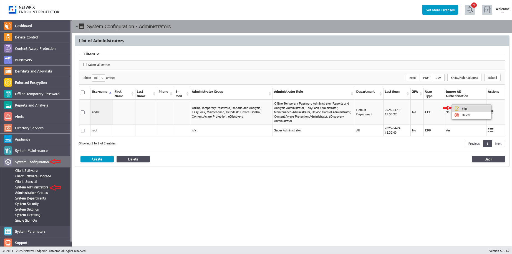
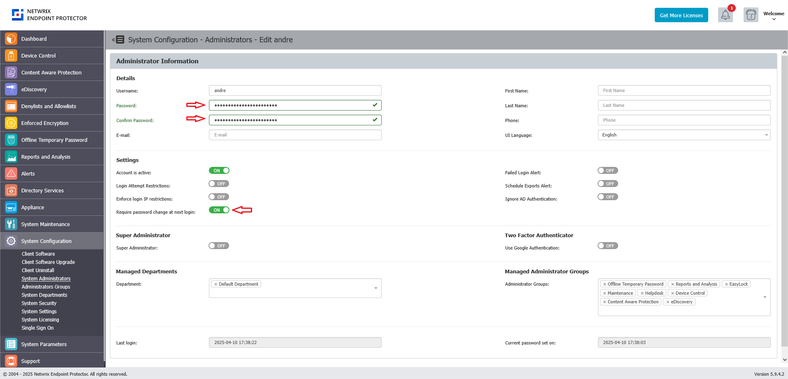

# Resetting an Administrator Password

## Overview

This article explains how to reset an administrator password on the Netwrix Endpoint Protector Server. These instructions apply to regular Netwrix Endpoint Protector administrators. For administrators imported from Active Directory, you must manage the password through Active Directory.

## Instructions

1. In the Netwrix Endpoint Protector Console, navigate to **System Configuration** > **System Administrators**.  
2. Edit the administrator account that requires a password reset.  
3. Enter the new password in the **Password** and **Confirm Password** fields.  
4. Check **Require password change at next login** to allow the administrator to set a password of their choice upon their next login.  
5. Save the modifications.  

6. If you encounter any issues and are unable to reset the password, create a support ticket via the [Netwrix Support portal](https://www.netwrix.com/support.html) for assistance.
7. If the server is hosted on your end, the support team will contact you to schedule a remote session for resetting the password in the server's backend.
