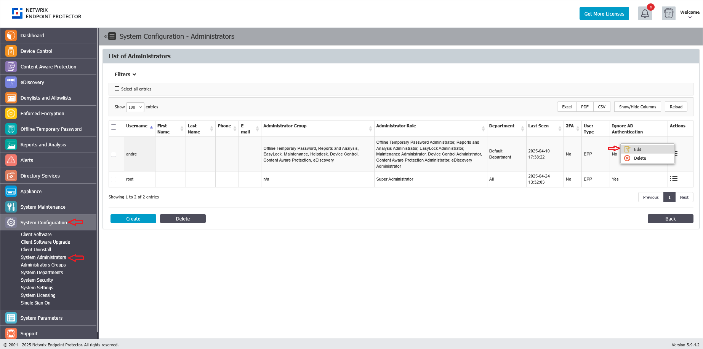
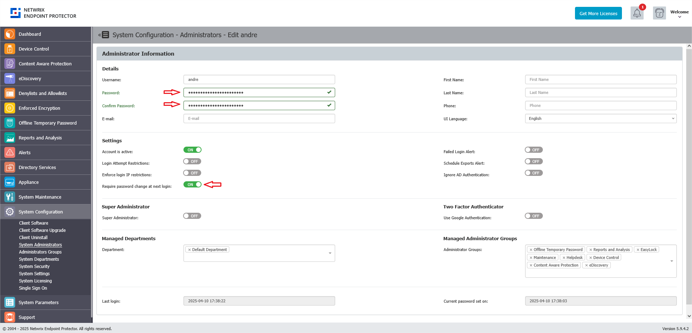

# Resetting an Administrator Password

## Overview

This article explains how to reset an administrator password on the Netwrix Endpoint Protector Server. These instructions apply to regular Netwrix Endpoint Protector administrators. Administrators imported from Active Directory or from SSO (Azure and OKTA) must have their password managed through their respective identity provider instead.

For the full list of administrator account settings, roles, and password security options, see [Administration and Access Control](/docs/endpointprotector/admin/systemconfiguration/adminandaccess).

## Instructions

1. In the Netwrix Endpoint Protector Console, navigate to **System Configuration** > **System Administrators**.  
2. Edit the administrator account that requires a password reset.  
3. Enter the new password in the **Password** and **Confirm Password** fields.  
4. Check **Require password change at next login** to allow the administrator to set a password of their choice upon their next login.  
5. Save the modifications.  

:::warning
The **Require password change at next login** setting is ignored for Active Directory imported administrators and for SSO users (Azure and OKTA). It's also overridden if **Enforce All Administrator Password Security at Next Login** is enabled under **System Configuration** > **System Security** — that setting takes priority and forces a password change for all users, not only administrators.
:::

6. If you encounter any issues and are unable to reset the password, create a support ticket via the [Netwrix Support portal](https://www.netwrix.com/support.html) for assistance.
7. If the server is hosted on your end, the support team will contact you to schedule a remote session for resetting the password in the server's backend.
