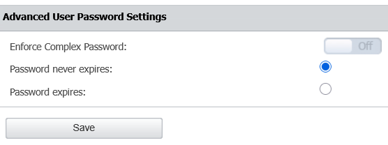

# Set Password Validity or Remove Password Expiration for Administrators

## Overview

This article explains how to change the validity period for administrator passwords or remove password expiration entirely.

For the full list of password security options, including complex password requirements and enforcing a password change for all users at next login, see [System Security](/docs/endpointprotector/admin/systemconfiguration/systemsecurity#advanced-user-password-settings).

:::danger
Removing password expiration for administrator accounts weakens your security posture and goes against security best practices. Netwrix strongly recommends against setting administrator passwords to never expire.

Endpoint Protector administrator accounts are privileged accounts: they control Device Control, Content Aware Protection, Enforced Encryption, and other security enforcement across your organization. If an administrator's credentials are ever compromised, through phishing, credential stuffing, or a third-party data breach, an expiration policy limits how long the compromised credentials remain valid. Without expiration, an attacker with a stolen administrator password retains access indefinitely, until someone notices and manually resets it.

Password expiration for privileged accounts is also a baseline control expected by common compliance and security frameworks (for example, PCI DSS, HIPAA, ISO 27001, and SOC 2). Removing it can put your organization out of alignment with these requirements.

If you must extend or remove password expiration for operational reasons, compensate with additional controls: enable **Two Factor Authentication** for all administrator accounts, enforce complex password requirements, and regularly review the **Admin Actions** report for anomalous administrator activity.
:::

## Instructions

Follow these steps to set a custom password validity period or remove password expiration for administrator accounts:

1. Navigate to **System Configuration > System Security** in Endpoint Protector.
2. In the **Advanced User Password Settings** section, select a custom validity period or choose to remove the expiry completely.

