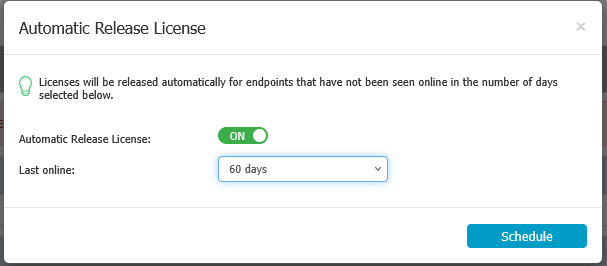

# How to Set Up Automatic License Release

## Overview

If you have licenses assigned to computers that are no longer active and want to ensure that licenses are not used unnecessarily, you can enable the Automatic License Release feature in Endpoint Protector.

## Instructions

To set up Automatic License Release, log in to the Endpoint Protector web console and follow these steps:

1. In the Endpoint Protector console, navigate to **System Configuration** > **System Licensing**.
2. In the Licensing window, click **View Licenses**.
3. Click the **Automatic Release License** button in the **View Licenses** window.
4. Toggle the **Automatic Release License** option. In the **Last Online** drop-down, select either a predefined value or enter a custom value (between 1 and 360 days).  
   
5. Click the **Schedule** button. All computers that were last seen longer than the defined value will have their license released.