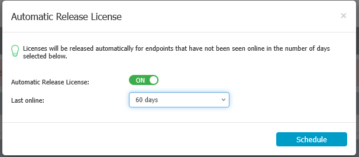

# How to Set Up Automatic License Release

## Overview

If one or more licensed Workstations have been permanently decommissioned - its license can be released and reassigned. Released licenses will automatically be reassigned to other active Workstations.

By using the automatic release license functionality, licenses can be released from decommissioned Workstations, that have not been seen online for over a certain number of days (15, 30, 90 days, etc.)
It is not intended for frequent repeated reassignment of licenses among ephemeral or non-persistent virtual desktops, pooled sessions, or other temporary compute instances.
If you operate a non-persistent VDI environment, contact Netwrix to ensure your deployment and licensing model align with product use requirements.

## Instructions

To set up Automatic License Release, log in to the Endpoint Protector web console and follow these steps:

1. In the Endpoint Protector console, navigate to **System Configuration** > **System Licensing**.
2. In the Licensing window, click **View Licenses**.
3. Click the **Automatic Release License** button in the **View Licenses** window.
4. Toggle the **Automatic Release License** option. In the **Last Online** drop-down, select either a predefined value or enter a custom value (between 1 and 360 days).  
   
5. Click the **Schedule** button. All Workstations that were last seen longer than the defined value will have their license released.